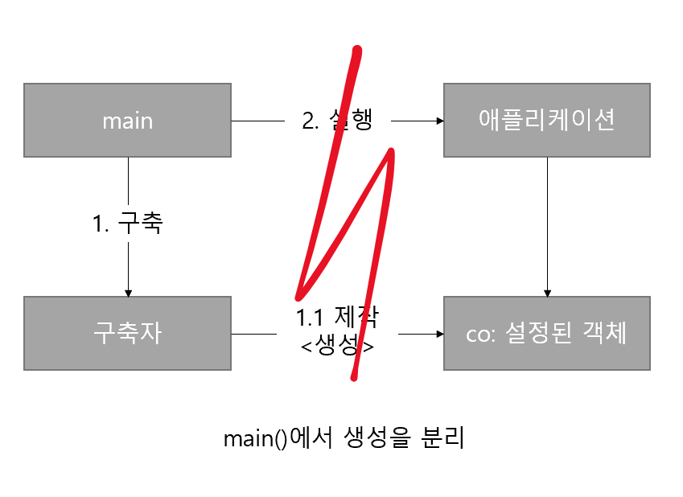
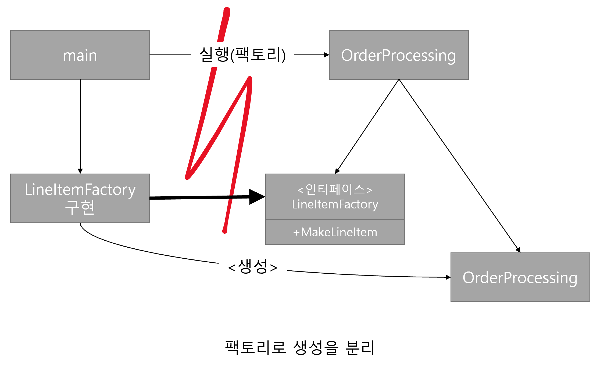

# 11. 시스템

> 복잡성은 죽음이다. 개발자에게서 생기를 앗아가며, 제품을 계획하고 제작하고 테스트하기 어렵게 만든다.
>
> Ray Ozzie, Chief Software Architect, Microsoft Corporation.

저는 이 챕터를 배우기 위해 기존 챕터들을 배워왔다고 생각합니다. 왜 그렇게 생각했는지 풀어보겠습니다.

## 도시를 세운다면?

도시는 한 사람이 모두 관리할 수 없습니다. 관리해야 하는 세부사항에 따라 관리자들을 두고 세부 작업을 나누었기 때문에 이와 같은 마법이 가능합니다. 다시 말해 도시가 _돌아가는_ 이유는 적절한 추상화와 모듈화 덕분이라고 할 수 있습니다.

앞서 살펴본 챕터 내용을 종합하여 추상화와 모듈화, 나아가 시스템 수준에서까지 이를 유지하는 방법을 논의해봅시다.

## 시스템 제작과 시스템 사용을 분리하라

제작(Construction), 사용(User)는 아주 다릅니다.

건물로 예를 들어봅시다. 공사중일 때의 외관과 내부는 온통 바쁜 현장의 모습일 것입니다. 완공된 뒤의 건물은 지어진 목적에 따라 이용되겠지요. 이처럼 소프트웨어 시스템 또한 아래와 같이 '제작'과 '사용'을 분리해야 합니다.

> 소프트웨어 시스템은
>
> 애플리케이션 객체를 제작하고 의존성을 서로 '연결' 하는 **준비 과정** 과
>
> 준비 과정 후에 이어지는 **런타임 로직** 을 분리해야 합니다.

### 관심사(concern)

이번 챕터에서는 여러 **관심사** 를 살펴볼 것입니다. 또한 **관심사 분리** 와 같은 설계방안을 주요 설계 기법중 하나로 소개하고 있습니다.

1. *시작 단계*는 애플리케이션이 풀어야 할 **관심사** 중 하나 입니다.

이를 이야기 하며 대다수의 애플리케이션이 시작단계라는 관심사를 분리하지 않음을 시사합니다. 준비 과정 코드와 런타임 로직을 _뒤섞는_ 케이스를 설명합니다. 우선 아래코드를 살펴봅시다.

```java
public Service getService() {
    if (service == null)
        service = new MyServiceImpl(...);
    return service;
}
```

이런 기법은 Lazy Initialization, Lazy Evaluation 이라고 하며 아래와 같은 장단점이 있습니다.

- 장점
  - 필요하기 전까지 객체를 생성하지 않으므로, 불필요한 부하가 걸리지 않습니다.
  - `null` 포인터 반환이 없습니다.
- 단점
  - `getService` 메소드는 `MyServiceImpl` 이란 구현체에 의존합니다
    - 의존성 해결이 되지 않으면 컴파일이 안 됩니다.
    - 이 객체가 **모든 상황**에 적합할까요? 이런 설정을 자주 사용한다면 _중복이 심각_ 해지고 모*듈성이 떨어지기 쉽* 습니다.
  - 테스트가 힘듭니다
    - `MyServiceImpl` 을 Mock object로 service 필드에 할당해야 합니다.
    - 런타임 로직에서 준비과정 로직을 섞었기 때문에, `service` 변수를 호출하는 모든 실행경로를 테스트 해야합니다. → 책임이 둘이 되므로 이 메소드는 두가지 일을 하기 때문에 작게나마 SRP를 위배합니다.

따라서, 적절한 시기에 사용하도록 하면서 의존성을 해소하기 위한 방안을 찾아야 합니다.

### `main` 분리

`main` 분리는 시스템 생성과 시스템 사용을 분리하는 기법 중 하나입니다. 예시와 아래 그림을 통해 살펴봅시다.

> 생성 코드를 `main` 으로 몰고, 나머지 시스템은 별도 객체 생성 및 의존성 연결을 해두었다고 가정해봅시다.



이런 코드는 제어흐름을 따라가기 수월합니다.

- `main` 에서는 필요한 객체를 생성하고 애플리케이션에 전달합니다.
- 애플리케이션은 이를 사용합니다. 애플리케이션은 주는대로 잘 쓴다고 할 수 있겠지요.

### 팩토리

하지만 객체 생성시점을 애플리케이션이 결정해야할 때도 있습니다.

> 주문 처리 시스템으로 예를 들어봅시다.
>
> `LineItem` 이란 인스턴스를 사용하여 `Order`를 추가하는 로직이 있다고 가정해봅시다.

초기화 단계에서 어떤 `LineItem` 구현체에 따라 `Order` 를 추가할지에 대한 로직은 [추상 팩토리 패턴](https://refactoring.guru/ko/design-patterns/abstract-factory)이 어울립니다. 아래 도식을 살펴봅시다.



- 의존성은 `OrderProcessing` 애플리케이션으로 향합니다.
- 필요에 따라 어떤 팩토리를 사용할지 인터페이스를 통해 알려 줄 뿐입니다.
- `MakeLineItem()`을 통해 `OrderProcessing` 객체가 어떻게 만들어지는지는 관심을 두지 않습니다.

### 의존성 주입

의존성 주입(Dependency Injection)은 사용과 제작을 분리하는 강력한 메커니즘 중 하나입니다. 제어 역전(Inversion of Control, IoC) 기법을 의존성 관리에 적용한 메커니즘을 의미합니다. 제어 역전에서는 한 객체가 맡은 보조책임을 새 객체에게 전가합니다. 새 객체는 전달받은 책임만을 맡으므로 SRP를 지킵니다.

초기화 지연을 통한 장점도 얻을 수 있습니다. 대다수의 DI 컨테이너는 필요하면 팩토리를 호출하거나 프록시를 생성합니다.

파이썬에서는 이를 사용하는 [아주 걸출한 라이브러리](https://python-dependency-injector.ets-labs.org/)가 있습니다. 예시를 한번 살펴봅시다. 주석의 번호와 아래 번호를 쫓아가며 읽어 주십시오.

### 의존성 주입 예시 1. 의존성 주입의 에시

```python
from dependency_injector import containers, providers
from dependency_injector.wiring import Provide, inject


# 1.
class Container(containers.DeclarativeContainer):

    config = providers.Configuration()

    api_client = providers.Singleton(
        ApiClient,
        api_key=config.api_key,
        timeout=config.timeout,
    )

    service = providers.Factory(
        Service,
        api_client=api_client,
    )


# 2.
@inject
def main(service: Service = Provide[Container.service]) -> None:
    ...


if __name__ == "__main__":
    container = Container()
    container.config.api_key.from_env("API_KEY", required=True)
    container.config.timeout.from_env("TIMEOUT", as_=int, default=5)
    container.wire(modules=[__name__])	# 3.

    main()  # 4. <-- 의존성이 자동으로 주입되었습니다.

    with container.api_client.override(mock.Mock()):
        main()  # 5. <-- 오버라이드한 의존성이 자동으로 주입되었습니다.
```

1. `Container` 안에, 설정(Configuration), 싱글톤(Singleton), 팩토리(Factory) 형식으로 주입할 요소들을 준비해둡니다.
2. `main()` 위에, `@inject` 데코레이터를 달아서 이를 주입하도록 설정합니다.
3. 어떤 모듈에 의존성을 주입할지 결정합니다. 해당 구문을 통해 **wiring을 해주어야 의존성이 주입** 됨에 유의합니다.
4. `3.` 구문을 통해, 함수 실행과 동시에 의존성을 주입합니다.
5. 테스트 할 때도, mock 객체를 위와같이 주입해주면 얼마든지 변경 가능합니다.

### 의존성 주입 예시 2. FastAPI 환경변수 로드

이어서 `FastAPI` 앱 구동시 환경변수 로드에 대한 부분을 의존성 주입으로 해제한 예시를 살펴봅시다.

먼저, 설정값은 `Pydantic`으로 뺐습니다.

```python
# settings.py 에서...

from pydantic import BaseSettings

class ServerDescriptionSettings(BaseSettings):
    ...


class DataSettings(BaseSettings):
    ...


class Settings(BaseSettings):
    DEBUG: bool = Field(env="DEBUG", default=True)

    desc: ServerDescriptionSettings = ServerDescriptionSettings()
    data: DataSettings = DataSettings()

    class Config:
        case_sensitive = True


settings = Settings()
```

`main.py` 에서 컨테이너 객체 생성 후, `FastAPI` 의 컨테이너 값에 의존성을 주입하는 코드입니다[^1].

```python
# main.py 에서...

from config.apis import Settings

container = Container()
container.config.from_pydantic(Settings())  # 상기 환경변수를 로드해옴

# 로드해온 환경변수를 사용
app = FastAPI(
    description=container.config.desc.REST_SERVICE_DESCRIPTION(),
    openapi_url=container.config.desc.OPENAPI_URL(),
    title=container.config.desc.REST_SERVICE_NAME(),
    version=container.config.desc.REST_SERVICE_VERSION(),
)
app.container = container	# FastAPI의 방식대로 DI 컨테이너를 전달

...
```

## 확장

하나의 거대한 도시가 완성되기까진 많은 과정이 있었을 것입니다. 아마도 처음은 작은 군락에서 시작했겠지요. 군락이 마을로, 나아가 도시로 성장하는 과정이 있었을 것입니다. 그 과정 동안 **이상적인** 발전이 이루어졌을까요? 그렇지 않았을 것입니다. 현대적인 계획도시라 하더라도 미처 예상치 못한 확장이 있게 마련입니다.

이 챕터는 _'처음부터 올바른 시스템'_ 을 만들 수는 없음을 시사합니다. 이를 위한 두 가지 방안을 제시합니다.

- 코드 레벨 에서의 관점입니다. 오늘 맞추어 개발하고, 내일 맞추어 개발하되 이를 작게 점진적으로 개발하는 것이 필요하다고 말합니다. 그를 위해 깨끗한 코드를 지향하며 TDD, 리팩토링을 수행하는 것으로 확장 가능하게 합니다.
- 시스템 레벨에서는 **관심사의 분리** 를 통해 소프트웨어 아키텍처를 점진적으로 발전하는 것을 말합니다. 아이러니하게도 수명이 소프트웨어 시스템은 _수명이 짧기_ 때문에 점진적으로 발전할 수 있습니다. 예시를 살펴봅시다.

`EJB1`, `EJB2` 아키텍처는 어떤 부분에서 관심사 분리가 어려운지를 보여줍니다.

- `EJB2` 로컬 인터페이스와 `EJB2` 엔티티 빈 을 살펴보면 `EJB2` 컨테이너에 **강하게** 결합되어 있음을 시사합니다.
- 이런 식이라면 테스트도 어렵고 `EJB2` 가 아니라면 재사용하기 어려운 코드가 되었습니다.
- 그런 의미로 데이터를 주고받을 때 DTO를 사용하여 주고받을 수 밖에 없었습니다.

### 횡단(cross-cutting) 관심사

`EJB2` 아키텍처는 _일부 영역_ 에서 관심사를 잘 분리하였습니다. 예를 들어 트랜잭션, 보안, 영속적 동작(persistence behaviors) 등을 소스코드가 아닌 [DD](https://en.wikipedia.org/wiki/Deployment_descriptor)(Deployment descriptor, `web.xml` 같은 파일)로 분리하였습니다.

영속성같은 **관심사** 는 애플리케이션 각각의 경계를 넘나들기도 합니다. 따라서 모든 객체가 전반적으로 동일한 방식으로 가리키게 만들어야 합니다. 특정 RDBMS를 사용하거나, 테이블, row에 대한 명명관례, 트랜잭션에 대한 의미를 일관적으로 정의하는 식을 의미하지요.

그렇지만 현실적으로 이런 코드들은 온갖 객체로 흩어지기 쉽습니다(중복되거나, 달라지거나 하는 식으로요). 이런 이유로 인해 **횡단 관심사** 라는 용어가 등장하였습니다. 영속성 프레임워크, 도메인 논리 또한 모듈화하겠다는 것이지요.

AOP(Aspect-Oriented Programming)이란 말은 횡단 관심사에 대해 모듈성을 확보하는 방법론을 의미합니다. AOP에서 관점(aspect)은 "특정 관심사를 지원하려면 시스템에서 특정 지점들이 동작하는 방식을 일관성있게 바꿔야 한다" 라고 합니다. 이러한 명시는 간결한 선언이나 프로그래밍 메커니즘으로 수행합니다.

영속성을 예로 들자면, 영속적으로 저장할 객체와 속성을 선언하고, 영속성 책임을 프레임워크에게 위임합니다. 그러면 AOP 프레임워크는 대상 코드에 영향을 미치지 않는 상태로[^2] 동작 방식을 변경합니다. 자바에서의 케이스를 살펴봅시다.

## 자바 프록시

책에 의하면 단순한 상황에 적합합니다.

1. proxy 메커니즘
   1. 먼저 추상화 객체, 구현체 객체 그리고 프록시 객체를 만듭니다.
   2. 실행 메소드를 직접 호출하는 것을 피하여 호출합니다.
2. JDK가 제공하는 Dynamic proxy[^3]
   1. `java.lang.reflect.Proxy` 를 사용합니다.
   2. 지정된 인터페이스에 대한 프록시 클래스의 인스턴스를 반환합니다.
      이 인스턴스는 메서드 호출을 지정된 `InvocationHandler` 로 디스패치하는 값을 의미합니다.

## 순수 자바 AOP 프레임워크

Spring AOP 등이 내부적으로 프록시를 사용합니다[^4]. 스프링은 비즈니스 논리를 POJO[^5]로 구현합니다. POJO는 도메인에 초점을 맞춥니다. POJO는 이름값을 합니다. 엔터프라이즈 프레임워크 뿐 아니라 다른 도메인에도 의존하지 않습니다. 따라서 테스트가 수월합니다. 그렇기 때문에 사용자 스토리를 올바르게 구현하기 쉬우며, 코드를 보수하고 개선하기 편리합니다.

프로그래머는 설정파일, API를 사용하여 애플리케이션 기반 구조를 구현합니다. 이 때 스프링의 관점을 명시하고, 프레임워크는 사용자 모르게 프록시, 바이트코드 라이브러리를 통해 구현합니다. 이런 선언들이 요청에 따라 주요 객체를 생성하고 연결하는 등 DI 컨테이너의 구체적 동작을 제어합니다.

스프링 v2.5의 `app.xml` 예시를 살펴봅시다. 이건 읽어볼 필요가 충분히 있다고 생각합니다. 각 `bean` 객체는 마치 마트료시카[^6] 같습니다. 데이터소스-DAO-논리객체 순으로 감싸져있습니다(프록시 되었습니다).

```xml
<beans>
    ...
    <bean id="appDataSource"
    class="org.apache.commons.dbcp.BasicDataSource"
    destroy-method="close"
    p:driverClassName="com.mysql.jdbc.Driver"
    p:url="jdbc:mysql://localhost:3306/mydb"
    p:username="me"/>

    <bean id="bankDataAccessObject"
    class="com.example.banking.persistence.BankDataAccessObject"
    p:dataSource-ref="appDataSource"/>

    <bean id="bank"
    class="com.example.banking.model.Bank"
    p:dataAccessObject-ref="bankDataAccessObject"/>
    ...
</beans>
```

<center><i>구체화된 데이터 소스부터, DAO, 객체까지 참조하네요.</i></center>

클라이언트가 `Bank` 객체에서 `getAccounts()` 를 호출한다고 생각하지만, 내부에는 Bank POJO의 동작을 확장한 [DECORATOR](https://refactoring.guru/design-patterns/decorator) 객체 집합의 외곽과 통신합니다. 필요하다면 트랜잭션이나 캐싱에도 이런 [DECORATOR](https://refactoring.guru/design-patterns/decorator)가 얼마든지 붙을 수 있습니다. 만약 애플리케이션이 DI 컨테이너에게 (XML에 명시된) 시스템 내 최상위 객체를 요청하려면 아래와같이 사용합니다.

```java
XmlBeanFactory bf = new XmlBeanFactory(new ClassPathResource("app.xml", getClass()));
Bank bank = (Bank) bf.getBean("bank");
```

책에서 봤던 `EJB2` 형식의 스프링 관련 자바코드가 없어졌습니다. 이제 애플리케이션은 **스프링과 분리** 되었습니다. 이를 통해 결합도 문제가 사라졌습니다.

### 어노테이션!

관심사와 역할을 함께 분리하는 자바의 어노테이션을 살펴봅시다[^7].

1. 도메인 객체별로 그에 맞는 저장방식을 사용 (bad)
1. 특정 인터페이스를 상속한 도메인 객체들을 일관된 방법으로 사용 (good)
   1. 데이터 저장을 위해 추가적인 상속이 필요
   1. 기존 객체와 속성충돌을 고려해야함
   1. (결과) 비즈니스 로직에 오롯이 집중하기 어려움
1. `@Annotation`을 이용 (better)
   1. 타겟이 어떤 기능을 하는지, 어떤 속성을 가지는지 한번에 지정

`EJB3` 이 등장할 때는 `app.xml` 과 자바 5의 Annotation 을 사용하여 횡단 관심사를 선언적으로 지원하는 스프링 모델을 따르게 되었습니다. 책의 예시를 살펴봅시다.

```java
package com.example.banking.model;
import javax.persistence.*;
import java.util.ArrayList;
import java.util.Collection;

@Entity
@Table(name = "BANKS")
public class Bank implements java.io.Serializable {
    @Id @GeneratedValue(strategy=GenerationType.AUTO)
    private int id;

    @Embeddable // Bank의 DB row에 인라인으로 포함된 객체
    public class Address{
        protected String streetAddr1;
        protected String streetAddr2;
        protected String city;
        protected String state;
        protected String zipCode;
    }

    @Embedded
    private Address address;

    @OneToMany(
        cascade = CascadeType.ALL,
        fetch = FetchType.EAGER,
        mappedBy = "bank"
    )
    private Collection<Account> accounts = new ArrayList<Account>();

    public int getId() {
        return id;
    }

    public void setId(int id) {
        this.id = id;
    }

    public void addAccount(Account account) {
        account.setBank(this);
        accounts.add(account);
    }

    public Collection<Account> getAccounts() {
        return accounts;
    }

    public void setAccounts(Collection<Account> accounts) {
        this.accounts = accounts
    }
}
```

<center> <i>스프링 코드를 들여다 볼 때의 그 수많은 그 코드들이 이런 배경을 통해 등장한 것 이었군요!</i> </center>

## AspectJ 관점

관심사를 관점으로 분리하는 가장 강력한 도구는 AspectJ 언어입니다. 보다 쉬운 설명은 [이 게시글](https://logical-code.tistory.com/118)을 참고해 주십시오.

## 테스트 주도 시스템 아키텍처 구축

관점 혹은 그 유사한 개념으로 관심사를 분리할 수 있다면 테스트 주도 아키텍처 구축 또한 가능해집니다. 그때그때 새 기술을 채택하여 단순한 아키텍처를 보다 복잡한 아키텍처로 변경할 수 있습니다. **앞으로 벌어질 모든 사항을 설계하는(BDUF, Big Design Up Front)** 식의 접근은 변경을 쉽사리 수용하기 어렵게 합니다.

소프트웨어는 그런 의미로 건물 건축보다는 정원 관리에 보다 가깝다[^8] 라고 합니다. 관점을 효과적으로 분리한다면 극적인 변화 또한 경제적으로 가능함을 의미합니다. '아주 단순하고' 괜찮은 아키텍처로 결과물을 빠르게 출시한 후 기반 구조를 천천히 추가해도 괜찮다는 것을 의미합니다.

그렇지만, '무계획'으로 뛰어들면 안됩니다. 프로젝트는 일반적인 범위, 목표, 일정 및 결과로 내어놓을 시스템의 일반적 구조 또한 생각해야 합니다. 하지만 변하는 환경에 대처하여 진로를 변경할 능력 또한 갖추고 유지해야 합니다.

저자는 현재까지의 이야기를 이렇게 요약하였습니다.

---

> 최선의 시스템 구조는 각기 POJO(또는 다른) 객체로 구현되는 모듈화된 관심사 영역(도메인)으로 구성된다.
>
> 이렇게 서로 다른 영역은 해당 영역 코드에 최소한의 영향을 미치는 관점이나 유사한 도구를 사용해 통합한다.
>
> 이런 구조 역시 코드와 마찬가지로 테스트 주도 기법을 적용할 수 있다.

## 의사 결정을 최적화 하십시오

모듈을 나누고 관심사를 분리하면 세세한 부분까지 관리/결정을 내릴 수 있습니다. 큰 시스템은 한 사람이 모든 결정을 내리기 힘듭니다. 그런 의미로 담당자에게 책임을 위임하는 것이 중요합니다.

때로는 최후의 최후까지 **결정을 미루어서** 최대한 정보를 모아 최선의 선택을 하는 것이 필요합니다. 이는 시스템을 **너무 일찍 결정하지 말라**는 것을 시사합니다.

---

> 관심사를 모듈로 분리한 POJO 시스템은 기민함을 제공한다.
>
> 이런 기민함 덕택에 최신 정보에 기반해 최선의 시점에 최적의 결정을 내리기가 쉬워진다.
>
> 또한 결정의 복잡성도 줄어든다.

## 명백한 가치가 있을 때 표준을 현명하게 사용하십시오

**"도메인에 맞는 기술을 선택하라."** 한마디로 정리할 수 있겠습니다. 도메인을 추구하면 고객 가치를 추구하게 됩니다. 고객에게 소프트웨어를 제공하는 것이 프로그래머의 제 1원칙이니까요.

---

> 표준을 사용하면 아이디어와 컴포넌트를 재사용하기 쉽고, 비슷한 경험을 할 사람을 구하기 쉬우며, 좋은 아이디어를 캡슐화하기 쉽고, 컴포넌트를 엮기 쉽다.
>
> 하지만 표준을 만드는 시간이 너무 오래 걸려 업계가 기다리지 못한다.
>
> 어떤 표준은 원래 표준을 제정한 목적을 잊어버리기도 한다.

## 시스템은 도메인 특화 언어가 필요합니다

도메인 특화 언어(이하 DSL, Domain Specific Language)와 유비쿼터스 언어를 이야기합니다.

도메인을 만드는 사람 모두가 읽을 수 있는 언어와 공통적으로 사용하는 단어, 어휘를 통해 **의사소통의 간극을 줄이는** 것이 이 둘의 핵심입니다.

---

> DSL을 사용하면 고차원 정책에서 저차원 세부사항에 이르기까지 모든 추상화 수준과 모든 도메인을 POJO로 표현할 수 있다.

## 결론

시스템 또한 깨끗해야 합니다. 깨끗하지 못한 아키텍처는 도메인 논리를 흐리며 기민성을 떨어뜨립니다. 도메인 논리가 흐려지면 제품 품질이 떨어집니다. 버그가 숨어들기 쉬워지고, 스토리를 구현하기 어려워집니다. 기민성이 떨어지면 생산성이 낮아져 TDD가 제공하는 장점이 사라집니다.

모든 추상화 단계에서 의도는 명확히 표현되어야 합니다. 그러려면 POJO를 작성하고, 관점 혹은 관점과 유사한 메커니즘을 사용해 각 구현 관심사를 분리해야 합니다[^9].

무엇보다도, 시스템을 설계하든 개별 모듈을 설계하든 **_실제로 돌아가는 가장 단순한 수단_** 을 사용해야 합니다.

[^1]: [해당 예시](https://python-dependency-injector.ets-labs.org/examples/fastapi.html#application-factory) 를 로직에 맞게 푼 코드입니다. `@inject` 를 통해 의존성을 주입하는 코드는 예시를 살펴보시기를 강력히 권장드립니다. 또한 해당 게시글들이 매우 도움되었습니다. <br />[[FastAPI] 11. Dependency Injector를 이용한 의존성 관리](https://blog.neonkid.xyz/279)<br />[파이썬 애플리케이션 의존성 주입 - dependency injector](https://www.humphreyahn.dev/blog/dependency-injector)&nbsp;&nbsp;
[^2]: 대상 소스코드를 수작업으로 편집할 필요가 없다는 뜻을 의미합니다. 예시코드나 개념을 보면 이해가 되실 것입니다.&nbsp;&nbsp;
[^3]: [해당 게시글](https://taes-k.github.io/2021/05/15/dynamic-proxy-reflection/)이 도움되었습니다.
[^4]: 보다 쉽고 상세한 설명은 [해당 게시글](https://taes-k.github.io/2021/02/07/spring-aop-proxy/)을 참고하십시오.&nbsp;&nbsp;
[^5]: Plain Old Java Object 를 의미합니다. _어떤 프레임워크와 라이브러리에 속하지 않는_ 쌩 자바 객체를 의미합니다. 다른 언어에서 이 용어를 본다면 _어떤 프레임워크와 라이브러리에 속하지 않는_ 객체를 의미한다고 이해하면 되지 않을까 하고 생각합니다.&nbsp;&nbsp;
[^6]: Матрёшка. 인형 속에 인형이 있고, 그 속에 인형이 계속 있는 러시아 인형을 의미합니다. [출처](https://ko.wikipedia.org/wiki/%EB%A7%88%ED%8A%B8%EB%A3%8C%EC%8B%9C%EC%B9%B4)&nbsp;&nbsp;
[^7]: 어노테이션을 이해하는데 [해당 게시글](https://www.nextree.co.kr/p5864/)이 큰 도움이 되었습니다.&nbsp;&nbsp;
[^8]: 보다 상세한 내용에 대해서는 [해당 게시글](https://technical-leader.tistory.com/45)을 참고하십시오.&nbsp;&nbsp;
[^9]: 이런 식의 접근은 DDD(Domain-driven Development)와 직접적으로 맞닿아 있습니다.&nbsp;&nbsp;
