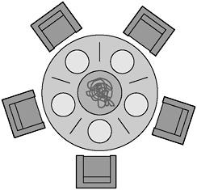

# 13. 동시성(Concurrency)

> 객체는 처리의 추상화다. 스레드는 일정의 추상화다.
>
> James. O. Coplien[^1]

동시성과 깔끔한 코드는 양립하기 매우 힘들다고 합니다. 껍데기는 멀쩡하나 깊숙한 곳에 문제가 있는 다중 스레드 코드도 짜기 쉽기 때문이며, 문제 발생 전까지 원인을 파악하기조처 힘듭니다.

이 챕터를 통해 여러 스레드를 왜 쓰는지, 무엇 때문에 어려운지, 이런 어려움을 대처하고 깨끗한 코드를 짤 것인지, 마지막으로 테스트 방법 및 문제점에 대해 살펴보겠습니다.

간략히 살펴볼 예정입니다. 상세한 내용은 다루기 어렵습니다. 물론 책에서 추가 사항을 살펴보겠지만, 정말 깊숙히 딥다이브 하려면 새 시리즈를 통해 설명해야 할 것입니다...

## 동시성이 필요한 이유?

동시성은 결합(coupling)을 없애는 전략입니다. 이는 '무엇'과 '언제'를 분리하는 전략입니다. 단일 스레드 프로그램은 이 둘이 항상 밀접합니다. 이런 프로그램을 디버깅한다면 breakpoint를 잡고 시스템의 상태를 파악합니다.

동시성이 필요하다면 "무엇"과 "언제"를 분리하는 것이 좋습니다. 시스템 상에 큰 루프 하나가 아니라, 작은 협력 프로그램 여럿을 통해 결과를 내는 것을 생각하면 됩니다. 이렇게 만들어진 시스템은 전체 구조파악 및 문제 분리라는 관점에서 수월해집니다.

`Servelt`이 그 예시입니다. 초기 서블릿은 스레드 풀을 만들고 그 한계에 대해 요청/응답을 처리할 수 있었습니다. [헤드퍼스트 게시글](https://www.oreilly.com/library/view/head-first-servlets/9780596516680/ch04s04.html)을 살펴보시면 이해가 빠를겁니다[^2].

그렇지만 이런 구현을 문제없이 하기란 결코 쉽지 않습니다! 구조적 이점에 비해 구현 난이도가 어렵기 때문입니다. 그럼에도 불구하고, 한번에 여러 작업(사용자 요청이 되었건, 연산이 되었건...)을 처리할 수 있는 시스템은 성능 향상을 이끌어낼 수 있습니다.

### 미신과 오해

동시성은 어렵고, 오해하기 쉬운 것들이 몇가지 있습니다.

- 동시성은 항상 성능을 올린다?
  - 대기시간이 아주 길어 여러 스레드가 프로세서를 공유할 수 있거나
  - 여러 프로세서가 동시에 처리할 독립적 계산이 "충분히" 많아야 성능이 올라갑니다.
- 동시성을 구현해도 설계는 변하지 않는다?
  - "무엇"과 "언제"를 분리하는 것은 시스템 자체가 바뀌는 것을 의미합니다.
- 웹, EJB 컨테이너 등을 쓰면 동시성을 몰라도 된다?
  - 사용하는 프레임워크나 라이브러리의 근간이 어떻게 돌아가는지 알아야합니다. 그래야 동시 수정과 데드락을 어떻게 해결할지 생각할 수 있습니다.

그렇지만 아래와같은 타당한 생각을 할 수 있습니다.

- 동시성은 다소 부하를 유발합니다.
  - 성능 측면에서 부하가 걸립니다.
  - 코드도 더 짜야합니다.
- 동시성은 복잡합니다.
- 동시성 버그는 재현하기 어렵습니다. 그래서 이 버그들을 글리치로 오해할 수도 있습니다.
- 동시성을 구현하려면 설계전략을 다시 생각해봐야 합니다.

## 난관

왜 동시성을 구현하기 어려울까요?

자바 진영에서 두 스레드가 동시에 같은 변수를 다루는 케이스를 살펴봅시다. 두 스레드가 자바 코드 하나를 읽는 "경로" 를 "**잘못**" 내어놓을 수 있습니다. 이 경로는 정말 많습니다. 이를 알기위해선 정확히 JIT 컴파일러가 바이트코드를 다루는 방식과 자바 메모리 모델이 atomic한 연산으로 판단하는 최소 단위를 알아야 합니다[^3].

잘못된 결과를 내어놓는 일부 경로로 인해 답이 달라지는 것이 문제이기 때문입니다. 그렇다면 이러한 문제를 회피하는 방안을 살펴봅시다.

저희 스터디에서는 후에 부록 A 동시성 II 를 함께 보면서 더 다뤄볼 예정입니다. 또한 뮤텍스, 세마포어 및 모니터를 각자 살펴보고 각자 자신이 선택한 언어에서 동시성 프로그래밍을 어떤 원칙으로 구현하였는지 살펴볼 예정입니다. 아래 링크를 통해 살펴보시기를 권장드립니다:

- [부록 A 동시성 II](/404)
- [파이썬에서의 동시성 프로그래밍에 대하여(연재글)](/404)

## 동시성 방어 원칙

### SRP

동시성을 다루는 코드는 최대한 작게 만듭시다! 아래 사항을 고려하여 제작하는 편이 좋습니다.

- 동시성 코드는 독자적인 개발, 변경, 조율 주기가 있습니다.
- 잘못 구현한 동시성 코드는 어디로 튈지 모릅니다.
- 동시성 코드는 독자적 난관이 있습니다. 다른 코드를 짤 때와는 다르며, 훨씬 어렵습니다.

**권장사항**: 동시성 코드는 다른 코드와 분리합시다.

### 따름 정리(Corollary): 자료 범위 제한

critical section을 보호할 필요가 있습니다. 예를들어 자바에서는 `synchronized` 라는 키워드가 있지요.[^4]이런 critical section을 많이 줄이는 것도 필요합니다. 공유 자료를 수정하는 위치가 많아질 수록 다음 가능성도 커집니다:

- 보호할 critical section을 빼먹을 수 있습니다. 이는 공유 자료를 수정하는 모든 코드가 망가지는 원인이 됩니다.
- 모든 critical section이 보호되었는지 확인하느라 노력과 수고를 기울이게 됩니다.
- 버그 찾기가 더 힘들어집니다...

**권장사항**: 자료를 캡슐화하고 공유자료를 최대한 줄입시다.

### Corollary: 자료 사본을 사용하기

가능한 객체 자체를 복사하여 읽기 전용으로 씁시다. 객체를 복사하는 시간과 부하가 걱정된다면 실측해서 비교해봅시다.

### Corollary: 스레드는 독립적으로 구현합시다.

각 스레드가 독자적인 시스템에서 동작하는 것 처럼 처리합시다.

권장사항: 프로그램을 독자적인 스레드로(가능하면 다른 프로세서에서) 구동해도 괜찮도록 자료를 독립적인 단위로 분할합시다.

## 라이브러리를 이해하십시오

자바 5 등의 과거 얘기가 주로 나오지만, 핵심을 짚읍시다.

### Thread-safe 컬렉션 관련

언어별로 스레드 간 공유해도 사용할 수 있는 컬렉션을 사용합시다.

**권장사항**: 언어가 제공하는 클래스를 검토하십시오.

## 실행 모델을 이해하십시오

다중 스레드 애플리케이션을 분류하는 방식은 여러가지 입니다. 기본용어부터 이해해봅시다.

| 용어             | 설명                                                                                                                                                           |
| ---------------- | -------------------------------------------------------------------------------------------------------------------------------------------------------------- |
| Bound Resource   | 다중 스레드 환경에서 사용하는 자원으로, 크기나 숫자가 제한적임. DB 연결, 길이가 일정한 읽기/쓰기 버퍼 등.                                                 |
| Mutual Exclusion | 한 번에 한 스레드만 공유 자료나 공유 자원을 사용할 수 있는 경우.                                                                                               |
| Starvation       | 한 스레드나 여러 스레드가 영원히/오랫동안 자원을 기다리는 경우. 항상 짧은 스레드에만 우선순위를 주면 긴 스레드는 굶어죽는다.                              |
| Deadlock         | 여러 스레드가 서로 끝나기를 기다리는 경우. 이러면 서로 기다리니까 진행이 안된다.                                                                               |
| Livelock         | 락을 거는 단게에서 각 스레드가 서로를 방해하는 경우. _'상대 스레드가 점유중이다'_ 라는 상황을 서로 바라보는 탓에 영원히/오랫동안 대기하는 경우를 의미한다.[^5] |

아래에는 다중 스레드 프로그래밍에서 사용하는 실행 모델을 살펴봅시다[^6].

### 생산자-소비자(Producer-Consumer) 문제

생산자 스레드가 정보를 생성하여 버퍼나 큐에 넣고, 소비자 스레드가 이를 가져와 사용하며, 서로에게 정보 여부를 확인하는 시그널을 주고받는 것이 기본 가정입니다. 잘못하면 생산자, 소비자 모두 진행 가능하지만 동시에 **서로에게서 시그널을 기다릴 가능성이 존재**합니다.

데드락을 어떻게 풀어나갈지 논의하는 문제입니다.

상세한 내용은 [영문 위키백과 글](https://en.wikipedia.org/wiki/Producer%E2%80%93consumer_problem)을 참고하여 주시길 바랍니다.

### 읽기-쓰기(Readers-Writers) 문제

읽기 스레드를 위한 주된 정보원으로 공유 자원을 사용하지만, 쓰기 스레드가 이 공유 자원을 이따금 갱신하는 것이 기본 가정입니다. **처리율(throughput)이 높아지면 Starvation이 생겨** 오래된 정보가 쌓이지만, **갱신을 허용하면 처리율에 영향을 미칩**니다.

쓰기 스레드와 읽기 스레드 양쪽의 균형을 잡는 방안에 대해 논의하는 문제입니다.

상세한 내용은 [영문 위키백과 글](https://en.wikipedia.org/wiki/Readers%E2%80%93writers_problem)을 참고하여 주시길 바랍니다.

### 식사하는 철학자들(Dining Philosophers) 문제

이런 내용입니다. 그림과 함께 살펴보시죠.

> 둥근 식탁에 철학자들이 둘러 앉아서 식사를 하려 합니다.
>
> 각 철학자 왼쪽에는 젓가락이 있고, 식탁 가운데는 큰 스파게티 접시가 있습니다.
>
> 이들은 배가 고프면 젓가락 두 개를 가지고 먹어야 합니다.
>
> 자신의 좌측 또는 우측 철학자가 젓가락을 쓰는 중이라면, 젓가락을 내려놓을 때 까지 기다려야 합니다.

이 문제는 철학자를 스레드로, 포크를 리소스로 생각해보면 됩니다. 프로그램 내에서 여러 프로세스가 리소스를 얻기 위해 경쟁해야 합니다. 주의해서 설계하지 않으면 데드락, 라이브락, throughput 저하, 효율 저하가 생기지요.

상세한 내용은 [영문 위키백과 글](https://en.wikipedia.org/wiki/Dining_philosophers_problem)을 참고하여 주시길 바랍니다.

**권장사항**: 위에서 설명한 기본 알고리즘과 각 해법을 이해합시다.

## 동기화하는 메소드 사이에 존재하는 의존성을 이해합시다

동기화하는 메소드 사이에 의존성이 존재하면 동시성 코드에 찾기 힘든 버그가 생깁니다. 자바는 개별 메소드를 보호하는 `synchronized` 라는 개념이 있습니다. 하지만 공유 클래스 하나에 동기화된 메소드가 여럿이라면 구현이 올바른지 체크해야 합니다. 이는 [부록 A 동시성 II의 "메소드 사이에서 존재하는 의존성을 조심하라"]() 를 참조해주십시오.

**권장사항**: 공유 객체 하나에는 메소드 하나만 사용합시다.

공유 객체 하나에 여러 메소드가 필요한 상황도 생깁니다. 그럴 떄는 아래 세가지 방법을 고려합시다

- 클라이언트에서 잠금
  - 클라이언트에서 첫 번째 메소드를 호출하기 전 서버를 잠급니다.
  - 마지막 메소드를 호출할 때 까지 잠금을 유지합니다.
- 서버에서 잠금
  - 서버에 아래 메소드를 구현합니다:
  - 서버를 잠그고 모든 메소드를 호출한 후 잠금을 해제한다
  - 클라이언트는 상기 메소드를 호출합니다.
- 연결서버(Adapted Server)
  - 잠금을 수행하는 중간단계를 생성합니다.
  - 서버에서 잠금 방식과 유사하지만, 원래 서버를 변경하지 않습니다.

## 동기화하는 부분을 작게 만드십시오

`synchronized` 를 사용하여 락을 설정한 모든 코드 영역은 한 번에 한 스레드만 실행이 가능합니다. 락은 스레드를 지연시키고 부하를 가중하기 때문에 필요한 critical section만을 감싸야 합니다.

## 올바른 종료코드는 구현하기 어렵습니다

깔끔하게 종료하는 코드를 잘 짜기는 어렵습니다. 아래 두 케이스로 살펴봅시다.

1. 부모 스레드가 자식 스레드를 여럿 만들고 모두 끝나는 시그널을 대기한다고 가정합시다. 자식 스레드 하나가 데드락에 걸리면, 부모도 자식도 모두 영원히 대기하겠지요.
2. 부모 스레드가 자식 스레드에게 종료하라는 시그널을 전달했다고 가정합시다. 그런데 두 자식 스레드가 서로 생산자/소비자 관계였고 하필이면 생산자가 먼저 죽어서 소비자가 블록되어서 종료 시그널을 못 받는다면 영원히 대기하겠지요.

그런고로 깔끔하게 종료하는 다중 스레드 코드는 공을들여 올바르게 구현해야 할 것입니다.

**권장사항**: 종료 코드를 개발 초기부터 잘 고민하고 동작하게 초기부터 구현하십시오. 이미 나온 좋은 알고리즘을 검토하여 사용하십시오.

## 스레드 코드 테스트하기

스레드가 하나라면 충분한 테스트로 위험을 낮출 수 있습니다. 하지만 스레드가 두개 이상이면 극도로 복잡해집니다.

**권장사항**: 문제를 노출하는 테스트 케이스를 작성하십시오. 프로그램 설저오가 시스템 설정, 부하를 바꾸어가며 자주 돌리십시오. 테스트가 실패하면 원인을 추적하십시오. '다시 돌려보니 잘 돈다' 라는 이유로 넘어가지 마십시오.

고려할 사항이 아주 많으므로 아래 구체적 지침을 살펴봅시다:

1. [말이 안 되는 실패는 잠정적인 스레드 문제로 취급하십시오](#지침-1)
2. [다중 스레드를 고려하지 않은 순차 코드부터 제대로 돌게 만드십시오](#지침-2)
3. [다중 스레드를 쓰는 코드 부분을 다양한 환경에 쉽게 끼워 넣을 수 있도록 스레드 코드를 구현하십시오](#지침-3)
4. [다중 스레드를 쓰는 코드 부분을 상황에 맞춰 조정할 수 있게 작성하십시오](#지침-4)
5. [프로세서(Processor) 수보다 많은 스레드를 돌려보십시오](#지침-5)
6. [다른 플랫폼에서 돌려보십시오](#지침-6)
7. [코드에 보조 코드(instrument)를 넣어 돌리십시오. 강제로 실패를 일으키게 해보십시오](#지침-7)

### 지침 1

다중 스레드 코드는 진짜 말도 안 되는 오류를 일으킵니다.

이런 일회성 문제를 꼭 캐치해두고, 잠정적인 스레드 문제로 취급하십시오. 이런 문제는 _필연적_ 일테니까요.

**권장사항**: 시스템 실패를 '일회성'으로 치부하지 마십시오.

### 지침 2

스레드 환경 밖에서부터 코드가 제대로 도는지 반드시 확인합시다. 문제가 아닌 것을 하나씩 없애는 것으로도 충분히 도움됩니다. 스레드가 호출하는 POJO 단위부터 테스트 코드로 검증합시다.

**권장사항**: 스레드 환경 밖의 버그와 스레드 환경 안의 버그를 동시에 디버깅하지 마십시오. 먼저 스레드 환경 밖에서 코드를 올바르게 테스트 하십시오.

### 지침 3

다중 스레드를 쓰는 코드를 다양한 설정으로 실행하기 쉽게 구현하십시오.

- 한 스레드로 실행하거나, 여러 스레드로 실행하거나, 실행 중 스레드 수를 바꿔봅니다.
- 스레드 코드를 실제 환경이나 테스트 환경에서 돌려봅니다.
- 테스트 코드를 빨리, 천천히, 다양한 속도로 돌려봅니다.
- 반복 테스트가 가능하도록 테스트 케이스를 작성합니다.

**권장사항**: 다양한 설정에서 실행할 목적으로 다른 환경에 쉽게 끼워넣을 수 있게 코드를 구현하십시오.

### 지침 4

적절한 스레드 갯수는 서비스 별로 모두 다릅니다. 그러므로 그 스레드 갯수를 조율하기 쉽게 코드를 작성하십시오. 프로그램이 도는 도중에 스레드 개수를 변경하는 방법도 고려해보십시오. 더 나아가 프로그램의 처리율/효율에 따라 스스로 스레드 개수를 조율하는 코드가 되면 이상적일 것입니다.

### 지침 5

시스템이 스레드를 swapping할 때도 문제가 일어날 수 있습니다. swapping을 일으키면 프로세서(processor) 수 보다 많은 스레드를 돌립니다. swapping이 잦을 수록 critical section을 빼먹은 코드나 데드락을 일으키는 코드를 찾기 쉬워집니다.

### 지침 6

다중 스레드 코드는 플랫폼에 따라 다르게 구현될 수 있습니다. 코드가 돌아갈 가능성이 있는 플랫폼 모두에서 테스트를 수행하는 것이 바람직합니다.

**권장사항**: 처음부터 그리고 자주 모든 목표 플랫폼에서 코드를 구동하십시오.

### 지침 7

스레드 코드는 진짜 어쩌다가 한 번 문제를 일으킵니다. 간단한 테스트로는 나오지도 않습니다. 이런 코드는 수많은 경로 중 아주 소수만 실패하기 때문입니다.

이런 드문 오류를 자주 일으키려면, 코드 실행순서를 바꿔봅시다. 자바라면 `Object.wait()`, `Object.yield()`, `Object.priority()` 등을 추가하여 코드를 다양한 순서로 실행해봅시다.

(자바기준?) 각 메소드는 스레드가 실행되는 순서에 영향을 미칩니다. 따라서 버그가 드러날 가능성도 높아집니다. 자바라면, [이런 게시글](https://www.baeldung.com/java-testing-multithreaded) 의 라이브러리들을 참고하시는 것도 하나의 방법일 겁니다.

## 정리

- 다중 스레드 코드는 짜기 힘듭니다! 진짜 왜 일어나는지 모르는 버그가 생길 수 있습니다.
- SRP를 준수해서 짭시다. 이 때 스레드를 아는 코드와 스레드를 몰라도 되는 코드를 분리해서, 최대한 작게 만듭시다.
- 잠정적인 원인을 파악합시다. 동시성 오류나 경계 조건으로 인한 문제는 특히나 잡기 어려우니 주의합시다.
- 무심코 쓰는 라이브러리와 동시성 처리를 위한 기본 알고리즘을 이해합시다.
- 락은 필요한 부분에 작게 답시다. 필요하다면 객체 설계를 바꿀 필요가 있습니다.
- 사소한 문제다 싶은 것들도 반드시 기억해두고 테스트해봅시다.
- 보조 코드를 만들고 스레드 순서 까지 _흔들어서_ 테스트를 최대한 많이 해보도록 고민해봅시다.

[^1]: [자바 병행 프로그래밍 디자인 원리와 패턴](https://www.amazon.com/Concurrent-Programming-Java%C2%99-Principles-Pattern/dp/0201310090)의 저자입니다.&nbsp;&nbsp;
[^2]: 문득 `asyncio` 의 이벤트 루프가 생각나서 이런 것도 검색해봤습니다. [이 링크](https://velog.io/@jihoson94/EventLoopModelInSpring)를 읽어보십시오.&nbsp;&nbsp;
[^3]: [이 부분](/404)을 살펴보십시오.&nbsp;&nbsp;
[^4]: 아래 링크들이 도움 되었습니다.  [Java의 동기화 Synchronized 개념 정리#1](https://tourspace.tistory.com/54) [Java의 동기화 Synchronized 개념 정리#2](https://tourspace.tistory.com/55)&nbsp;&nbsp;
[^5]: [이 링크](https://stackoverflow.com/a/8863671) 의 내용이 도움 되었습니다.&nbsp;&nbsp;
[^6]: Tanenbaum의 Modern Operating Systems, Chapter 2 관련 장표가 상당히 도움되었습니다. [참고링크](http://www.ece.sunysb.edu/~yang/333slides-2010/MOS-3e-02-2010.pdf)&nbsp;&nbsp;
