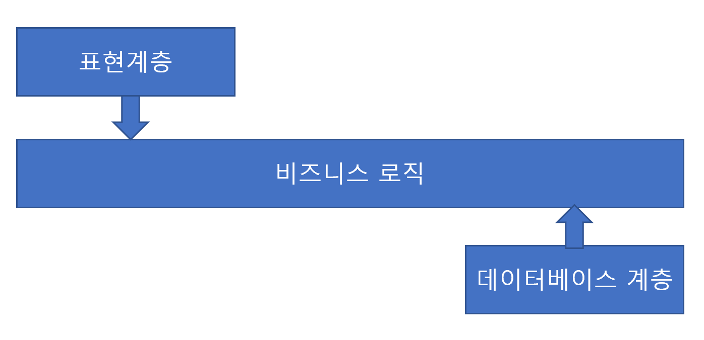
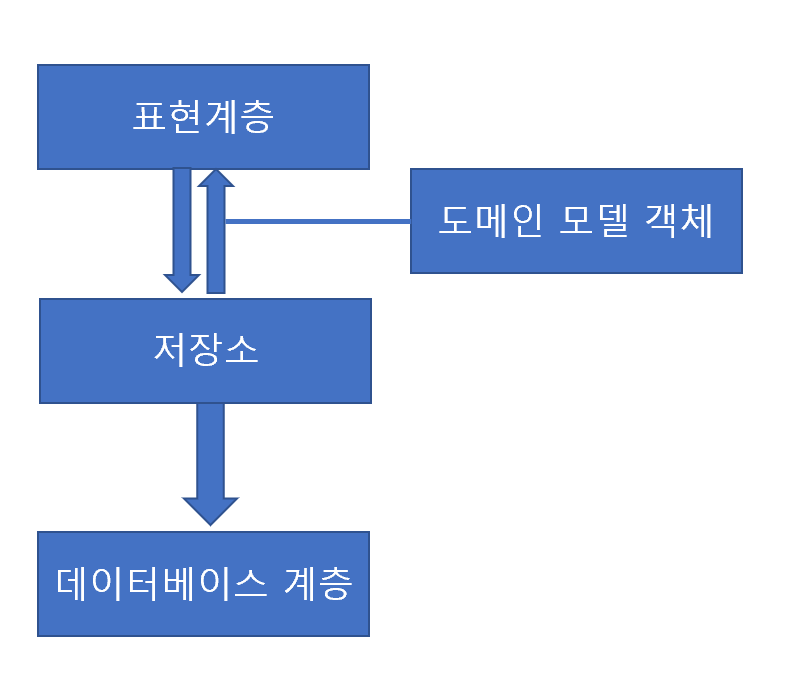

이 내용은 "파이썬으로 살펴보는 아키텍처 패턴" 을 읽고 작성한 내용입니다. 블로그 게시글과, 작성한 코드를 함께 보시면 더욱 좋습니다.

2장은 해당 코드를 살펴봐주세요. [코드 링크](https://github.com/s3ich4n/cosmicpython-study/tree/main/pt1/ch02)

# 2장

Repository Pattern: 데이터 저장소를 추상화

이득

- 모델 계층과 데이터 계층을 분리할 수 있다
- 데이터베이스의 복잡성을 감춰서 시스템을 테스트하기 좋게 만든다

# 2.1. 도메인 모델 영속화

애자일하게 개발할 땐 뭐가 필요하냐? MVP가 빨리 나와야된다. 책에선 e2e 테스트부터 바로 들어간 후 웹 프레임워크에 기능을 넣고 외부로부터 내부 방향으로 테스트를 한다고 한다.

어쨌거나 영속적 저장소가 필요한건 사실이다.

# 2.2. pseudo-code로 뭐 필요한지 보자

```python
from fastapi import FastAPI

from model import OrderLine, allocate

app = FastAPI()

@app.post(
    "/allocate",
    status_code=201,
)
def allocate_endpoint():
    # line = OrderLine(request.params, ...)
    #
    # batches = ...
    #
    # allocate(line, batches)
    return {}
```

대충 이런 코드가 필요하다…

# 2.3. 데이터 접근에 DIP 적용하기

계층을 분리하는게 핵심이다!

그리고 도메인 모델은 **의존성을 단 하나도 두지 않도록** 한다. 사실 `pydantic` 을 쓰는 것도 편해서 그런거지 가능하면 dataclassse를 쓰는 형태로 갖고가는게 맞는 것 같다…

의존성이 비즈니스 로직 즉, 도메인 모델로 들어오도록 하는 방법으로 가도록 한다. 



다시말해, 높은 계층의 도메인이 하부 구조(표현계층이든 DB든)에 의존하면 안 된다 라는 것이다.

# 2.4 책에서의 모델을 DB로 바꾸려면?

“할당” 이라는 개념은 `OrderLine` 과 `Batch` 를 연결하는 개념이다. 이걸 DB화 해보자.

## 2.4.1 일반적인 ORM: ORM에 의존하는 모델

모델 객체를 SQL문으로 매핑해주는 프레임워크를 ORM(Object Relational Mapping)이라 한다. 객체-도메인 모델-데이터베이스 를 이어주는 역할을 하기 때문이다.

ORM은 영속성 무지(Persistence Ignorance)가 가장 중요한 역할을 한다. 데이터를 어떻게 쌓고 어떻게 영속화 하는지는 관심없도록 한다.

Declarative 형식으로 짜면 모델이 ORM에 의존하게 된다고 한다.

이걸 뒤집으려면 스키마를 따로 짜고, 스키마와 도메인 모델을 상호 변환하는 매퍼를 정의할 필요가 있다. 이걸 SQLAlchemy에선 imperative mapping(혹은 classical mapping) 이라고 한다. [참고링크](https://docs.sqlalchemy.org/en/20/orm/mapping_styles.html#imperative-mapping)

> 참고사항

SQLAlchemy 2.0 들어서선 Imperative mapping 방법이 좀 바뀌었다. [해당링크 참고](https://docs.sqlalchemy.org/en/20/orm/mapping_styles.html#imperative-mapping)
`relationship` 기재의 경우 `properties` 라는 kwargs로 넣어주면 된다
> 

## 2.4.2 의존성 역전: 모델에 의존하는 ORM으로 만들기

요는 명시적 매퍼를 정의해서 내가 만든 코드로 테이블을 의존시키는 것이다.

진짜 핵심은 **“도메인”이 다른 하부 구조에 의존하게 않도록** 만드는 것이다.

도메인 모델을 잘 가져가는 것이 객체지향 패러다임을 계속해서 가져갈 수 있도록 하는 힘이다.

# 2.5 저장소 패턴 소개

저장소 패턴(Repository pattern)은 영속적 저장소를 추상화한 것이다.

컴퓨팅 환경에서는 저장공간이 유한하기 때문에 어딘가에 데이터를 넣고 조회하는 것이 너무나 당연하다. 그리고 설령 모든 객체가 메모리 안에 있을 수 있다 하더라도 나중에 다시 찾을 수 있도록 어딘가에 보관해야한다.

## 2.5.1 추상화한 저장소

- `add()`: 원소를 저장소에 저장한다.
- `get()`: 원소를 저장소에서 가져온다.

도메인과 서비스 계층에서 데이터에 접근할 떄는 **저 함수들만을 사용**하도록 하면 결합을 끊을 수 있다. 이 때 가상 저장소는 `ABC`로 만들면 된다.

ABC 대신 덕 타이핑, [PEP 544(프로토콜)](https://peps.python.org/pep-0544/) 도 방안이다.

덕 타이핑은 add(thing), get(id) 메소드를 제공하는 **어떠한 객체**든 다 덕 타이핑을 할 수도 있다.

파이썬 3.8 들어서는 PEP 544를 통해 필요한 값만 골라서 처리할 수 있는 프로토콜이 더 낫다고 생각한다. 자세한 사항은 Fluent Python 11장을 참고하자. [관련 링크1](https://junstar92.tistory.com/356), [관련 링크2](https://blog.doosikbae.com/entry/Fluent-Python-Chapter-11-%EC%9D%B8%ED%84%B0%ED%8E%98%EC%9D%B4%EC%8A%A4-%ED%94%84%EB%A1%9C%ED%86%A0%EC%BD%9C%EC%97%90%EC%84%9C-ABC%EA%B9%8C%EC%A7%80)

## 2.5.2 트레이드오프?

으레 사람들이 이런 말을 한다. 이걸로 얻는 이득과 손해가 뭐지?

지역적으로는 좀더 복잡해지고 지속적으로 유지보수를 해야하지만, 전체적으로는 점차적으로 나아지는 길이다.

DDD를 한번 시작했다면 돌이키기 힘들다. 하지만 각각의 계층을 보다 유지보수 하기 쉬워진다.

저장소 패턴이 추가되면 어떤 그림이 되는지 살펴보자



만들거면 테스트부터 만들어보자.

# 2.6 테스트에 사용하는 가짜 저장소를 쉽게 만드는 방법

파이썬 원형을 만들고 테스트할 때 저걸로 대신 쓰면 된다.

# 2.7 파이썬에서의 포트, 어댑터?

포트와 어댑터는 객체지향에서 나온 단어다. 이 책에선 아래와같이 쓰인다

- 포트
    - 애플리케이션과 추상화하려는 대상 사이의 인터페이스
    - 추상 기반 클래스를 쓴다
    - `AbstractRepository`
- 어댑터
    - 이 인터페이스나 추상화가 뒤에있는 구현이라는 정의를 채택함
    - `SqlAlchemyRepository`, `FakeRepository`

# 2.8 pros and cons

| 장점 | 단점 |
| --- | --- |
| 영속적 저장소와 도메인 모델 사이의 인터페이스를 간단히 유지할 수 있다 | ORM이 어느정도 (모델과 저장소의) 결합을 완화시켜준다. (ORM을 쓰면) 외래키를 바꾸기는 어렵지만, 필요할 때 MySQL과 Postgres를 서로 바꾸기 쉽다 |
| 모델과 인프라 사이의 사항을 완전히 분리한다 → 단위 테스트에 대한 가짜 저장소 생성이 쉽고 저장소 해법을 변경하기도 쉽다 | ORM 매핑을 수동으로 하려면 작업과 코드가 더 필요하다 |
| 영속성 고려 전 도메인 모델을 작성하면 비즈니스 문제에 집중하기 쉽다. 접근 방식을 극적으로 바꾸고 싶을 때 외래키나 마이그레이션 등에 대해 고려하지 않고 모델이 이를 반영할 수 있다. | 간접 계층을 추가하면 유지보수 비용이 증가함을 의미한다. |
| 객체를 테이블에 매핑하는 과정을 원하는 대로 제어할 수 있어서 스키마를 단순히 할 수 있다 |  |

단순 CRUD만 가질거면 도메인 모델이나 저장소를 안써도 된다. 도메인이 복잡할 수록 인프라에 대해 신경쓰지 않을 정도로 투자하면 모델이나 코드를 보다 쉽게 변경할 수 있다. 그게 최고의 장점이다.

# 정리하기

- ORM에 의존성 역전을 적용하자. ORM은 모델을 임포트 해야한다. 반대로 되면 안 된다.
- 저장소 패턴은 영속적 저장소에 대한 단순한 추상화다.

# 번외

## `text` 사용 시...

- [파라미터는 꼭 이렇게 보내자...](https://docs.sqlalchemy.org/en/20/tutorial/dbapi_transactions.html#sending-parameters)
- `Engine` 을 쓰건, `Session` 을 쓰건 이런 식이다.


## 매핑

`sqlalchemy.Table` 로 매핑하나 `sqlalchemy.orm.DeclarativeBase` 로 하나 똑같다

https://docs.sqlalchemy.org/en/20/tutorial/metadata.html#using-orm-declarative-forms-to-define-table-metadata

1. 둘 다 충분히 테이블에 엮이지 않도록 한다. 다만 ORM Declarative로 가면 특정 RDBMS에 대한 지원을 보다 더 낫게 할 수도 있다
2. `mypy` 를 이용한 타입 힌팅을 충분히 가져갈 수 있다
3. persistance / object loading 작동에 필요한 테이블 메타데이터를 한번에 가져와서 쓸 수 있다
    1. SQLAlchemy에 대한 이해도가 높아야겠지만, 쓴다면 당연히 높은 이해도를 제고해야 하는 것이 마땅하다.

어차피 추상 리포지토리를 개별 리포지토리가 상속하고, 개별 리포지토리에서는 접근하고자 하는 RDBMS(SQLAlchemy 예시니까) 별로 다르게 코드가 나온다.
이게 길어지면 모듈로 분리하여 코드를 작성하면 될 일이다.
다른 어댑터나 포트는 다른 개별 리포지토리 형식으로 구현될텐데 말이지.

근데 결국 아는만큼 쓴다고, `Table` 로 매핑하면서 쓰다가 필요할 때 ORM Declarative로 넘어가는게 나을 듯 싶다.

## 모델 - 쿼리 엮기

### 배운 점

- 논리적인 흐름을 DB로 풀어낼 때....
    - VO가 그대로 테이블이 될 수 있다
    - 엔티티 내의 특정 값(`set`값인 `allocations`) 은 `OrderLine` 을 모아두는 논리적인 값이다
        - 이 값이 테이블이 될 수 있다 
    - `allocate()` 함수를 통해 `OrderLine`을 `Batch`에 allocate 할 수도 있다.
        - Java에선 이런 것 하나하나 인터페이스로 처리했어야 했었을 것을 함수 단위로 그냥 선언하고 땡
        - 다만 하나의 모듈(`model.py`) 안에 잘 두고 분리를 잘 해야할 것이다.

### 복습

- 테이블 만들고 `mapper` 로 매핑하는 건 기존 프로젝트들에서 해왔던 것과 유사하다

## 리포지토리

- 안 엮인 쿼리를 짜면 greenlet 에러 뜬다. 쿼리를 엮으면서 동시에 `selectinload` 를 배웠음.
- 쿼리 1 예시
    - N+1 쿼리 방지를 위한 방안 소개
        - `selectinload`[^1] 를 통해 특정 테이블에 대해서만 내보낼 수 있는 SELECT 양식을 사용하여 쿼리함.
        - 내부적으로는 두개의 쿼리를 하고 그 결과물을 처리한다고 보면 됨
    
    ```python
    query = (
        (
            await self.session.execute(
                select(model.Batch)
                # 이 라인 없으면 에러납니다!
                # relationship으로 엮인 테이블을 참조할 방도가 없어요~~~
                .options(selectinload(model.Batch.allocations))
                .filter_by(reference=reference)
            )
        )
        .scalar_one()
    )
    ```

- 쿼리 2 예시
    - 상기 쿼리 1과 마찬가지의 예시임
    ```python
    query = (
        (
            await self.session.scalars(
                select(model.Batch)
                .options(selectinload(model.Batch.allocations))
            )
        )
        .all()
    )
    ```

[^1]: [참고 링크](https://soogoonsoogoonpythonists.github.io/sqlalchemy-for-pythonist/tutorial/7.%20ORM%20%EB%B0%A9%EC%8B%9D%EC%9C%BC%EB%A1%9C%20%EA%B4%80%EB%A0%A8%20%EA%B0%9C%EC%B2%B4%20%EC%9E%91%EC%97%85%ED%95%98%EA%B8%B0.html#select-in-loading-%E1%84%87%E1%85%A1%E1%86%BC%E1%84%89%E1%85%B5%E1%86%A8)
