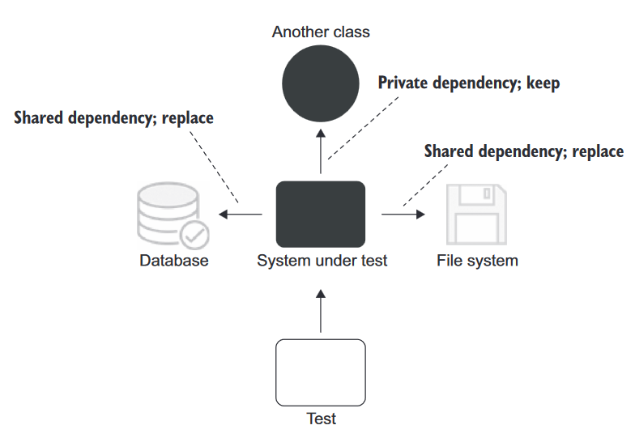
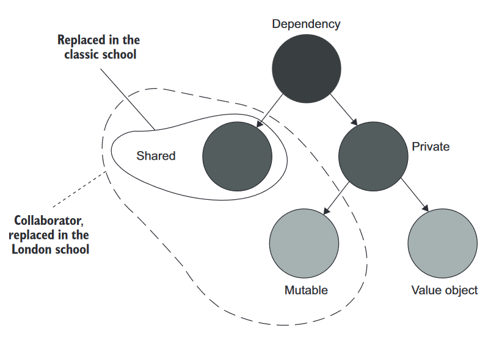
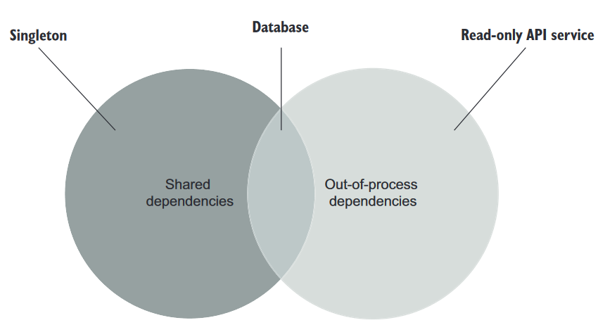

이 내용은 "단위 테스트" 를 읽고 작성한 내용입니다. 블로그 게시글과, 작성한 코드를 함께 보시면 더욱 좋습니다.

2장은 해당 코드를 살펴봐주세요. [코드 링크](https://github.com/s3ich4n/unit-testing-101/tree/main/pt1/ch02)

Chapter 2. 단위 테스트란 무엇인가

> 커맨드로 테스트를 직접 실행하기 위해선 현재 디렉토리로 이동한다.
>   `cd pt1/ch02`

앞으로 꾸준히 나올 단어에 대해:

* 테스트 대상 시스템(SUT, System under Test. 이하 SUT): 코드베이스, 즉 테스트 대상을 의미

---

# 들어가며

단위 테스트를 바라보는 관점은 생각 보다 중요하다. 접근 방법에 따라 고전파(_classical school_)과 런던파(_london school_)로 나뉜다(이걸 얘기하고자 하는 건 아니다. 이렇게 단도직입적으로 풀 문제도 아니다. 좀 더 살펴보면서 차이점을 비교해보자!).

> 🍅 tips
> 
> **단위 테스트의 고전파와 런던파**
> 
> 고전파
> - 단위 테스트와 테스트 주도 개발에 원론적으로 접근하는 방식으로 인해 고전(classic)이라고 부른다
> 
> 런던파?
> - 코드 격리에 대한 부분을 mocking으로 해결하고자 한다. 이런 기조가 런던의 프로그래밍 커뮤니티에서 시작된 탓에 런던파라고 부른다.

# 2.1 '단위 테스트'에 대한 정의

단위 테스트의 중요한 세 가지 속성은 아래와 같다:

- 작은 코드 조각(혹은 단위)을 검증한다
- 빠르게 수행한다
- 격리된 방식으로 처리하는 자동화된 테스트이다

앞서 살펴본 두가지는 논란의 여지가 없다. 작은 코드조각을 검증한다는 것은 말할 것도 없다. 빠르게 구동한다는 것은, 테스트 스위트의 실행시간이 충분하면 테스트는 충분히 빠르다로 이해할 수 있기 때문이다.

'격리'를 어떻게 해석하는지에 따라 두 분파별로 관점이 달라진다( [2.3](#23-고전파와-런던파의-비교) 에서 설명)

## 2.1.1 격리 문제에 대한 런던파의 접근

- 테스트 대상 시스템을 협력자(_collaborator_)로부터 분리하는 것을 의미한다
- 하나의 클래스가 다른 클래스, 여러 클래스에 의존한다면 그 모든 의존성을 테스트 대역(_Test double_, 이하 테스트 더블)로 대체할 수 있어야 한다.
- 동작을 외부 영항과 분리해서 테스트 대상의 클래스에 집중한다.

장점?

- 테스트가 실패하면, 어느 부분에 문제가 있는지 파악하기 쉽다.
- 객체 그래프(_object graph_, 같은 문제를 해결하는 클래스의 통신망)를 분할할 수 있다
    - 클래스의 의존성, 심지어는 순환의존성 등을 빠르게 파악하고 나눌 수 있다
- 의존성을 가진 코드베이스를 테스트하려면 실제 제품에 해당하는 의존성 외에 테스트 목적의 의존성들로 구성해서 대체한다
    - 직접 참조하는 의존성을 테스트 목적의 의존성으로 대체
    - 해당 의존성들이 테스트 목적의 의존성을 참조

### 고전파의 접근방식?

고전파의 접근방식으로 테스트를 짜면 아래와 같다. 여기서는 `Store`, `Customer` 에 대한 내용은 생략했다. 상세한 내용은 `test/` 디렉토리 내의 파일을 참고하길 바란다.

```python
#
# test\test_01_classical_way.py 의 일부분
#
def test_purchase_succeeds_when_enough_inventory():
    # Arrange
    store = Store(Product("Shampoo", 10))
    customer = Customer()

    # Act
    success = customer.purchase(store, Product("Shampoo", 5))

    # Assert
    assert success is True
    assert 5 == store.item.count


def test_purchase_fails_when_not_enough_money():
    # Arrange
    store = Store(Product("Shampoo", 10))
    customer = Customer()

    # Act
    success = customer.purchase(store, Product("Shampoo", 15))

    # Assert
    assert success is False
    assert 10 == store.item.count
```

테스트는 아래 명령으로 구동한다:

> `pytest test\test_01_classical_way.py -v`

```powershell
=============================================== test session starts ===============================================
platform win32 -- Python 3.10.11, pytest-7.4.0, pluggy-1.2.0 -- C:\REDACTED\python.exe
cachedir: .pytest_cache
rootdir: C:\unit_testing\pt1\ch02
plugins: cov-4.1.0
collected 2 items

test/test_01_classical_way.py::test_purchase_succeeds_when_enough_inventory PASSED                           [ 50%] 
test/test_01_classical_way.py::test_purchase_fails_when_not_enough_money PASSED                              [100%] 

================================================ 2 passed in 0.04s ================================================
```

Arrange-Act-Assert 접근 방식은 5장에서 다시 살펴볼 예정이다. 쉽게 말해 아래 과정을 포함한다고 보면 된다.

- 어떤 테스트를 할지 준비(_Arrange_)한다. SUT와 하나의 협력자를 준비한다.
    - 여기서는 `Customer`(SUT), `Store`(협력자) 일 것이다.
    - 협력자가 필요한 이유는 아래와 같다
        - SUT를 사용하려면 `Store` 인스턴스를 아규먼트로 쓰기 때문
        - 검증단계에서 `Customer.purchase()` 의 호출결과로 상점 제품 수량이 감소할 가능성이 있기 때문
- 테스트를 수행한다(_Act_)
- 적절한 결과를 가정한다(_Assert_)

> 🍅 tips
> 
> 테스트 대상 메소드(MUT, Method under test)?
> 
> 테스트 대상 메소드(MUT)는 테스트에서 호출한 SUT의 메소드를 의미한다.
> MUT는 흔히 메소드를, SUT는 클래스 전체를 가리킨다.

이어서 고전파의 스타일대로 짠 코드를 설명한다.

- 테스트는 협력자(`Store` 클래스)를 대체하지 않는다. 운영용 인스턴스를 사용한다.
    - `Customer`, `Store` 둘 다 검증한다.
    - 하지만, `Customer`가 정상작동 해도 `Store` 안에 버그가 있으면 테스트는 실패한다 → 테스트가 서로 격리되어있지 않다

### 런던파의 접근방식?

런던파의 접근방식을 따라가보자. 동일한 테스트에서 `Store` 인스턴스를 테스트 더블(구체적으로는 목으로)로 교체한다. (상세한 내용은 5장으로)

> 목(Mock)
> 
>   SUT와 협력자 간의 상호작용을 검사할 수 있는 특별한 테스트 더블이다.

목은 테스트 더블의 부분집합이다. 테스트 더블에는 많은 접근방법이 있다. 다시말해 아래와 같다

- 테스트 더블은 실행과 관련없이 모든 종류의 가짜 의존성을 설명하는 포괄적인 용어다
- 목은 그러한 의존성의 한 종류다

런던파의 접근방식으로 테스트를 짜면 아래와 같다:

```python
#
# test\test_02_london_school_way.py 의 일부분
#
def test_purchase_succeeds_when_enough_inventory(mocker):
    # Arrange
    mock_store = mocker.MagicMock(spec=Store)
    mock_product = mocker.MagicMock(spec=Product)
    mock_store.has_enough_inventory.return_value = True
    customer = Customer()

    # Act
    success = customer.purchase(mock_store, mock_product)

    # Assert
    assert success is True
    mock_store.sell.assert_called_once_with(mock_product)


def test_purchase_fails_when_not_enough_money(mocker):
    # Arrange
    mock_store = mocker.MagicMock(spec=Store)
    mock_product = mocker.MagicMock(spec=Product)
    mock_store.has_enough_inventory.return_value = False
    customer = Customer()

    # Act
    success = customer.purchase(mock_store, mock_product)

    # Assert
    assert success is False
    mock_store.sell.assert_not_called()

```

테스트는 아래 명령으로 구동한다:

> `pytest test\test_01_london_school_way.py -v`

```powershell
======================================================= test session starts ========================================================
platform win32 -- Python 3.10.11, pytest-7.4.0, pluggy-1.2.0 -- C:\REDACTED\python.exe
cachedir: .pytest_cache
rootdir: C:\unit_testing\pt1\ch02
plugins: cov-4.1.0, mock-3.11.1
collected 2 items

test/test_01_london_school_way.py::test_purchase_succeeds_when_enough_inventory PASSED                                        [ 50%]
test/test_01_london_school_way.py::test_purchase_fails_when_not_enough_money PASSED                                           [100%]

======================================================== 2 passed in 0.02s =========================================================
```

어떤 식으로 다른지 살펴보자:

- 구현이 일부 변경되었다. 직접 상태를 수정하는 구현방식이 아니라 몇가지 더 추가되었다!
    - `has_enough_inventory` 메소드 호출에 어떻게 응답할지 목에 직접 정의한다
    - 이 경우, `test_purchase_succeeds_when_enough_inventory` 테스트에서는 `Store`의 실제 상태와 관련없이 `True`를 리턴하도록 가정한다
    - (추가설명은 8장에) 협력자에서 격리된 테스트 대상 시스템에는 인터페이스가 필요하다
- `Customer` 객체가 호출하였는지 확인하기 위해, `Store` 내의 특정 메소드가 호출되었는지(`assert_called_once_with`) 확인한다
    - `test_purchase_succeeds_when_enough_inventory` 테스트에서는 **한 번만 호출했는지** 살펴본다
    - `test_purchase_fails_when_not_enough_money` 테스트에서는 **한 번도 호출되지 않았음** 을 살펴본다

## 2.1.2 격리 문제에 대한 고전파의 접근

런던 스타일은 테스트 더블(여기서는 목)으로 테스트 대상 조각을 분리해서 격리 요구사항에 다가간다. 이 관점은 각 분파의 코드 조각(단위)에 대한 견해를 보여주기도 한다.

단위 테스트의 속성을 다시 살펴보자:

- 작은 코드 조각(혹은 단위)을 검증한다
- 빠르게 수행한다
- 격리된 방식으로 처리하는 자동화된 테스트이다

그렇다면,

- 코드가 얼마나 *작아야* 되는가?
    - 각각의 모든 클래스를 격리해야 한다면 SUT 코드는 단일 클래스 이거나 해당 클래스 내의 메소드여야 한다(격리 문제에 접근하는 방식 때문에 이보다 더 클 수는 없음)
- 최대한 '한 번에 한 클래스만' 지침을 따라야 한다.

격리 특성을 해석하는 또 하나의 방법을 고전파의 방식으로 살펴보자:

- 테스트는 서로 격리시켜서 실행해야 하는 것은 아니다. 그 대신 단위 테스트는 서로 격리해서 실행해야 한다. 
- 그렇다면 테스트 실행순서가 어떻든 간에(_parallel, sequentially, etc._) 적합한 방식으로 실행할 수 있으며, 서로의 결과에 영향을 미치지 않는다.
- 여러 클래스가 모두 메모리에 올라가있고 공유 상태에 다다르지 않는 한, 여러 클래스를 한번에 테스트 해도 된다. 이를 통해 테스트가 서로 소통하고 실행 컨텍스트에 영향을 줄 수 있다.
- 공유 상태: DB, 파일 시스템, 프로세스 외부 의존성 등을 의미
- 공유 상태의 예시?
    - E.g., 테스트 준비 단계에서 DB 내에 고객 생성을 할 수도 있고, 테스트 실행 전에 다른 테스트의 준비단계에서 고객을 삭제하는 경우
        - 테스트를 병렬실행하면 다른 테스트에 의해 간섭받아 실패하는 케이스가 나오기도 한다

> 공유 의존성, 비공개 의존성, 프로세스 외부 의존성?
>
>   공유 의존성
>   - 테스트 간에 서로 공유되고 서로의 결과에 영향을 미칠 수 있는 수단을 제공하는 의존성
>   - E.g., 정적 가변 필드(_static mutable field_), 데이터베이스
>
>   비공개 의존성
>   - 공유하지 않는 의존성
>
>   프로세스 외부 의존성
>   - 애플리케이션 실행 프로세스 외부에서 실행되는 의존성
>   - 아직 메모리에 없는 데이터에 대한 프록시
>   - 프로세스 외부 의존성은 "대부분" 공유 의존성에 해당된다.
>   - E.g., 데이터베이스(프로세스 외부 의존성 이자 공유 의존성)
>       - 도커 컨테이너로 DB를 실행시키면 테스트가 더 이상 동일 인스턴스로 작동하지 않는다.

격리 문제에 대한 견해는 테스트 더블 사용(목 포함) 그 이상의 견해가 뒤따른다.



- 공유 의존성은 단위 테스트 간에 공유한다(_테스트 대상 클래스가 아님_)
    - 싱글턴 의존성은 각 테스트에서 새 인스턴스를 만들 수만 있으면 됨
    - 제품 코드에는 단 하나의 인스턴스만 있지만, 테스트에서는 달리 쓰인다
    - E.g., 설정 클래스를 사용한다고 했을 때?
        - 실제 코드에서는 단 하나의 인스턴스를 사용한다
        - 테스트 코드 상에서는 그럴 필요는 없다
        - 그러나 새 파일 시스템이나 DB를 만들 수는 없으며, 테스트 간 공유되거나 테스트 더블로 대체되어야 한다

> 공유 의존성, 휘발성 의존성에 대해
>
>  휘발성 의존성은 다음 속성 중 하나를 나타내는 의존성이다.
>   1.
>     - 개발자 머신에 기본 설치된 환경 외에 런타임 환경의 설정, 구성을 요구함
>     - 추가설정이 필요하며, 시스템에 기본적으로 없음
>       - E.g., DB 혹은 API 서비스
>   2.
>     - 비결정적 동작(_non-deterministic behavior_)을 포함함 (때에 따라 다른 결과가 나오기 때문)
>       - E.g., 난수 생성기, "현재" 날짜 및 시간을 리턴하는 클래스
>
> 휘발성 의존성은 공유 의존성과 겹치는 부분이 있다. 아래 사항들의 의존성을 예시로 살펴보자:
> 
>| 테스트 대상  |공유 의존성?|휘발성 의존성?|비고|
>|--------------|------------|--------------|----|
>| 데이터베이스 |     O      |       O      |  . |
>| 파일 시스템  |     O      |       X      |모든 개발자 머신에 설치되고, 대부분 결정적으로 작동함|
>| 난수 생성기  |     X      |       O      |각 테스트에 별도의 인스턴스를 제공할 수 있음| 

공유 의존성을 대체하는 다른 이유: 테스트 실행속도 향상
- 공유 의존성은 실행 프로세스 밖에 있음, 테스트 수행 시간이 길어짐
- 테스트 코드의 속성 2번째―빨리 실행되어야 함을 충족해야함
- 이런 것들이 필요한 테스트는 통합 테스트 영역에서 수행되어야 함

# 2.2 단위 테스트의 런던파와 고전파

두 분파는 격리 특성의 견해 차이로 인해 나누어졌다.

- 런던파: 테스트 대상 시스템에서 협력자를 격리하는 방향을 채택
- 고전파: 단위 테스트 끼리 격리하는 방향을 채택

종합하자면, 아래 세 가지 주요 주제에 대해 의견 차이가 있다.

- 격리 요구사항
- 테스트 대상 코드조각(단위)의 구성요소
- 의존성 처리

표로 정리해보자:

| ＼   |격리 주체|단위의 크기|테스트 더블 사용대상|
|-----|---|---|---|
| 런던파 |단위|단일 클래스|불변 의존성 외의 모든 의존성|
| 고전파 |단위 테스트|단일 클래스 또는 클래스 세트|공유 의존성|

## 2.2.1 고전파와 런던파가 의존성을 다루는 방법

테스트 더블은 어디서든 쓰지만, 런던파는 테스트에서 일부 의존성을 그대로 쓸 수 있도록 하고있다. 불변객체(*immutable objects*)는 굳이 바꾸지 않아도 된다. 런던 스타일의 코드로 살펴보자.

```python
#
# test\test_02_london_school_way.py 의 일부분
#
def test_purchase_succeeds_when_enough_inventory(mocker):
    # Arrange
    mock_store = mocker.MagicMock(spec=Store)
    mock_product = mocker.MagicMock(spec=Product("Shampoo", 5))
    mock_store.has_enough_inventory.return_value = True
    customer = Customer()

    # Act
    success = customer.purchase(mock_store, mock_product)

    # Assert
    assert success is True
    mock_store.sell.assert_called_once_with(mock_product)
```

`Customer`의 두 가지 의존성 중, `Store`만 시간에 따라 변할 수 있는 내부 상태를 포함하고 있고, `Product` 객체는 이뮤터블(여기서는 `namedtuple`)이다. 그래서 여기서는 Store 인스턴스만 바꿔주고, `Product`값은 VO(_Value objects_)로써 그대로 사용한 것이다.

아래 그림은 의존성에 대한 종류를 나타내고, 동시에 단위테스트의 두 분파가 의존성을 어떤식으로 처리하는지 보여준다.
- 비공개 의존성은 변경 가능하거나 불변이다. 불변은 VO라고 부른다
- E.g.,
    - DB: 공유의존성. 내부 상태(테스트 더블로 대체되지 않은 값)는 모든 테스트에서 공유함
    - `Store` 인스턴스: 변경 가능한 비공개 의존성
    - `Product` 인스턴스: 불변인 비공개 의존성(VO의 예시)
- 모든 공유 의존성은 변경 가능하지만, 변경 가능한 의존성을 공유하려면 여러 테스트에서 재사용 되어야 함



- 고전파에서는 공유 의존성을 테스트 더블로 대체한다
- 런던파에서는 변경 가능한 비공개 의존성도 테스트 더블로 교체할 수 있다

> 협력자(Collaborator)와 의존성
>
> 협력자
> - 공유하거나 변경 가능한 의존성이다
> - E.g.,
>     - 데이터베이스 접근 권한을 제공하는 클래스
>     - `Store` 객체

모든 프로세스 외부 의존성이 공유 의존성의 범주에 속하지 않는다.
- 공유 의존성은 거의 항상 프로세스 외부에 있다. 그 반대는 그렇지 않다.
- 프로세스 외부 의존성을 공유하려면 단위 테스트가 서로 통신할 수 있는 수단이 있어야한다.
- 의존성 내부를 수정하면 통신이 이루어진다.
- 프로세스 외부의 불변 의존성은 그런 수단이 없다.
- 테스트는 내부의 어떤 것도 수정할 수없다. 서로의 실행 컨텍스트에 영향을 줄 수 없다.



상기 사항에 대한 예시를 살펴보자.

- E.g., 조직에서 판매하는 모든 제품에 대한 카탈로그를 반환하는 API
    - API는 카탈로그를 변경하는 기능을 노출하지 않는 한 공유 의존성이 아님
    - 테스트가 반환하는 데이터에 영향을 미칠 수 없기 때문 (의존성은 휘발성이고 애플리케이션 경계를 벗어나긴 하지만) 
    - 이런 의존성을 테스트의 범주에 넣을 필요는 없음
    - 대부분 테스트 속도를 올리기 위해서는 테스트 더블로 교체해야함
    - 하지만 프로세스 외부 의존성이 충분히 빠르고 연결이 안정적이면 테스트에서 그대로 써도 됨

# 2.3 고전파와 런던파의 비교

고전파와 런던파의 차이는 단위테스트에서의 격리 문제를 처리하는 방안으로 갈린다. 이는 테스트 단위 처리와 의존성 취급에 대한 방법이라 말할 수 있다.

저자는 목을 사용하는 테스트는 고전적 테스트보다 불안정한 경향이 있다 라는 표현을 사용했다. (5장에서 다시 볼 것) 런던파의 장점을 살펴보자.

- 입자성(_granularity_)이 좋다. 테스트가 세밀해서 한 번에 한 클래스만 확인한다
- 서로 연결된 클래스의 그래프가 커져도 테스트하기 쉽다. 모든 협력자를 테스트 더블로 처리하기 때문.
- 테스트가 실패하면 어떤 기능이 실패했는지 확실히 알 수 있다.
    - 의존성이 거의 대부분 분리되어있기 때문

저자는 상기 세 장점이 가지는 맹점을 비판한다.

## 2.3.1 한 번에 한 클래스만 테스트

런던파는 클래스를 단위로 간주하고, 이로 인해 클래스를 테스트에서 검증할 최소한의 단위로 취급한다.

다만 이러한 관점은 코드의 입자성에 집중하게 되어, 문제 영역에 의미가 있는 것을 검증하는 것을 멀리할 수도 있다.

> 🍅 tips
> 
> 테스트는 코드의 단위를 검증하는 것이 아니라, 동작의 단위(문제영역)를 검증해야 한다.
> 
> 비즈니스 담당자가 유용하다고 인식할 수 있는 것을 검증해야 한다.
> 
> 동작의 단위는 아주 작은 메소드가 될 수도 있고, 한 클래스에만 있을 수도 있고, 심지어는 여러 클래스에 걸쳐있을 수도 있다.

따라서 식별할 수 있는 동작의 주제를 살피고, 내부적인 세부 구현과 어떻게 구별짓는지 살펴본다(5장에서).

## 2.3.2 상호 연결된 클래스의 큰 그래프를 단위 테스트

런던파는 실제 협력자 대신 목을 사용하고, 의존성 그래프가 복잡할 때 테스트 더블을 써서 전체 복잡한 객체 그래프에 대해 잘 대체하고 테스트할 수 있다고 한다.

다만 저자는 클래스 그래프가 커진 것을 설계 문제의 결과로 판단한다. 클래스 그래프를 작게 가지도록 하는 것을 주문한다.

따라서 코드 조각을 테스트 더블 없이 면밀하게 설계할 수 있도록 기본적인 코드 설계를 풀어보는 과정을 살펴본다(2부에서).

## 2.3.3 버그 위치 정확히 찾아내기

런던파 철학을 따르는 테스트 위의 시스템에 버그가 생기면, SUT에 버그가 포함된 테스트만 실패한다. 고전적인 방식을 통해, 테스트할 때는 원하지 않았던 파급효과까지 테스트 할 수 있음을 시사한다. 

다만 저자는 다른 관점으로 본다. 테스트를 정기적으로 수행하여 마지막으로 바꾼 코드 변화가 어떤 테스트 실패를 초래하였는지 볼 수 있다고 한다. 

그리고 테스트 스위트 전체에 걸쳐 계단식으로 실패하는 것 또한 주목할 만한 지표로 판단한다. 고장낸 코드 조각(코드베이스의 본 로직)이 큰 가치가 있는 코드임을 알 수 있다. 이는 시스템이 그 코드에 의존한다는 것을 의미한다.

## 2.3.4 고전파와 런던파 사이의 다른 차이점

고전파와 런던파 사이에는 아래 차이점이 더 존재한다

- TDD를 통한 시스템 설계방식
    - 추가기능에 대한 명세를 테스트로 작성(필히 실패함)
    - 테스트가 통과하는 코드를 작성
    - 리팩토링
- 과도한 명세(_over-specification_) 문제

> 🍅 tips
> 
> TDD(_Test-driven Development_)란?
> 
> 테스트에 의존하여 프로젝트 개발을 추진하는 소프트웨어 개발 프로세스. 아래 세 단계로 구성되며, 각 테스트케이스마다 이를 반복한다:
> 
> 1. 추가할 기능과 작동에 대한 테스트 코드 작성 → 테스트 구동 시 빨간막대 생성
> 2. 테스트를 통과하는 코드베이스를 작성 → 테스트 구동 시 초록막대로 변함
> 3. 코드 리팩토링 → 테스트 구동 시 초록막대를 유지하도록 리팩토링

- TDD 관점차이 - 런던파
    - 하향식 TDD
    - Mock을 사용해 예상 결과를 달성하고자 시스템이 통신해야하는 협력자를 지정
    - 모든 클래스를 구현할 때 까지 클래스 그래프를 다짐
- TDD 관점차이 - 고전파
    - 상향식 TDD
    - 도메인 모델을 시작으로 엔드유저가 소프트웨어를 사용할 수 있을 때 까지 계층을 그 위에 더 둔다 
- over-specification 차이? → 테스트가 SUT의 구현 세부사항에 결합되는 것을 의미
    - 런던파는 고전파보다 테스트가 구현에 더 자주 결합된다
    - 목 사용 남용이 주로 지적된다

# 2.4 두 분파의 통합 테스트

런던파는 실제 협력자 객체를 사용하는 모든 테스트를 통합 테스트로 간주한다.

저자는 본 책에서 단위 테스트와 통합 테스트의 고전적 정의를 사용한다. 고전파의 관점에서 단위 테스트는 아래와 같다:

- 단일 동작 범위를 검증한다
- 빠르게 테스트한다
- 다른 테스트와 별도로 처리한다

통합 테스트는 이런 기준 중 하나를 충족하지 않는 테스트다

E.g., DB 접근 테스트 → 다른 테스트와 분리하여 실행할 수 없다
- 특정 테스트에서 DB 상태 변경을 시키면? 병렬 수행 시 동일 DB에 의존하는 모든 테스트 결과가 달라질 것이다
- 이런 테스트는 수나적으로 실행해서 공유 의존성과 함께 작동하려고 기다릴 수 있다

E.g., 프로세스 외부 의존성이 있는 테스트 → 테스트가 느려진다

- DB 호출은 수백 밀리초가 걸릴 수 있다
- 테스트 스위트가 커지면 커질 수록 체감된다!

E.g., 둘 이상의 동작 범위를 검증할 때의 테스트 → 통합 테스트로 간주된다

E.g., 다른 모듈 이상을 둘 이상 검증할 때의 테스트 → 통합 테스트로 간주된다

종합하면, 통합 테스트는 소프트웨어 품질향상에 기여하는 주요 요소 중 하나다. (3부에서 다시 살펴볼 예정)


## 2.4.1 통합 테스트의 일부인 엔드투엔드 테스트

- 엔드 투 엔드 테스트(end-to-end test, aka. e2e test)는 통합 테스트의 일부이다
- 코드가 프로세스 외부 종속성과 함께 어떻게 작동하는지 검증한다
- 의존성을 더 많이 포함되는 특징이 있다(거의 대다수, 전부의 의존성)
- 가장 비용이 많이 들기 때문에, 모든 단위 테스트와 통합 테스트 통과 후 수행하는 것이 좋다

# Summary

- 단위 테스트의 정의는 아래와 같다
    - 단일 동작 단위를 검증한다
    - 빠르게 수행한다
    - 다른 테스트와 별도로 처리한다
- 단위 테스트는 격리 문제를 주로 논의한다. 이 논쟁으로 인해 고전파와 런던파의 두 분파로 나뉘어졌다. 상호 두 분파는 무엇이 단위 테스트인지, 테스트 대상 시스템의 의존성 처리 방식을 어떻게 정의하느냐에 대한 관점이 다르다.
    - 런던파는 테스트 대상 단위를 서로 분리해야 한다고 한다. 테스트 대상 단위는 코드의 단위, 보통 단일 클래스다. 불변 의존성을 제외한 모든 의존성을 테스트 더블로 대체하길 바란다.
    - 고전파는 단위 테스트를 서로 분리해야 한다고 한다. 테스트 대상 단위는 동작 단위다. 공유 의존성만 테스트 더블로 대체하길 바란다. 공유 의존성은 테스트가 서로 실행 흐름에 영향을 미치는 수단을 제공하는 의존성을 의미한다.
- 런던파는 아래 이점을 제공한다
    - 더 나은 입자성
    - 상호 연결된 큰 그래프에 대한 테스트 용이성
    - 테스트 실패 후 버그를 쉽게 찾을 수 있는 편의성
- (저자 왈) 다만 런던파는 맹점을 가진다
    - 테스트 대상 클래스에 대한 관점: 테스트 코드 단위가 아닌 테스트 동작을 검증해야
    - 코드 조각을 테스트 할 수 없는 맹점: 코드 설계를 다시 검증해야... 테스트 더블을 통한 테스트는 이를 숨길 뿐
    - 테스트 실패 결과의 맹점: 지속적으로 테스트 하면 해결됨. 그렇다면 마지막에 수정한 코드가 버그의 원인임
- 런던파 테스트의 가장 큰 맹점 → 과잉명세(_over-specification_). SUT 세부 구현에 결합된 테스트
- 통합 테스트는 상기 단위 테스트의 요소 셋 중 하나 이상을 만족하지 못하는 테스트를 의미
- 엔드 투 엔드 테스트는 애플리케이션과 함께 작동하는 프로세스 외부 의존성의 거의 대부분(혹은 전부)에 접근함
