이 내용은 "단위 테스트" 를 읽고 작성한 내용입니다. 블로그 게시글과, 작성한 코드를 함께 보시면 더욱 좋습니다.

4장은 해당 코드를 살펴봐주세요. [코드 링크](https://github.com/s3ich4n/unit-testing-101/tree/main/pt2/ch04)

Chapter 4. 좋은 테스트의 4대 요소

> 커맨드로 테스트를 직접 실행하기 위해선 현재 디렉토리로 이동한다.
>   `cd pt2/ch04`

---

# 들어가며

1장에서 살펴본 좋은 단위 테스트 스위트의 특성을 상기시켜보자

- 개발 주기에 통합되어있다. 실제로 사용하는 테스트만 가치있다.
- 코드베이스의 가장 중요한 부분만을 테스트 대상으로 한다. 애플리케이션의 핵심(도메인 모델)을 다른 것과 구별하는 것이 중요하다 (7장 참고)
- 최소한의 유지비로 최대 가치를 끌어낸다. 이를 위해선 아래 두 가지를 할 수 있어야 한다
    - 가치 있는 테스트 _식별_(고가치, 저가치)
    - 가치 있는 테스트 _작성_

이 장은 가치 있는 테스트를 _식별_ 하는 것 부터 알아본다.

# 4.1 좋은 단위 테스트의 4대 요소

좋은 단위 테스트는 아래 네 가지 특성을 가진다:

1. 회귀 방지
2. 리팩토링 내성
3. 빠른 피드백
4. 유지 보수성

이 네 특성을 바탕으로 어떠한 자동화된 테스트(단위 테스트, 통합 테스트, e2e 테스트)든 분석 가능하다.

## 4.1.1 회귀 방지(_Protection against regressions_)

여기서 말하는 회귀는 '소프트웨어 버그'다. 코드 수정 후(신규기능 출시 후) 기능이 의도대로 작동하지 않는 경우다.

버그는 코드베이스가 커지면 커질 수록 잠재적인 버그에 더 많이 노출된다. 따라서 코드보호를 통해 이를 방지해야 한다.

회귀 방지 지표에 대한 테스트 점수가 얼마나 잘 나오는지 평가하려면 아래 사항을 고려한다:

- 테스트 중에 실행되는 코드의 양
- 코드 복잡도
- 코드의 도메인 유의성(_significance_)

실행되는 코드가 많을 수록 테스트에서 회귀가 나타날 가능성이 높다. 물론 이 테스트에 대한 일련의 검증이 있다고 가정할 때, 단순히 코드를 실행시키는 것 만으로는 충분하지 않다. 테스트 수행을 통한 코드베이스의 실행결과도 검증해야 한다.

코드 양 뿐 아니라 복잡도와 도메인 유의성 또한 중요하다. 복잡한 비즈니스 로직이 보일러플레이트 등을 통한 자동생성코드 보다 훨씬 중요하다. 비즈니스에 중요한 기능버그가 가장 큰 피해를 일으키기 때문이다.

반면에 단순한 코드를 검증하는 것은 가치가 거의 없다. attribute 하나를 검증하기 위한 로직은 실수할 여지가 그리 많지 않다.

작성하지 않은 코드(E.g., 라이브러리, 프레임워크, 외부 시스템 등)도 중요하다. 최상의 보호를 위해선 이런 코드 또한 검증이 올바른지 확인한다.

> 🍅 tips
>
>   회귀 방지 지표를 극대화하려면 테스트가 가능한 한 많은 코드를 실행하도록 목표해야한다.

## 4.1.2 리팩토링 내성

좋은 단위 테스트의 두 번째 특성은 리팩토링 내성이다. 이는 '빨간막대'로 바꾸지 않고 기본 애플리케이션 코드를 리팩토링할 수 있는지에 대한 척도다.

> ‼️ 정의
>
> 리팩토링은 식별할 수 있는 동작을 수정하지 않고 기존 코드를 변경하는 것을 의미한다.
>
> 코드의 비기능적 특징을 개선하는 것으로 가독성을 높이고 복잡도를 낮추는 것이 주요 의도다.
>
> E.g., 메소드 명 변경, 코드 조각을 새 클래스로 추출.

예를 들어 이런 상황이 발생했다고 생각해보자.

새 기능 추가, 테스트코드 올패스 후 코드 리팩토링을 하려 한다. 리팩토링을 하니 테스트코드가 말썽이다. 기능은 의도대로 돌아가고 있다. 테스트만 '빨간막대' 로 변했다. 이런 상황을 거짓 양성(_false positive_, 긍정 오류. Type 1 에러라고도 함)이라고 한다.

> 이하 **오탐** 으로 지칭하도록 하겠다.

이는 허위 경보다. 기능은 의도대로 돌지만 테스트가 실패하는 경우다. 이러한 '오탐'은 코드 리팩토링 시 발생한다. 좋은 단위 테스트의 한 가지 특성으로 이름붙이자면 '리팩토링 내성'이라고 일컫는다.

> Q: 거짓 양성, 거짓 음성이 헷갈려요
>
> A: 아래 짤방을 보세요

 [^1]

리팩토링 내성 지표에서 테스트 점수가 얼마나 잘 나오는지 평가하려면 테스트에서 얼마나 많은 '오탐'이 발생했는지 살펴봐야한다. 이는 적을 수록 좋다.

'오탐'을 신경써야 하는 이유는 전체 테스트 스위트에 치명적인 영향을 줄 수 있기 때문이다. 단위 테스트의 목표는 프로젝트 성장을 지속가능하게 하는 것이다. 테스트가 지속 가능한 성장을 하기 위한 메커니즘은 회귀없이 주기적으로 리팩토링하고 새 기능을 추가할 수 있는 것이다. 이로 인한 장점은 아래와 같다:

- 기존 기능이 고장났을 시 테스트로 조기경고를 받아볼 수 있다[^2]
    - 결함 있는 코드를 배포 전 점검가능
    - 프로덕션 환경에서 문제 처리하려면 더 골치아팠을 것
- 코드 변경이 회귀로 이어지지 않을 것이라고 확신할 수 있다
    - 좀더 공격적인 리팩토링을 할 수 있는 추진력이 된다
    - 코드베이스를 보다 깔끔하게 가져갈 수 있다

'오탐'은 두 이점을 모두 방해한다! 이유는 아래와 같다:

- 테스트가 타당한 이유 없이 실패하면, 코드 대응능력과 의지가 희석된다
    - 실패에 익숙해지면 신경을 저절로 쓰지 않게 된다
    - **타당한 실패까지 무시** 하게 된다! 이는 프로덕션 환경에 버그가 살포됨을 의미한다
- '오탐'이 빈번하면 테스트 스위트를 신뢰할 수 없게 된다
    - 믿을 만한 안전망으로 인식하지 않게 된다. _양치기 소년_ 이 되어버린다!
    - 신뢰가 부족해지면 리팩토링을 시도하기 어려워진다

이에 대한 대응은 테스트 스위트를 다시 살펴보고, 안정성을 높이는 것이다. (7장에서 다시 볼 것)

## 4.1.3 무엇이 '오탐'의 원인인가?

테스트에서 발생하는 '오탐'의 수는 테스트 구성방식과 관련되어있다. **테스트와 SUT의 구현 세부 사항이 많이 결합할 수록** '오탐'이 많이 생긴다. 이를 위해선 테스트를 구현 세부 사항에서 분리해야한다.

테스트는 SUT의 최종결과, 즉 동작을 검증하는 것이다. 동작하기 위한 과정을 테스트하는 것이 아니다. 테스트는 최종 사용자(end user)의 관점에서 SUT 검증하고, 최종 사용자에게 의미있는 결과가 나오는지 확인해야한다. (5장에서 다시 볼 것)

테스트를 구성하기에 가장 좋은 방법은 문제 영역을 이야기하는 것이다. 테스트가 실패하면, 해당 애플리케이션 동작과 테스트 시나리오가 분리되는 것을 의미한다. 이런 구조라면 실패는 '시나리오 밖의 동작 시' 발생하며, 이는 문제 파악에 도움이 된다.

예시를 통해 살펴보자. 예시코드를 구동가능한 파이썬 코드로 고치면 아래와 같다. (좋은 코드는 아닙니다!)

```python
class Message:
    header: str
    body: str
    footer: str


class Renderer(Protocol):
    def render(self, msg: Message):
        ...


class HeaderRenderer(Renderer):
    def render(self, msg: Message):
        return f"<h1>{msg.header}</h1>"


class BodyRenderer(Renderer):
    def render(self, msg: Message):
        return f"<b>{msg.body}</b>"


class FooterRenderer(Renderer):
    def render(self, msg: Message):
        return f"<i>{msg.footer}</i>"


class MessageRenderer(Renderer):
    sub_renderers: List[Callable] = [
        HeaderRenderer(),
        BodyRenderer(),
        FooterRenderer(),
    ]

    def render(self, msg: Message):
        # 결과를 계속 받아서 지속적으로 하나의 string에 aggregate
        output = (x.render(msg) for x in self.sub_renderers)
        result = "".join(output)

        return result
```

테스트는 아래 명령으로 구동한다:

> `pytest test\test_01_html_message.py -v`

```powershell
=============================================== test session starts ================================================
platform win32 -- Python 3.10.11, pytest-7.4.0, pluggy-1.2.0 -- C:\python.exe
cachedir: .pytest_cache
rootdir: C:\unit_testing\pt2\ch04
plugins: cov-4.1.0, mock-3.11.1
collected 2 items

test/test_01_html_message.py::test_message_renderer_uses_correct_sub_renderers PASSED                         [ 50%] 
test/test_01_html_message.py::test_rendering_a_message PASSED                                                 [100%] 

================================================ 2 passed in 0.04s =================================================
```

- `test_message_renderer_uses_correct_sub_renderers` 테스트 케이스를 살펴보자

```python
def test_message_renderer_uses_correct_sub_renderers():
    sut = MessageRenderer()

    renderers = sut.sub_renderers

    assert 3 == len(renderers)
    assert isinstance(renderers[0], HeaderRenderer)
    assert isinstance(renderers[1], BodyRenderer)
    assert isinstance(renderers[2], FooterRenderer)
```

`MessageRenderer` 안의 렌더러 갯수가 3개인 것을 확인하고, 헤더-바디-푸터를 파싱하고있다. 하지만, 이 테스트는 실제 `MessageRenderer`의 `render()` 의 **동작** 을 확인하지 않는다. 하위 렌더링 클래스의 구성을 변경해도 HTML 문서가 동일하게 유지될 수는 있으나, 이 테스트는 구현 세부사항과 매우 결합되어있다. 예를 들어, `BodyRenderer`를 `BoldRenderer`로 바꾼다거나, `MessageRenderer`에서 한번에 렌더링을 구현해버리거나 하면 테스트는 **깨진다**.

이런 그림으로 테스트를 수행하고 있음을 알 수 있다. 아래 그림과 함께 정리해보자:

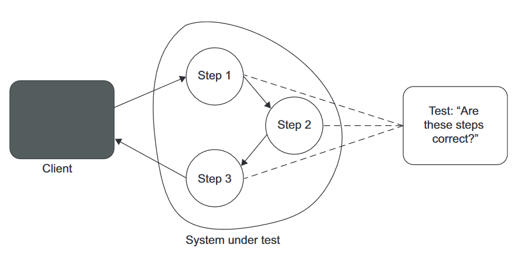

- 리팩토링 과정은 애플리케이션의 식별동작에 영향을 주지 않으면서 구현을 변경하는 것이다
- 상기 예시대로 코드를 바꾸면 이 테스트 케이스는 '빨간막대'로 변한다

즉, SUT의 구현 세부 사항과 결합된 테스트는 리팩토링 내성이 없다. 위에서 살펴본 모든 단점이 보인다:

- 회귀 발생 시 조기 경고를 제공하지 않는다. 대부분 잘못된 것이므로 경고를 무시하게 된다
- 리팩토링에 대한 능력과 의지를 방해한다. 테스트의 방향성을 알 수가 없으므로 버려진 테스트코드가 된다!

깨지기 쉬운 테스트코드를 한번 더 살펴보자.

```python
def test_message_renderer_is_implemented_correctly(whole_code):
    import pathlib
    cwd = pathlib.Path().cwd() / "pt2/ch04/test/test_01_html_message.py"

    with open(cwd, "r", encoding="utf-8") as source_code:
        assert whole_code == source_code.read()
```

이 코드는 테스트코드의 **단 하나라도** 수정하면 실패한다! SUT의 식별동작이 아니라 특정 구현이 동일한지를 고집한다. 구현을 바꿀 때마다 '빨간막대'가 뜬다.

## 4.1.4 구현 세부 사항 대신 최종 결과를 목표로 하기

리팩토링 내성을 높이려면 SUT의 구현 세부 사항과 테스트 간의 결합도를 낮추는 것이다. 이를 위해서 필요한 것이 어떤 것인지 살펴보자:

- `MessageRender`에서 얻는 최종 결과는 메시지의 HTML 표현이다. 클래스에서 얻을 수 있는 관찰 가능한 결과이기 때문에 이를 확인하는 것 또한 마땅하다. 즉, `MessageRenderer`를 블랙박스로 취급하고 식별 가능한 동작에만 신경쓰기로 한 것이다. 관련 테스트 코드는 아래와 같다:

```python
def test_rendering_a_message():
    sut = MessageRenderer()
    message: Message = Message()
    message.header = "h"
    message.body = "b"
    message.footer = "f"

    html = sut.render(message)

    assert "<h1>h</h1><b>b</b><i>f</i>" == html
```

이런 그림으로 테스트를 개선하였음을 알 수 있다. 상기 테스트로 아래 이점을 얻었다:

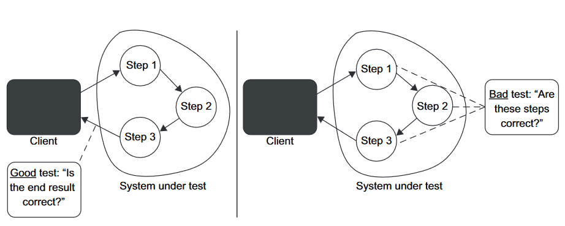

- 최종 사용자에게 의미있는 유일한 결과를 검증했다
- 고객에게 영향을 줄 수 있는 애플리케이션 동작을 점검한다
- (책처럼 C# 혹은 Java, Kotlin을 쓴다할 때) 컴파일이 잘못된다거나 하면 테스트에 '오탐'이 발생할 수 있으나, 이는 훨씬 쉽게 캐치할 수 있는 문제다

# 4.2 첫 번째 특성과 두 번째 특성 간의 본질적인 관계

좋은 단위 테스트의 처음 두 요소(회귀 방지, 리팩토링 내성) 사이에는 본질적인 관계가 있다. 둘 다 정 반대의 관점에서도 테스트 스위트의 정확도에 기여한다. 이 두가지 특성은 시간이 흐르며 프로젝트에 영향을 다르게 미치는 경향이 있다. 프로젝트가 시작된 직후에는 회귀 방지를 훌륭히 갖추는 것이 중요하지만, 리팩토링 내성은 바로 필요하지 않다.

이 절에는 아래 내용을 살펴볼 것이다

- 테스트 정확도 극대화
- '오탐'과 거짓 음성(_false negative_, 부정 오류. Type 2 에러라고도 함. 이하 **미탐** 으로 지칭)의 중요성

## 4.2.1 테스트 정확도 

테스트 결과를 다시 큰 그림으로 보고, 이를 분석해보자:

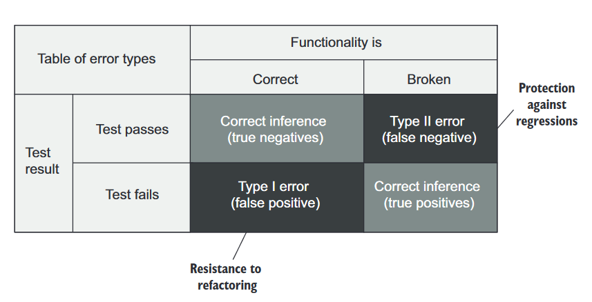

- 버그가 있어서 있다고 하거나(참 양성), 버그가 없어서 없다고 하는 건(참 음성) 지극히 정상이다.
- 테스트에서 의도한 오류가 발생하지 않으면 '미탐' 이다. 회귀 방지가 훌륭한 테스트는 '미탐'을 최소화하는데 도움이 된다.
- 기능은 올바르지만, 테스트에서 실패를 보고하면 '오탐' 이다. 리팩토링 내성이 훌륭한 테스트는 '오탐'을 최소화 하는데 도움이 된다.

결국 테스트의 정확도는 좋은 단위 테스트의 처음 두 특성에 대한 것이다. 회귀 방지와 리팩토링 내성은 테스트 스위트의 정확도를 극대화 하는 것을 목표로 한다. 정확도 지표는 아래 두 가지 요소를 의미한다:

- 테스트가 버그 있음을 얼마나 잘 나타내는가('미탐' 제외)
- 테스트가 버그 없음을 얼마나 잘 나타내는가('오탐' 제외)

'오탐'과 '미탐'을 생각해보는 다른 방법은 소음 대비 신호 비율 측면에서 볼 수 있다. 하기 분모를 줄이거나, 분자를 늘리는 테스트로 개선하는 것을 의미한다.

$테스트 정확도 = \dfrac{신호(발견된 버그 수)}{소음(허위 경보 발생 수)}$

## 4.2.2 '오탐'과 '미탐'의 중요성: 역학관계

단기적으로 '오탐'도 '미탐'만큼 나쁘지 않다. 초기 프로젝트에서는 버그를 프로덕션에 풀지 않는 것이 중요하기 때문이다. 하지만 프로젝트가 성장함에 따라 '오탐'은 테스트 스위트에 점차 큰 영향을 미친다.

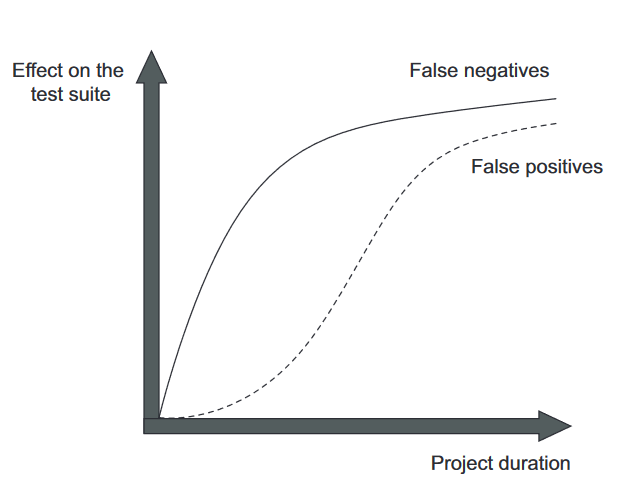

초기에는 '오탐'이 크게 중요하지는 않다. 리팩토링보다는 제품을 내어놓아야 하니까. 초반에는 코드에 대해 리팩토링을 빠르게 할 수 있다. 아직 머릿속에 있으니까. 그렇지만 가면 갈 수록 그 중요성이 점차 중요해진다.

하지만 시간이 지날 수록 코드베이스는 나빠진다. 이 경향을 줄이려면 정기적으로 리팩토링을 해야한다. 그렇지 않으면 그 모든 것이 비용이다.

리팩토링이 점차 필요함에 따라 테스트의 리팩토링 내성도 중요해진다. '오탐'을 말하는 테스트를 계속 둔다면 이른바 _양치기 소년_ 테스트가 된다.

후반까지 가는 프로젝트라면 '오탐', '미탐' 이 두가지에 대해 특히나 신경써야 한다.

# 4.3 세 번째 요소와 네 번째 요소: 빠른 피드백과 유지 보수성

아래 두 내용을 마저 살펴보자:

- 빠른 피드백
- 유지 보수성

빠른 피드백은 단위 테스트의 필수 속성이다. 테스트를 빠르고 자주 돌리면 코드 결함을 빠르게 캐치할 수 있다. 이를 피드백 루프라고 일컫는데, 이것이 줄어들면 버그 수정비용이 상당히 줄어든다.

유지 보수성 지표는 유지비를 평가한다. 이 지표는 아래 두 가지 요소로 구성된다:

- 테스트가 얼마나 이해하기 어려운가?
    - 이 구성요소는 테스트의 크기와 관련있다. 테스트가 짧으면 더 읽기 쉽다. (쓸데없이 코드를 줄이는 경우를 말하는 것이 아니다!)
    - 테스트 코드의 품질 또한 중요하다. 테스트 작성 시에도 절차를 생략하지 말자
- 테스트가 얼마나 실행하기 어려운가?
    - 테스트가 프로세스 외부 종속성으로 작동하면, 외부 의존성을 갖추는 시간 또한 들여야 한다

# 4.4 이상적인 테스트를 찾아서

다시, 좋은 단위 테스트의 4대 특성을 보자.

1. 회귀 방지
2. 리팩토링 내성
3. 빠른 피드백
4. 유지 보수성

이 네 특성을 _곱하면_ 테스트의 가치가 결정된다. 즉, 어떤 특성이라도 `0`이 되면 전체가 `0`이 되어버린다(!)

`가치 추정치 = [0..1] * [0..1] * [0..1] * [0..1]`  

> 🍅 tips
>
>   가치가 있으려면 테스트는 네 가지 범주 모두에서 점수를 내야 한다.

이 수치는 정확히 산정할 수 없다. 이런 것을 할 수 있는 도구 또한 없다. 다만 네 가지 특성과 관련하여 테스트가 어느정도 레벨인지는 비교할 수 있다. 이 평가를 통해 테스트의 가치평가가 가능하고, 테스트 스위트에서 계속 활용할지/말지 를 결정할 수 있다.

테스트 코드를 포함한 모든 코드는 책임(_liability_) 이다. 최소 필수값에 대해 매우 높은 임계치를 정하고, 이 임계치를 충족하는 테스트만 남기자. 매우 가치있는 테스트를 기반으로 쌓아올리자.

이상적인 테스트는 짤 수 있을까?

## 4.4.1 이상적인 테스트를 만들 수 있는가?

아쉽지만 그럴 수 없다. 회귀 방지, 리팩토링 내성, 빠른 피드백은 상호 배타적(_mutually exclusive_)이다. 셋 중 하나는 희생해야 한다. 그렇지만 어느 것 하나라도 `0`점이 되면 안 된다. 두 특성을 최대로 하는 것을 목표하되, 한가지 특성을 희생하는 케이스를 살펴보자.

## 4.4.2 극단적 사례 1: 엔드 투 엔드(e2e) 테스트

e2e 테스트는 최종 사용자의 관점에서 시스템을 살펴본다. UI, DB, 외부 앱을 포함한 모든 시스템 구성을 거친다.

이는 많은 코드를 테스트하므로 회귀 방지를 잘 수행한다. 많은 코드에는 직접 작성한 코드 뿐 아니라 외부 라이브러리, 프레임워크, 서드파티 앱 등 간접적으로 사용하는 모든 코드까지 테스트하게 된다.

'오탐'에도 면역이다. 리팩토링 내성에도 우수하다. 리팩토링을 올바르게 했다면 식별할 수 있는 동작을 변경하지 않으므로 e2e 테스트에도 영향이 없다. 또한 기능이 되는지만을 보기 때문에 특정 구현에 구애받지 않는다.

그러나 너무 느리다. **e2e 테스트에만** 의존하면 피드백이 너무 느릴 수 밖에 없다.

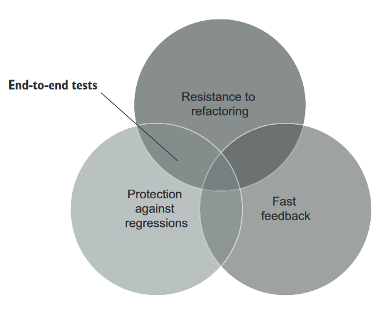

## 4.4.3 극단적 사례 2: 간단한 테스트

너무 간단한 테스트... getter/setter 를 테스트 하는 수준의 코드는 빨리돈다. 피드백도 빠르다. 리팩토링 내성도 우수하다. '오탐'이 생길 여지가 없기 때문이다.

그러나 기반 코드에 실수할 여지가 많지 않기 때문에 간단한 테스트는 회귀를 나타내지 않을 것이다.

이름만 다르고 동일한 테스트를 할 수도 있다. 이런 테스트는 항상 통과하거나 검증이 무의미하므로 제대로된 테스트라 하기 힘들다.

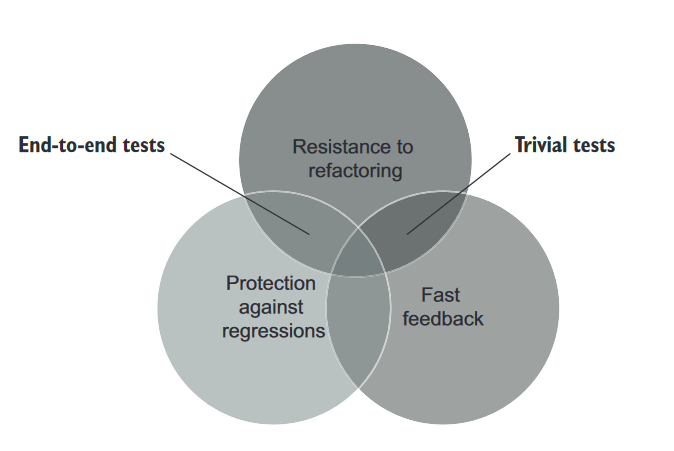

## 4.4.4 극단적 사례 3: 깨지기 쉬운 테스트(_brittle test_)

실행이 빠르고 회귀를 잡을 가능성이 높지만, '오탐'이 많은 테스트도 있다. 이런 테스트를 깨지기 쉬운 테스트라고 한다. 리팩토링을 견디지 못하고, 해당 기능이 고장났는지 여부와 관계없이 '빨간막대'로 바뀐다.

이런 테스트를 생각하면 된다.

```python
class UserRepository:
    last_query: str

    def get_by_id(self, user_id: int):
        ...

    def get_query(self):
        return self.last_query


def test_get_by_id_executes_correct_sql_code():
    sut: UserRepository = UserRepository()

    user = sut.get_by_id(5)

    assert sut.last_query == "SELECT * FROM dbo.User WHERE user_id = 5"
```

빠르게 실행될 수 있고 회귀를 잡을 수도 있겠지만, 리팩토링 내성이 없다. 코드를 잘못짜도 '오탐', ORM으로 만들어지는 쿼리가 조금이라도 다르면 '오탐', 등등. 내부 구현사항에 결합되었기 때문에 이런 결과가 나온다.

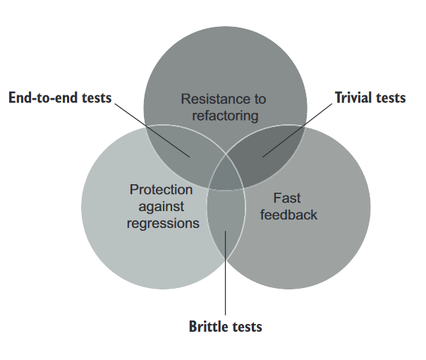

## 4.4.5 이상적인 테스트를 찾아서: 결론

**모두 완벽한 테스트는 없다!** 상기 세 가지 특성은 상호 배타적이다. 그렇다면 어떻게 희생해야할지 살펴보자.

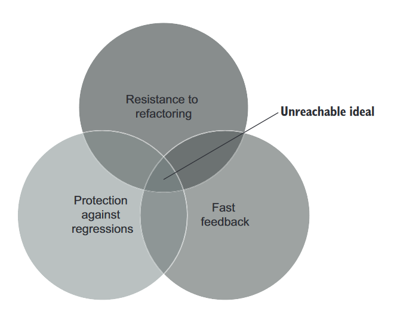

유지보수성은 e2e 테스트를 제외하고는 처음 세 가지 특성과 크게 관련없다.

리팩토링 내성은 최대한 많이 갖는 것을 목표로 해야한다. 이것은 양보하기 어려운 요소기 때문이다. 따라서 테스트가 얼마나 버그를 잘 찾는지(회귀방지)와 얼마나 빠른지(빠른 피드백) 사이의 선택으로 절충안을 정하게 된다.

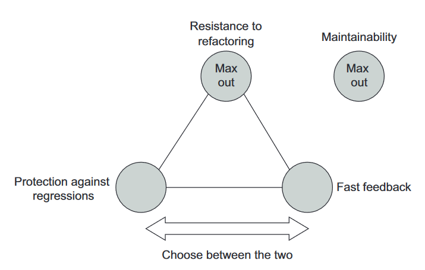

리팩토링 내성은 포기하기 어렵다. 리팩토링 내성은 둘 중 하나를 선택해야한다. 내상이 있거나/없거나 이다. 그렇다면 가져갈 수 밖에 없다.

회귀 방지와 빠른 피드백에 대한 지표는 조절이 가능하다.

> 🍅 tips
>
>   테스트 스위트를 탄탄하게 하려면 테스트의 '오탐'을 제거하는 것이 최우선 과제다.

> ❓ CAP Theorem
>
> 좋은 단위 테스트의 세 특성은 상호배타적이다. 이는 마치 DB의 CAP 이론과 유사하다.
>
> CAP 이론은 분산 데이터 저장소가 아래 세 보증 모두를 동시에 제공할 수 없음을 의미한다
>
>   - 일관성(Consistency): 모든 읽기가 가장 최근의 쓰기 또는 오류를 수신
>   - 가용성(Availability): 모든 요청(시스템 내 전체 노드 중단 제외)이 응답을 수신
>   - 분할 내성(Partition Toleration): 네트워크 분할(네트워크 노드 간 연결 끊어짐)에도 시스템이 계속 작동함
>
> 두 가지 비슷한 점이 있다
>
>   - 셋 중 둘을 선택해야한다.
>   - 대규모 시스템이더라도 분할 내성을 포기할 수는 없다. 대규모 서비스는 분할 내성을 수행하지 않으면 그 많은 데이터를 가지고 있을 수가 없다.
>
> 그렇다면 일관성과 가용성 둘 중 하나를 절충해야한다.
>   - 실시간성이 필요하면 일관성을 선택
>   - 죽지않는 서비스여야 한다면 가용성을 선택

# 4.5 대중적인 테스트 자동화 개념 살펴보기

앞에서 살펴본 좋은 테스트의 특성은 기본적으로 깔고가야 하는 것이다. 기존에 알려진 테스트 자동화 개념은 하기 네 특성으로 거슬러 올라갈 수 있다.

- 테스트 피라미드
- 블랙박스 테스트
- 화이트박스 테스트

## 4.5.1 테스트 피라미드 분해

테스트 피라미드는, 테스트 스위트에서 아래 테스트 유형 간의 일정한 비율을 일컫는 개념이다.

- 단위 테스트
- 통합 테스트
- e2e 테스트

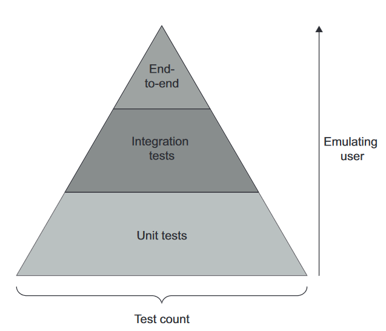

피라미드의 특징은 아래와 같다:

- 각 층의 너비: 테스트 스위트에서 해당 테스트가 얼마나 보편적인지 나타낸다. 넓을 수록 갯수가 많음을 말한다
- 층의 높이: 최종 사용자의 동작을 얼마나 유사하게 흉내내는지를 말한다. e2e 테스트가 가장 위에 있고, 최종 사용자와 유사하게 행동하는지를 나타내는 척도다.
- 피라미드 내 테스트 유형에 따라 빠른 피드백↔회귀 방지 사이에서 선택한다. 상단 테스트는 회귀 방지에 유리하다. 하단은 실행속도를 강조한다.
- 테스트 갯수는 보통 피라미드 형태를 유지한다. e2e는 최소 필수값만, 단위 테스트는 가장 많이.
- 다만 어느 계층도 리팩토링 내성을 포기하지 않는다. 단위 테스트에서도 그래야한다.

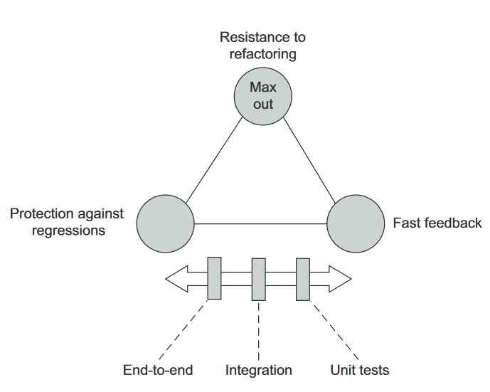

테스트 피라미드에도 예외가 있다. 비즈니스 규칙, 복잡도가 거의 없는 CRUD 작업이면 테스트 '피라미드'는 단위테스트, 통합테스트만 존재하고 e2e 테스트가 없는 직사각형처럼 될 수도 있다.

단위 테스트는 알고리즘이나 비즈니스 복잡도가 없는 환경에서는 유용하지 않으므로 간단한 테스트까지 내려간다. 하지만 통합 테스트는 아무리 단순하더라도 다른 하위의 시스템과 '통합'하여 도는지 확인하는 것이 중요하다. 결국 단위 테스트는 더 적어지고, 통합 테스트가 더 많아질 수 있다[^3].

테스트 피라미드의 또 다른 예외는 프로젝트 외부 의존성(예시: DB) 하나만 연결하는 API다. 이런 경우는 e2e 케이스를 더 많이 두는 것이 이런 애플리케이션에 적합한 옵션일 수 있다. UI도 없으니 유지비도 크지 않다. 이런 환경은 e2e 테스트와 통합테스트가 테스트의 진입점 정도밖에 차이가 없다.

## 4.5.2 블랙박스 테스트와 화이트박스 테스트 간의 선택

또 다른 잘 알려진 테스트는 블랙박스 테스트와 화이트박스 테스트가 있다.

- 블랙박스 테스트
    - 시스템 구조를 몰라도 시스템 기능을 검사할 수 있는 소프트웨어 테스트 방법
    - 명세, 요구사항 중심으로 구축한다("무엇을" 해야하는지 중심으로)
- 화이트박스 테스트
    - 애플리케이션 내부 작업을 검증하는 테스트 방식
    - 소스코드 중심으로 파생된다

두 방법 모두 장단점이 있다. 화이트박스 테스트가 더 철저한 편이다. 
- 소스코드를 집중분석하면, 외부명세(요구사항)에만 의존할 때 놓칠 수 있는 부분을 잡을 수 있다. 그렇지만 구현에 결합되어 있기 때문에 깨지기 쉽다. 다시말해 '오탐'을 많이 내고 리팩토링 내성 지표가 모자라다.
- 비즈니스 담당자에게 의미있는 동작으로 유추할 수 없다

블랙박스 테스트는 정반대의 장단점을 가진다. 아래는 표로 정리한 사항이다.

| ＼ |회귀 방지|리팩토링 내성|
|-----------|---|---|
| 화이트박스 테스트 |좋음|나쁨|
| 블랙박스 테스트  |나쁨|좋음|

그렇지만 리팩토링 내성은 타협할 수 없다. 기본적으로 블랙박스 테스트를 작성하되, 알고리즘 복잡도가 높은 유틸리티 코드를 다루거나 테스트를 분석할 때는 화이트박스 테스트 접근을 수행하라.

# Summary

- 좋은 단위 테스트에는 단위 테스트, 통합 테스트, e2e 테스트 등 자동화된 테스트를 분석하는 데 사용할 수 있는 네 가지 기본 특성이 있다.
    1. 회귀 방지
    2. 리팩토링 내성
    3. 빠른 피드백
    4. 유지 보수성
- 회귀 방지: 테스트가 얼마나 버그(회귀)의 존재를 잘 나타내는지에 대한 척도
- 리팩토링 내성: 테스트가 거짓 양성('오탐')을 내지 않고 애플리케이션 코드 리팩토링을 유지할 수 있는 정도
- 거짓 양성 → 오탐을 의미한다
    - 오탐에 익숙해지면... 테스트를 의미없는 것으로 본다(문제 대응의지력 하락, 테스트 비신뢰)
- 거짓 양성은 테스트 대상 시스템과 테스트 코드가 강하게 결합되어있음을 의미한다. 결합도를 낮추려면 SUT의 "단계"가 아니라 "결과"를 검증하라
- 회귀 방지와 리팩토링 내성은 테스트 정확도에 기여한다. 테스트는......
    - 가능한 한(리팩토링 내성)
    - 적은 소음('거짓 양성')으로
    - 강한 신호(버그 탐지... 회귀 방지 영역)
    - ...를 발생시킨다
- 거짓 양성은 프로젝트가 성장할 수록 점점 더 중요해진다
- 빠른 피드백은 테스트가 얼마나 빨리 실행되는지에 대한 척도다
- 유지 보수성은 두 가지 요소로 구성된다
    - 테스트 이해 난이도: 테스트가 작으면 읽기 쉬움
    - 테스트 실행 난이도: 테스트가 엮인 의존성(프로세스 외부 의존성)이 적으면 쉽게 운영할 수 있음
- 테스트의 가치 추정치는 상기 네 가지 특성에서 얻은 점수의 곱이다. 모두 중요하다! (하나라도 `0`이 되면 가치없어짐)
- 회귀 방지, 리팩토링 내성, 빠른 피드백은 상호 배타적(_mutually exclusive_)이다
    - 리팩토링 내성은 양보할 수 없는 가치다
    - 회귀 방지와 빠른 피드백 사이에서 절충안을 찾는다
- 테스트 피라미드는 단위 테스트, 통합 테스트, e2e 테스트의 적정 비율을 의미한다
    - 단위 테스트 > 통합 테스트 > e2e 테스트 순으로 갯수가 많다
    - e2e 테스트는 회귀 방지를 선호한다
    - 단위 테스트는 빠른 피드백을 선호한다
- 테스트를 작성할 때는 블랙박스 테스트 방법을 사용한다. 테스트 분석 시에는 화이트박스 테스트 방법을 사용한다.

[^1]: 출처: https://twitter.com/bikutoru/status/981977290430189569
[^2]: 버그 없는 시스템은 없다. 최소한 이 의견에 동의한다. True Negative 영역 어딘가에 존재할 '수도 있다'. [관련 내용에 대한 원본 링크](https://johngrib.github.io/wiki/Lubarsky-s-Law-of-Cybernetic-Entomology/)
[^3]: 코스믹 파이썬에서 시사하는 [high gear, low gear](https://www.cosmicpython.com/book/chapter_05_high_gear_low_gear.html)가 연관있을지 살펴보자.
