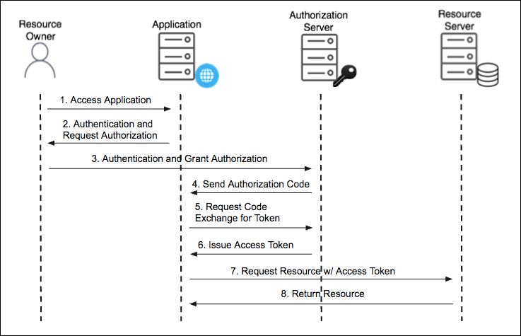
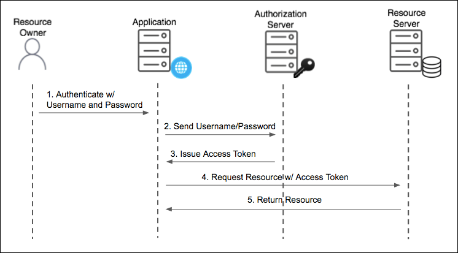
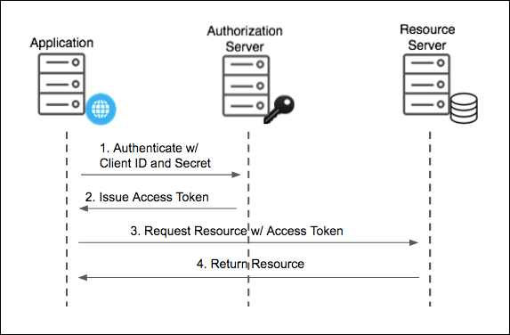

# OAuth 2.0이란?

유저에게 자신, 타인의 리소스에 접근할 수 있는 **권한을 토큰으로 부여** 하는 프로토콜([RFC 6749](https://tools.ietf.org/html/rfc6749))입니다.

## OAuth 2.0의 특징

OAuth 2.0은 인증 성공시 제한된 권한을 가진 **Access Token**과, 이를 갱신하는 **Refresh Token**을 동시에 발급받습니다. 이를 통해 유저별로 다양한 서비스에 대해 필요한 권한을 부여할 수 있습니다.

이처럼 권한을 부여하는 것이 **OAuth 2.0의 핵심** 입니다.

## OAuth 2.0의 주요 용어

OAuth 2.0의 토큰은 다음과 같습니다.

- `Access token`

  - OAuth 2.0에서 보호된 리소스에 접근하기 위해 필요한 토큰입니다. 주로 JWT를 이용합니다.
  - `Access Token` 만료시 `Refresh Token`으로 갱신합니다.

- `Refresh token`
  - 유효기간이 지나 만료된 `Access token` 을 갱신하기 위한 토큰입니다.
  - 갱신될 수 없으며, 유효기간이 만료되면 재로그인을 수행해야 합니다.

OAuth 2.0을 구성하고 있는 주요 4가지 객체(Roles)는 다음과 같습니다.

- ### Resource owner

  - 일반 사용자. 각자의 계정을 가지고 있습니다.
  - 계정은 정보에 접근할 수 있는 범위(scope)가 있습니다.
    - 이를 통해, 어떤 행동을 할지에 대한 권한을 부여할 수 있습니다.
    - read, write 뿐 아니라 다른 권한또한 비즈니스에 맞게 추가할 수 있습니다.

- ### Client

  - `Resource owner`가 리소스에 접근하는 유저를 의미합니다.

- ### Resource server

  - 일반 사용자(Resouce owner)의 정보에 접근할 수 있는 API 서버입니다.
  - Access token을 사용하여 요청을 수신할 때, 권한을 검증한 후 적절한 결과를 응답합니다.

- ### Authorization server
  - `Resource owner`를 인증한 후, Client에 대해 적절한 권한을 부여하는 API 서버. `Access token`, `Refresh token`를 발급합니다
    - `Access token`에는 각종 권한과 유효기간 등 주요정보가 들어가있습니다.

# OAuth 2.0의 작동방식

OAuth 2.0의 전체 프로토콜의 가장 기본적인 Flow는 다음과 같습니다.

```
     +--------+                               +---------------+
     |        |--(A)- Authorization Request ->|   Resource    |
     |        |                               |     Owner     |
     |        |<-(B)-- Authorization Grant ---|               |
     |        |                               +---------------+
     |        |
     |        |                               +---------------+
     |        |--(C)-- Authorization Grant -->| Authorization |
     | Client |                               |     Server    |
     |        |<-(D)----- Access Token -------|               |
     |        |                               +---------------+
     |        |
     |        |                               +---------------+
     |        |--(E)----- Access Token ------>|    Resource   |
     |        |                               |     Server    |
     |        |<-(F)--- Protected Resource ---|               |
     +--------+                               +---------------+

                     Figure 1: Abstract Protocol Flow
```

(A): 클라이언트는 인가를 resource owner에 요청합니다. 인증요청은 resource owner에 직접적으로 요청되거나, authorization server를 중간에 거쳐서 수행합니다.
(B): Resource owner는 Client에게 인증허가를 수행합니다. 인증허가 방법은 총 4가지가 있습니다.

- Authorization Code

  - 클라이언트가 resource owner에게 권한부여를 요청하는 대신, resource owner가 authorization server에서 인증을 받고 권한을 허가합니다.
  - owner가 권한을 허가하면 authorization code가 발급되고 이를 클라이언트에 전달합니다.
  - 클라이언트는 authorization code를 authorization server에 코드를 보내며 권한허가 사실을 알리고 access token을 받습니다.
  - 해당 프로토콜의 다이어그램은 다음과 같습니다:
    

- Implicit

  - Authorization code 방식에서 마지막의 코드 관련 통신을 뺀것입니다.
  - 간소회된 인증 방식이나 보안성이 낮아집니다. 주의해야 할 부분의 링크는 [여기를 참고](https://tools.ietf.org/html/rfc6749#section-10.16)해주세요.

- Resource Owner Password Credentials

  - 계정 인증정보(ID/PW) 같은 정보가 access token을 얻기 위한 authorizaion grant로 쓰입니다. access token을 얻으면 리소스 요청을 위해 ID/PW를 클라이언트가 보관할 필요는 없습니다.
  - 해당 프로토콜의 다이어그램은 다음과 같습니다:
    

- Client Credentials

  - 자원 소유자가 유저가 아니고 클라이언트면 사용하는 방식.
  - client가 관리하는 리소스에 접근하는 경우로 권한이 한정되어있을 때 씁니다. 클라이언트 각각이 resource owner가 될 수 있습니다.
  - 해당 프로토콜의 다이어그램은 다음과 같습니다:
    

(C): 권한부여를 받은 클라이언트는 access token을 authorization server 에 요청합니다.
(D): authorization server는 권한부여가 올바른지 유효성을 검증하고, 유효하다면 access token을 발급한 후 클라이언트에 결과를 보냅니다.
(E): 발급받은 access token으로 client는 resource server에 리소스를 요청합니다.
(F): resource server는 access token의 유효성을 점검 후 필요한 리소스를 줍니다.

# 마무리

이번 글을 통해, 아래 내용들을 살펴볼 수 있었습니다:

1. 

읽어주셔서 감사합니다.

---

- References
  - ..
