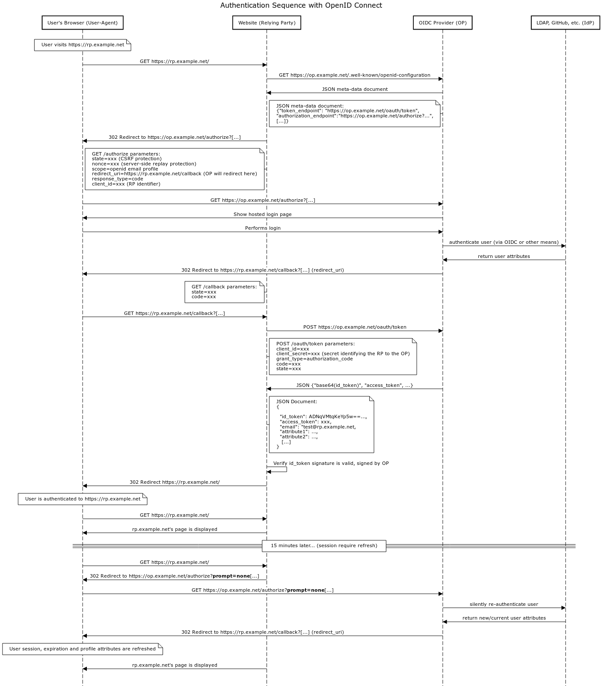

# 연재 안내

- [인가를 다시 살펴보다 (1)](/devlog/backend/2022-10-16-considering-authn-and-authz-revisited-pt01)
- 인가를 다시 살펴보다 (2)

# 들어가며

OAuth 2.0 스펙에 대해 알아보았으니, 흔히 잘못 사용되는 _OAuth 2.0을 인증으로 사용하기_ 의 오개념을 바로잡고, 이를 보완하기 위해 등장한 OpenID Connect를 살펴봅니다. 이는 OAuth 2.0 스펙에 **인증**을 추가한 프로토콜이며, 어떤 식의 개념을 알아야 올바르게 사용할 수 있는지 확인해봅시다.

# OpenID Connect(이하 OIDC)란?

OpenID Connect 1.0은 OAuth 2.0[RFC6749] 프로토콜 위에 있는 간단한 ID 계층입니다. 이를 통해 클라이언트는 권한 부여 서버에서 수행한 인증을 기반으로 최종 사용자의 신원을 확인할 수 있을 뿐만 아니라 상호 운용 가능한 REST 방식으로 최종 사용자에 대한 기본 프로필 정보를 얻을 수 있습니다.

다시말해, OAuth 2.0은 상황에 맞는 **권한 부여**에 적합한 프로토콜이며 여기에 인증 레이어를 추가한 기술로 이해하면 될 것입니다.

## OIDC의 등장배경

OAuth 2.0을 **인증** 프로토콜로 **잘못 사용**하는 케이스가 많았고, 이를 Pseudo-Authentication 이라고 부릅니다.

페이스북, 트위터로 로그인하기 기능을 구현하는 API들을 보면, Access token을 바로 사용하여 Resource owner(페이스북, 트위터 등)로부터 값을 가져옵니다.

이러한 방식은 문제가 있습니다. 사항은 아래와 같습니다:

1. 유저 정보를 직접적으로 가져오는 API는 OAuth 2.0 표준에 존재하지 않습니다. OAuth 2.0은 처음부터 **권한 부여** 프로토콜로 설계되었기 때문입니다.
1. **인증**을 고려할 때는 "누가", "언제", "어떻게" 유저 자신임을 증명하는 것이기 때문에, 단순히 Access token만을 가지고 **인증** 하는 것은 옳지 않습니다.

이러한 문제를 해결하기 위해 OIDC가 등장하였고, 후술할 `id_token` 이라는 값을 인증으로 사용할 수 있습니다.

## 용어소개

작성되지 않은 용어는 [해당 링크](https://openid.net/specs/openid-connect-core-1_0.html#Terminology)를 참고해주시기 바랍니다.

- Access Token
  - OAuth 2.0의 액세스 토큰을 의미합니다.
- Authentication
  - 엔터티와 제시된 아이덴티티 간의 바인딩에서 충분한 신뢰를 얻기 위해 사용되는 프로세스입니다.
- End-User
  - 서비스를 이용하는 **사람**을 의미합니다.
- OpenID Connect Provider (OP)
  - 인증, 인가 모두를 연관있는 Relying parties (RPs)에 제공합니다.
  - 이는 OIDC Provider(OP)일 수도 있고, 타 인증 제공처(IdP, Identity Provider. E.g., 외부 LDAP, WS-Federation, 등등)일 수도 있습니다.
- Relying Party(RP)
  - OpenID Provider로부터 받아온 End-User 인증과 클레임을 요구하는 OAuth 2.0 클라이언트 앱을 의미합니다.
- UserInfo Endpoint
  - 클라이언트가 액세스 토큰을 제공할 때 해당 권한 부여(Authorization Grant)가 나타내는 최종 사용자에 대한 권한 있는 정보를 반환하는 API 입니다.
  - 권한에 따라 보호받는 리소스값을 줍니다.
  - 이 엔드포인트는 `https` 로 서비스 해야합니다.
  - 포트, 경로, 쿼리 파라미터 컴포넌트는 포함될 수 있습니다.

## 대략적인 워크플로우 설명

```
+--------+                                   +--------+
|        |                                   |        |
|        |---------(1) AuthN Request-------->|        |
|        |                                   |        |
|        |  +--------+                       |        |
|        |  |        |                       |        |
|        |  |  End-  |<--(2) AuthN & AuthZ-->|        |
|        |  |  User  |                       |        |
|   RP   |  |        |                       |   OP   |
|        |  +--------+                       |        |
|        |                                   |        |
|        |<--------(3) AuthN Response--------|        |
|        |                                   |        |
|        |---------(4) UserInfo Request----->|        |
|        |                                   |        |
|        |<--------(5) UserInfo Response-----|        |
|        |                                   |        |
+--------+                                   +--------+
```

1. RP(클라이언트)가 OP(OpenID Provider)에 인증 요청을 보냅니다.
1. OP가 (IdP 혹은 자기자신을 통해) End-User을 **인증** 하고, 적당한 **권한**을 부여합니다.
   1. OP는 ID Token과 Access Token을 RP에 응답합니다.
   1. 이때 ID Token[1]은 JWT를 사용합니다.
1. RP는 Access Token을 가지고 UserInfo Endpoint에 요청합니다.
1. UserInfo Endpoint는 그 End-User에 대한 Claim을 리턴합니다.

### 설명을 풀어서 이해해봅시다!

그렇다면 상기 내용을 모질라에서 제공하는 OIDC 다이어그램으로 다시 살펴봅시다.


OIDC는 웹 애플리케이션(여기선 RP를 의미)이 OIDC Provider (OP)로부터 유저 정보를 **인증** 하는 기능을 제공하는 프로토콜 입니다. RP가 브라우저에 OP의 인증을 입력하는 로그인 폼을 제공하면`(1)`, OP는 인증을 수행하고`(2)` 성공시 유저 정보를 타 인증 제공처(IdP, Identity Provider)로부터 정보를 가지고옵니다`(3)`. 참고로 IdP는 유저의 인증정보와 유저 정보를 가지고 있는 데이터베이스를 의미합니다.

OP와의 통신은 토큰을 사용하여 수행됩니다. ID token이란 값이 RP에 주어지는데, 이는 OP로부터 **인증**을 완료하면 제공받습니다. 이 값은 JSON 으로 받으며 이 데이터 안에는 어떻게, 언제 인증을 완료하였는지와 필요한 어트리뷰트들, 그리고 인증의 만료기간은 언제까지인지 하는 정보들이 담겨있습니다. 이 토큰 또한 RP를 통해 갱신이 가능합니다. 이를 통해 유저와 각종 어트리뷰트들이 최신이자 유효한 값임을 확인시켜 줍니다.

예를 들자면, ID token의 어트리뷰트 중 `audience`를 가지고 유효한 클라이언트에서 온 값인지 확인할 수도 있으며, ID token 내에 담긴 어트리뷰트를 통해서도 관련 정보를 확인할 수 있겠습니다.

다른 Access token이나 Refresh token은 OAuth 2.0에서 쓰던 방식과 동일하게 사용하면 됩니다. OIDC는 OAuth 2.0 스펙에 인증을 추가하기 위한 기능이기 때문입니다.

# OIDC 인증 과정

- 개요

  - OIDC는 인증을 수행하여 최종 사용자에 로그인하거나 최종 사용자가 이미 로그인했는지 확인합니다.
  - OIDC는 서버에 의해 연산한 인증 결과를 클라이언트에게 보안규칙을 지켜서, 클라이언트가 이를 사용할 수 있도록 보냅니다.
  - 이런 이유로 클라이언트는 Relying Party(RP)를 호출합니다.

- 인증 결과

  - 인증 결과로는 ID Token을 리턴합니다. ID Token엔 아래 클레임들이 포함됩니다
    - Issuer(식별자 발행인)
    - Subject Identifier(개인 고유식별값)
    - Authentication expires(토큰 만료기간)
    - 등등, REQUIRED 값들과 OPTIONAL 값들

- 인증 플로우

  - 아래 인증 플로우를 따릅니다
    - Authorization Code Flow(`response_type=code`)
    - Implicit Flow(`response_type=id_token token` 혹은 `response_type=id_token`)
    - Hybrid Flow([OAuth 형식의 응답값](https://openid.net/specs/oauth-v2-multiple-response-types-1_0.html)

## 인증 과정의 플로우

상세 요구사항까지는 들여다보지 않겠습니다. 다만 이 글은 이런 플로우로 흐름을 살펴보고자 합니다.

OIDC의 다양한 플로우에 대한 상세한 설명은 [이 링크](https://darutk.medium.com/diagrams-of-all-the-openid-connect-flows-6968e3990660)를 참고하시면 상당히 도움이 됩니다.

### Authorization Code Flow

1. 클라이언트는 인증 Request를 원하는 리퀘스트 파라미터에 담아 보낼 준비를 합니다.
1. 클라이언트가 **인가 서버**에 요청을 보냅니다.
1. 인가 서버가 엔드유저를 인증합니다.
1. 인가 서버는 엔드유저의 Consent와 인가를 획득합니다.
1. 인가 서버는 인증 코드와 함께 엔드유저를 클라이언트로 다시 보냅니다.
1. 클라이언트는 인가 코드를 사용하여 토큰 엔드포인트에 응답을 요청합니다.
1. 클라이언트는 응답 바디값에 ID 토큰과 액세스 토큰이 담긴 응답을 받습니다.
1. 클라이언트는 ID 토큰을 검증하고, 엔드 유저의 Subject Identifier를 획득합니다.

### Implicit Flow

1. 클라이언트는 인증 Request를 원하는 리퀘스트 파라미터에 담아 보낼 준비를 합니다.
1. 클라이언트가 **인가 서버**에 요청을 보냅니다.
1. 인가 서버가 엔드유저를 인증합니다.
1. 인가 서버는 엔드유저의 Consent와 인가를 획득합니다.
1. 인가 서버는, ID 토큰과 요청 시 액세스 토큰과 함께 엔드유저를 클라이언트로 다시 보냅니다.
1. 클라이언트는 ID 토큰을 검증하고, 엔드 유저의 Subject Identifier를 획득합니다.

### Hybrid Flow

1. 클라이언트는 인증 Request를 원하는 리퀘스트 파라미터에 담아 보낼 준비를 합니다.
1. 클라이언트가 **인가 서버**에 요청을 보냅니다.
1. 인가 서버가 엔드유저를 인증합니다.
1. 인가 서버는 엔드유저의 Consent와 인가를 획득합니다.
1. 인가 서버는 인증 코드와, 응답 타입에 따라 하나 이상의 추가 파라미터를 담고 함께 엔드유저를 클라이언트로 다시 보냅니다.
1. 클라이언트는 인가 코드를 사용하여 토큰 엔드포인트에 응답을 요청합니다.
1. 클라이언트는 응답 바디값에 ID 토큰과 액세스 토큰이 담긴 응답을 받습니다.
1. 클라이언트는 ID 토큰을 검증하고, 엔드 유저의 Subject Identifier를 획득합니다.

# OIDC 시퀀스 다이어그램 살펴보기

마찬가지로, 모질라 재단에서 작성한 도식을 보고 이해해봅시다. 이해하기 위해, 상단에 먼저 작성한 [대략적인 워크플로우 설명](#대략적인-워크플로우-설명)을 활용해봅시다.



1. **(추가됨)** 인증 전 단계입니다.
   1. End-User가 브라우저를 통해 RP에 접속합니다. RP는 OP의 `.well-known/openid-configuration` 을 호출합니다.
   1. JSON 데이터를 받습니다. 이때 OIDC 프로토콜에 사용되는 엔드포인트의 메타데이터를 받습니다([이 링크](https://zetawiki.com/wiki/OpenID_%EB%94%94%EC%8A%A4%EC%BB%A4%EB%B2%84%EB%A6%AC_%EC%97%94%EB%93%9C%ED%8F%AC%EC%9D%B8%ED%8A%B8_/.well-known/openid-configuration)를 참고해주세요).
      1. 이를테면, `token_endpoint`, `authorizaion_endpoint` 등을 받습니다.
   1. OP의 `authorize` 엔드포인트로 리디렉션을 수행합니다.
      1. 이 때 보안 취약점을 방지하기 위한 값들과 `redirect_url` 값과 `response_code`, 그리고 클라이언트 고유 식별값 등을 제공받고, End-User의 브라우저는 이를 리디렉션 처리합니다.
   1. 로그인 페이지를 받아봅니다.
1. RP(클라이언트)가 OP(OpenID Provider)에 **인증** 요청을 보냅니다.
1. OP가 (IdP 혹은 자기자신을 통해) End-User을 **인증** 하고, **(상세과정 추가됨)** 적당한 **권한**을 부여합니다.
   1. `callback` 엔드포인트를 통해 `state` 값와 `code` 필드를 요청하도록 End-User의 브라우저가 RP에 리디렉션 처리할 수 있도록 합니다.
   1. RP는 토큰 요청을 수행합니다.
   1. OP는 ID Token과 Access Token을 RP에 응답합니다.
      1. 이때 ID Token[1]은 JWT를 사용합니다.
   1. 토큰이 유효한지, OP에 의해 서명된 것인지 확인합니다.
1. **(도식에 표현되어있지 않음)** RP는 Access Token을 가지고 UserInfo Endpoint에 요청합니다.
1. **(도식에 표현되어있지 않음)** UserInfo Endpoint는 그 End-User에 대한 Claim을 리턴합니다.
1. 세션 만료 시, RP는 URL에 `prompt=none` 값을 추가하고 OP에 요청합니다.
1. 유저에 대해 **재인증**을 수행합니다.

# OIDC 사용 시 보안 점검사항

## 세션 관리

OIDC의 OP는 일반적으로 유저의 세션쿠키를 생성합니다. 따라서 웹 애플리케이션(RP)에서 너무 자주 사용자에게 자격 증명을 다시 요청할 필요가 없습니다. 세션 만료는 OP가 세션을 설정하는 방법에 따라 다르며 쿠키가 사용자의 브라우저에 표시되는 것보다 빨리 OpenID Connect 공급자(OP)에 의해 세션이 강제로 만료될 수 있습니다. 이를 통해 OP는 OP 관점에서 사용자를 강제로 로그아웃시킬 수 있습니다. 그러나 OP와의 사용자 세션 조기 종료는 사용자가 로그인한 웹 애플리케이션(RP)에서 사용자 세션을 종료하지 않습니다.

이러한 이유로 RP는 세션 관리에 대해 아래 규칙을 지키는 것이 매우 중요합니다.

1. RP는 유저세션을 `exp` 값이 곧 다가오거나 지난다면, 유저의 세션을 **반드시** 비활성화 해야합니다.
1. 만약 유저세션의 길이가 `15분`을 넘는다면, 매 15분 혹은 다음 요청때마다, 어느쪽 먼저 되든지 간에 **반드시** ID token을 재점검 혹은 업데이트 해야합니다. 이를 통해 유저가 여전히 유효한지, 적합한 **권한**을 가지고있는지 확인합니다.
   1. OpenID Connect 공급자(OP)에 의해 사용자 계정이 비활성화된 경우 15분 이내에 액세스 권한이 취소될 수 있습니다.
   1. 유저에 대해 새 ID 토큰과 어트리뷰트를 발급받을 수 있습니다.
   1. ID 토큰의 만료시간을 갱신할 수 있습니다.
   1. OIDC `authorize` 엔드포인트 호출 시 `prompt=none` 파라미터로 처리할 수 있습니다.

## 추가 고려사항

### ID 토큰에 대해

- 토큰 시그니처에 대해 **언제나** 유효한지 확인하십시오.
- ID 토큰의 유효기간이 지난 토큰은 **언제나** 비활성화 하십시오.
- 토큰 만료 전 OP에 주기적으로 쿼리하여 ID 토큰의 컨텐츠를 업데이트 하십시오.

### Authorization code grant

- Front channel, Back channel 을 구별하여 구현하기를 권장합니다.
- `HttpOnly` 세션 쿠키를 유저에게 전달하기를 권장합니다.
- Authorization code가 탈취당하는 케이스를 방지하기 위해, [PKCE](https://www.rfc-editor.org/rfc/rfc7636)를 도입하여 추가 챌린지를 수행할 것을 권장합니다. [참고링크 또한 읽어보세요](https://oauth.net/2/pkce/).
- SPA 및 기본 애플리케이션은 리버스 엔지니어링에 취약합니다. SPA의 경우 애플리케이션의 소스 코드를 브라우저에서 사용할 수 있습니다.
  - 네이티브 앱은 디컴파일할 수 있습니다.
  - 이러한 이유로 SPA 및 기본 애플리케이션은 클라이언트 자격 증명(특히 클라이언트 암호)을 안전하게 저장할 수 없습니다.
  - 이러한 이유로 퍼블릭 클라이언트로 간주됩니다.
- 참고) OAuth 2.1 드래프트에는 Authorization code grant 사용 시, "반드시" 사용하도록 되어있다고 합니다.
- 참고2) PKCE 또한 **인증** 을 대체하는 로직이 아님에 유의하십시오!

### Implicit grant

- 가급적이면 해당 방안을 구현하지 않는 편을 권장합니다.
- Implicit grant는 Single Page Application(SPA)에 자주 쓰입니다.
  - 서버단에 주기적으로 호출하지 않고 웹 브라우저 쿠키에 획득한 토큰을 보관하려 하지 마십시오.
  - 웹 브라우저가 이러한 정보를 담는다면 XSS와 CSRF에 취약할 수 있습니다.
  - 브라우저의 스토리지에 보관하지 말고 가급적 메모리에 보관하십시오.
- Authorization code grant의 경우, 모든 요청이 적절한지 검증을 수행하기 때문에 이러한 문제를 해결할 수 있습니다.

### `state` 파라미터 사용

- CSRF 공격을 방지하기 위해 **언제나** `state` 파라미터를 사용하시길 권장합니다.

### Refresh token

- Refresh token은 RP 단(클라이언트)에서 연산되게 관리하십시오.
- 웹 브라우저가 직접 받고 처리하지 않도록 관리하십시오.

# 마무리

이번 글을 통해, 아래 내용들을 살펴볼 수 있었습니다:

1. OIDC는 OAuth 2.0에서 어떤 식의 발전을 이루었는지 살펴볼 수 있었습니다.
2. OIDC의 주요 플로우를 살펴보고, OIDC 구현 시 주요하게 살펴보아야 할 주의사항에 대해 확인할 수 있었습니다.

작성하며 많은 헷갈렸던 부분들이 정리되어 매우 기쁘게 생각합니다. 이 글을 읽으시는 여러분들께도 부디 도움이 되길 바랍니다.

읽어주셔서 감사합니다.

---

- References
  - [1] [OIDC의 전체 플로우를 이해하는데 큰 도움이 되었습니다](https://infosec.mozilla.org/guidelines/iam/openid_connect.html)
  - [2] [OIDC 개념을 잡는데 큰 도움이 되었습니다](https://nordicapis.com/what-is-openid-connect/)
  - [3] [OIDC의 보안 위험성 mitigation 뿐 아니라 기존 OAuth 2.0의 pseudo-authentication 이란 개념을 명확히 이해하는데 도움이 되었습니다](https://6991httam.medium.com/oauth%EB%9E%80-%EA%B7%B8%EB%A6%AC%EA%B3%A0-openid-8c46a65616e6)
  - [4] [OAuth 2.0의 Serverless + Cognito 구현 방안에 대해 알 수 있었습니다](https://swalloow.github.io/social-api-cognito/)
  - [5] [언제 OAuth 2.0을 쓰고 OIDC를 써야할지, 그리고 OAuth 2.1 드래프트를 살펴보며 어떤 식의 변화와 차이점에 주목해야 할지 알 수 있었습니다](https://medium.com/@robert.broeckelmann/when-to-use-which-oauth2-grants-and-oidc-flows-ec6a5c00d864)
