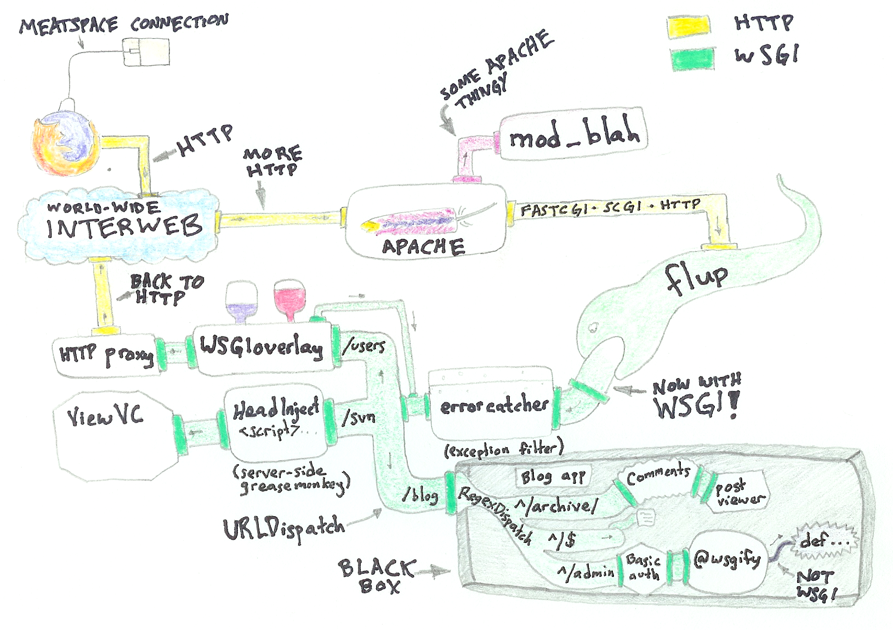
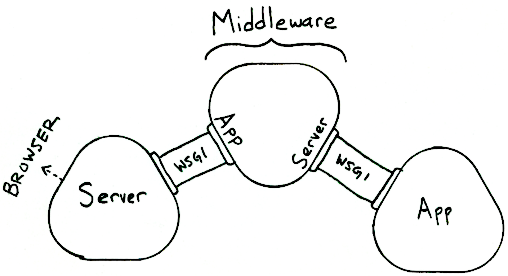
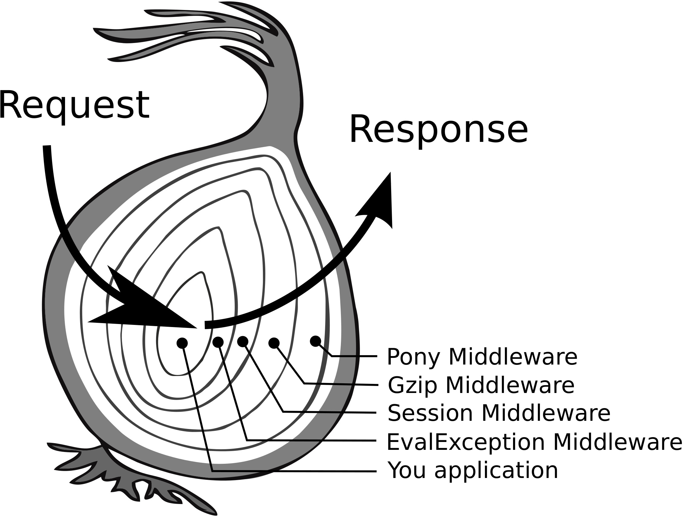
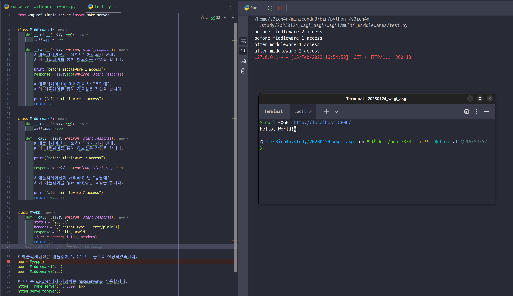

# 시리즈 안내

- PEP 333
- PEP 249

# 연재 안내

- PEP 333 (1)

# 들어가며

이번 시리즈에서는 파이썬에서 사용하는 웹 프레임워크 인터페이스의 근본부터 이해하고, 이에 대한 이해를 통해 사용하는 프레임워크가 어떤 식으로 작성되었나 이해해보고자 합니다.

따라서 모든 내용을 살펴보려는 것이 아니라, 필요한 사항에 대해 PEP 문서상의 내용을 참고하여 작성하는 것이 이번 글의 목표입니다.

글에 앞서, WSGI는 어디까지 살펴보면 되는 것인지 이 그림을 통해 돌아봅시다.



# 논외로 두려 하는 사항

자주 쓰는 CPython 구현체 뿐 아니라 PyPy, Jython, IronPython 등의 파이썬 플랫폼 모두를 아우르는 글이 PEP 입니다만, 거기까지 다룰 자신도 없고 제대로 말씀드리기도 어려울 듯 합니다...

따라서, CPython 기반으로 작성된 파이썬을 사용한다고 가정하도록 하겠습니다.

# PEP 333, PEP 3333

- 웹 서버와 파이썬 웹 앱/프레임워크와의 인터페이스를 제안한 문서입니다.
  - 이 문서는 2003년에 최초로 생성되었습니다(!)
- Python 3 버전에 맞추어서 새로 나온 PEP 3333을 같이 보도록 하겠습니다.
  - 이에 대해선 [귀도 판 로섬의 메일](https://mail.python.org/pipermail/python-dev/2010-September/104114.html)을 살펴보세요.

# Rationale and Goals

- 해당 PEP 발표 당시 파이썬도 웹 애플리케이션이 많이 등장했으나, 웹 및 서버-웹 앱의 선택이 한정적이었습니다.
- 한편 자바는 [servlet API](https://www.geeksforgeeks.org/servlet-api/) 를 통해 어떤 자바 앱이든 웹 서버-웹 앱 간 상호작용이 가능하도록 했습니다.
- 그 시절 파이썬은 웹 통신을 위한 구현체가 따로따로 있었습니다.

  - 예를 들어 아래 구현체들이 있습니다:
    - 파이썬으로 작성된 웹서버 ([Medusa, 아카이브](https://github.com/lispyclouds/medusa))
    - 웹 서버에 임베딩되어 쓰이는 형식 ([mod_python, 코드는 관리되나 더이상 업데이트 없음](https://github.com/grisha/mod_python))
    - 게이트웨이 프로토콜을 통해 파이썬을 호출한 방식 ([CGI, 정의만 있음](https://www.w3.org/CGI/), FastCGI

- PEP 333은 이런 불편을 덜기 위해 **_웹 서버-웹 앱 간의 인터페이스, 즉 WSGI(Python Web Server Gateway Interface)를 제안_** 한 내용입니다.
  - 별도의 WSGI 구현 에 대한 제한을 두어 필요한 사람들이 이를 보고 웹 프레임워크를 만들 수 있게끔 하는 것이 목적입니다.
  - WSGI의 구현체는 최대한 단순하면서도 파이썬 기본 라이브러리만을 사용하여 구현해야하고, `2.2.2`(PEP 333 기준) 버전 이상의 파이썬 버전을 요하지 않습니다.
- 요청, 응답에 대한 구현 뿐 아니라 WSGI 기반의 추가적인 **_미들웨어(middleware)_** 구성요소를 만들어 요청, 응답에 필요한 추가적인 작업을 수행할 수 있도록 합니다.
  - 단순하고, 견고하고, 느슨하게 결합된 미들웨어로 구성된 프레임워크가 충분히 만들어질 수 있습니다.

# Specification Overview

- WSGI 인터페이스는 "서버(혹은 게이트웨이)" 사이드, "앱(혹은 프레임워크) 사이드" 가 있습니다.

- 서버 사이드는 `Callable` 객체[1]를 호출합니다. 이 객체는 앱 사이드에서 제공하는 값입니다.

  - Callable 객체가 어떻게 제공되는지는 서버/게이트웨이가 정하기 나름입니다.
    - 일부 서버 또는 게이트웨이는 응용 프로그램 배포자가 서버 또는 게이트웨이의 인스턴스를 만들고
      응용 프로그램 개체와 함께 제공하는 짧은 스크립트를 작성해야 한다고 가정합니다.
    - 다른 서버 및 게이트웨이는 구성 파일 또는 기타 메커니즘을 사용하여 응용 프로그램 개체를 가져오거나 다른 방식으로 가져와야 하는 위치를 지정할 수 있습니다.

- 서버/게이트웨이, 앱/프레임워크 사이에 존재하는 "미들웨어"라는 것을 구현할 수 있습니다.

  - 이는 "미들웨어"를 포함하는 서버의 앱처럼, 혹은 애플리케이션에 포함된 서버처럼 쓰일 수도 있습니다.
  - 확장 API, 컨텐츠 변환, 탐색 등의 기타 유용한 기능을 추가로 제공해줄 수 있습니다.



음, 번역해보니 이런 내용이 있군요. 추가사항 몇 가지를 더 살펴보고 나서 구현체로 살펴봅시다.

## 문자열 타입에 대해

일반적으로 HTTP는 바이트를 처리합니다. 파이썬 3으로 들어서면서, 모든 `str` 타입은 유니코드로 처리됩니다[1]. 애플리케이션 단에서 인코딩/디코딩을 처리해야하며, 서버로부터 왔다갔다하는 타입은 **반드시** `str` 아니면 `bytes` 여야 합니다. `unicode` 값이 되면 **절대** 안 됩니다.

추가로, status 값이나 response header값에 담기는 값은 `start_response()` Callable로 주고받는 데이터에 response 값을 준비하는 시점, 즉 `write(body_data)` Callable의 리턴값입니다. 이 때는 **반드시** `Latin-1` 포맷(ISO/IEC 8859-1)으로 포매팅 해야합니다.

따라서 WSGI 스펙에서는 "네이티브" 문자열, "Bytestring" 으로 정의합니다.

- 네이티브 문자열
  - 요청/응답의 헤더와 메타데이터로 처리하는 값을 의미합니다.
  - `str` 타입이어야 합니다.
- Bytestring은 요청/응답의 body값에 사용되는 값을 의미합니다.
  - `bytes` 타입이어야 합니다.

## Application/Framework 사이드

Application 단은 **두 변수**를 받는 '호출 가능한' 오브젝트입니다(파이썬 `Callable` 이란 뜻입니다). 실제 객체로서의 오브젝트가 아니라 `__call__` 메소드를 가지고있는 함수, 메소드, 클래스 모두가 될 수 있습니다. 서버단으로부터 오는 호출을 여러 번 계속해서 호출 받을 수 있도록 대비해야합니다.

애플리케이션/프레임워크 단이라고 해서 실제로 이를 응용하여 개발하는 사람이 알 필요는 없습니다. 이걸 모르게 꽁꽁숨기는게 애플리케이션/프레임워크 사이드 개발자들의 목표죠.

예시를 살펴봅시다.

```python
class AppClass:
    """ 클래스를 사용한 구현체를 의미

    AppClass를 호출하는 것은 "해당 객체"를 리턴하는 것을 의미한다.
    이는, 사양에서 요구하는 "앱 Callable"의 iterable 리턴값이다.

    AppClass의 인스턴스를 앱 오브젝트로 대신 쓰려면,
    `__call__` 객체를 구현해야되고
    서버/게이트웨이 에서 쓸 인스턴스를 생성해야한다.

    """

    # body 값은 UTF-8 인코딩을 할 수 있도록 해야한다.
    RES = "wanna-say: s3ich4n rules! class".encode("UTF-8")

    def __init__(self, environ, start_response):
        self.environ = environ
        self.start = start_response

    def __iter__(self):
        status = '200 OK'
        response_headers = [
            ('Content-Type', 'text/plain'),
            ('Content-Length', len(self.RES)),
        ]
        self.start(status, response_headers)

        yield self.RES
```

- `environ`
  - dictionary 입니다. CGI 환경변수 비슷한 값이라고 합니다.
  - 자세한 스펙은 [이 링크](https://peps.python.org/pep-3333/#environ-variables) 를 참고해 주십시오.
- `response_header`
  - `List[Tuple(str, str), ...]` 형식으로 HTTP 헤더값을 추가합니다.
- `status` 서버를 통해 리턴해줄 HTTP 상태 코드를 의미합니다.

### 어떻게 쓰이나요?

웹 앱/프레임워크는 데이터를 전달하기 전에 `start_response()` 를 반드시 호출해야 합니다.

## Server/Gateway 사이드

서버/게이트웨이는 HTTP 클라이언트로부터 수신한 각 요청에 대해 호출 가능한 애플리케이션을 **한 번** 호출합니다. 이는 애플리케이션으로 향합니다. 예시로, 응용 프로그램 개체를 사용하는 함수로 구현된 간단한 CGI 게이트웨이(`run_with_cgi()`) 함수를 살펴봅시다.

참고: 기본적으로 포착되지 않은 예외는 `sys.stderr`에 덤프되고 웹 서버에 의해 기록되기 때문에 이 간단한 예제는 오류 처리가 제한되어 있습니다.

전체 코드는 [이 곳](https://github.com/s3ich4n/wsgi_asgi/tree/main/wsgi1)의 `server.py` 파일에서 보실 수 있습니다.

```python
def run_with_cgi(application):
    # environ = {k: unicode_to_wsgi(v) for k, v in os.environ.items()}
    environ = {'wsgi.input': sys.stdin.buffer, 'wsgi.errors': sys.stderr,
               'wsgi.version': (1, 0), 'wsgi.multithread': False,
               'wsgi.multiprocess': True, 'wsgi.run_once': True}

    if environ.get('HTTPS', 'off') in ('on', '1'):
        environ['wsgi.url_scheme'] = 'https'
    else:
        environ['wsgi.url_scheme'] = 'http'

    headers_set = []
    headers_sent = []

    def write(data):
        out = sys.stdout.buffer

        if not headers_set:
            raise AssertionError("write() before start_response()")

        elif not headers_sent:
            # Before the first output, send the stored headers
            status, response_headers = headers_sent[:] = headers_set
            out.write(wsgi_to_bytes('Status: %s\r\n' % status))
            for header in response_headers:
                out.write(wsgi_to_bytes('%s: %s\r\n' % header))
            out.write(wsgi_to_bytes('\r\n'))

        out.write(data)
        out.flush()

    def start_response(status, response_headers, exc_info=None):
        if exc_info:
            try:
                if headers_sent:
                    # Re-raise original exception if headers sent
                    raise exc_info[1].with_traceback(exc_info[2])
            finally:
                exc_info = None     # avoid dangling circular ref
        elif headers_set:
            raise AssertionError("Headers already set!")

        headers_set[:] = [status, response_headers]

        # Note: error checking on the headers should happen here,
        # *after* the headers are set.  That way, if an error
        # occurs, start_response can only be re-called with
        # exc_info set.

        return write

    # 앱 호출을 "했다" 고 가정하자.
    # iterable 객체가 리턴되고 이를 사용하는 것을 볼 수 있다
    result = application(environ, start_response)
    try:
        for data in result:
            if data:    # don't send headers until body appears
                write(data)
        if not headers_sent:
            write('')   # send headers now if body was empty
    finally:
        if hasattr(result, 'close'):
            result.close()
```

### 어떻게 쓰이나요?

웹서버는 애플리케이션을 호출하는 것으로 프레임워크/앱에 디스패치 합니다.

헤더를 만들고, 후술할 `start_response()`를 호출하는 것은 앱/프레임워크의 책임입니다. 그리고 `start_response()`가 리턴하는 `iterable` 값을 빌드합니다.

## 미들웨어: 양방향으로 작동하는 컴포넌트

미들웨어는 서버-애플리케이션의 양방향으로 작용합니다. 미들웨어를 응용프로그램에 통합하기 위해서는, 미들웨어 구성요소가 응용 프로그램인 것 처럼 서버에 제공하고 미들웨어 구성요소가 서버인 것 처럼 응용프로그램을 호출하도록 구성합니다. 말하자면 요청-응답 사이에 넣고싶은 로직을, 미들웨어로 분리하고 요청-응답 사이에 끼워넣는다고 보면 될 것 같네요. 요청시 호출하는 순서, 응답시 호출하는 순서를 [마치 양파처럼 표현](https://en.wikipedia.org/wiki/Onion_model)하여 적용합니다.



예시를 통해 함께 살펴보시죠.

```python
from wsgiref.simple_server import make_server


class Middleware1:
    def __init__(self, app):
        self.app = app

    def __call__(self, environ, start_response):
        # 애플리케이션에 "요청이" 처리되기 전에,
        # 이 미들웨어를 통해 하고싶은 작업을 합니다.

        print("before middleware 1 access")
        response = self.app(environ, start_response)

        # 애플리케이션이 처리하고 난 "응답에",
        # 이 미들웨어를 통해 하고싶은 작업을 합니다.

        print("after middleware 1 access")
        return response


class Middleware2:
    def __init__(self, app):
        self.app = app

    def __call__(self, environ, start_response):
        # 애플리케이션에 "요청이" 처리되기 전에,
        # 이 미들웨어를 통해 하고싶은 작업을 합니다.

        print("before middleware 2 access")

        response = self.app(environ, start_response)

        # 애플리케이션이 처리하고 난 "응답에",
        # 이 미들웨어를 통해 하고싶은 작업을 합니다.

        print("after middleware 2 access")
        return response


class MyApp:
    def __call__(self, environ, start_response):
        status = '200 OK'
        headers = [('Content-type', 'text/plain')]
        response = b'Hello, World!'
        start_response(status, headers)
        return [response]


# 애플리케이션은 아래와 같이 돌도록 설정되었습니다.
# 미들웨어 2가 가장 바깥쪽에서 요청값을 처리하고, 마지막에 응답값을 수정합니다
# 미들웨어 1은 미들웨어 2를 거친 후의 요청값을 처리하고, 가장 처음 응답값을 수정합니다
app = MyApp()
app = Middleware1(app)
app = Middleware2(app)

# 서버는 wsgiref에서 제공하는 makeserver를 사용합시다.
httpd = make_server('', 8800, app)
httpd.serve_forever()

```

해당 코드를 구동해본 예시는 아래와 같습니다.



# 마무리

PEP 333 및 3333은 여기까지 살펴보고, 나머지는 실제 WSGI 구현체를 통해 다시 살펴보도록 하겠습니다. 이 후 ASGI까지 함께 살펴보도록 하겠습니다.

긴 글 읽어주셔서 감사합니다.

---

- References

  - [1] `Callable`객체: `__call__()` 메소드를 구현한 객체를 의미합니다.
    - 구현은 알아서 하면 되지만, 호출할 때는 어떤 종류의 `Callable`이 호출되었는지 알지 모르게 해야합니다(종속성 제거를 위함).
    - 해당 콜러블은 자체검사되지 않습니다.
  - [2] 처음 PEP 333이 작성되던 시점에는 파이썬 2가 주력이었죠. 그 때는 `str` 타입이 `ASCII`만을 담을 수 있었다고 합니다. [이 링크](https://sites.pitt.edu/~naraehan/python2/unicode.html)를 참고해주세요!
  - [3] 그림 출처는 [이 링크](https://lectureswww.readthedocs.io/5.web.server/wsgi.html)입니다.
