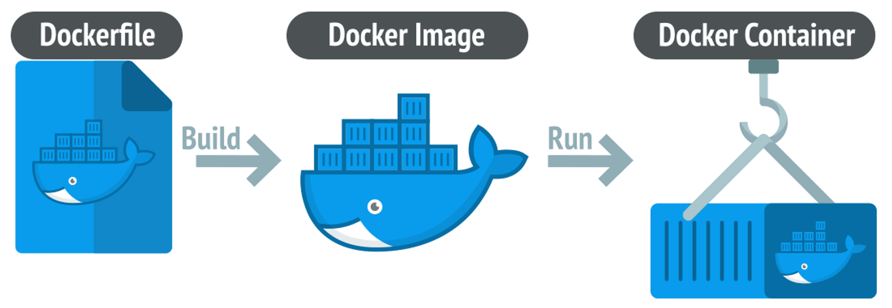

이번 게시글에서는 컨테이너 기술에 대해 간략히 설명하고, 파이썬 컨테이너를 구성하기 위한 선택지를 살펴봅니다.

이 게시글은, 파이썬으로 서버 개발을 진행한 경험이 있으시다면 보다 쉽게 이해하실 수 있습니다.

## 컨테이너 기술?

요즘은 컨테이너로 서비스를 배포하는 것이 굉장히 일상적입니다. 각종 기고문 등에서도 컨테이너를 사용한 배포가 일상화 되어있고, 국내의 큰 회사도 100만개의 컨테이너가 동시에(!) 돌기도 한다고 합니다. 그렇다면 컨테이너가 어떤 것인지 먼저 살펴볼까요?

### 컨테이너 이전에는...

과거 서버를 구성할 때는 개발팀(Dev)의 개발 후 품질보증팀(QA), 보안팀(Infosec)의 검증을 거쳐서 운영팀(Ops)이 배포하는 흐름이었습니다. 이러한 개발 방식은 서비스를 기획하고 지속적으로 운영하며 여러 문제를 겪는데요. 첫 번째 문제는, 개발한 코드가 배포되기까지의 흐름이 너무 늦다는 것입니다.

우리는 배포에 가까워지며 버그를 패치할 때는 임시방편으로 일정을 맞추기 위한 코드를 짜죠. 이런 '기술 부채'들은 지속적으로 쌓이고, 언젠간 해결해야지 하는 방법으로 계속 때우는 것으론 한계가 발생합니다. 근본결함을 수정하기에는 문제 해결에 대한 시간이 너무 짧다는 것입니다. 

두 번째 문제는 배포와 관리를 하기 위한 서버 관리 비용 또한 고려의 대상이라는 것입니다. 배포를 할 땐 서버 환경을 모두 알고 잘 구성해야 합니다. 하나라도 어긋나면 서버구동이 되지 않을 수 있습니다. 서버를 늘리고 줄이기 위해서는 물리 서버에 동일한 작업을 여러 번 반복하는 것 또한 일입니다.

이 두 가지 단점에 대해서는, 후술할 DevOps 개념과 컨테이너가 본격적으로 쓰이기 전인 2011년 IDC와 가트너(Gartner)는 전 세계 GDP의 약 3.1조 달러가 IT에 지출된다고 추정했습니다[^1].

> 🍎 tips
>
> 컨테이너가 등장하기 이전에도 이를 위한 많은 시도가 있었지만, 주제와 어긋나므로 과감히 생략합니다. 관련해서는 이 글[^2]의 단락을 읽어주세요.

### 컨테이너, IaC, DevOps, let's go

보통 말하는 컨테이너의 정의는 아래와 같습니다.

> 애플리케이션을 패키징화하고 실행을 격리한다.

다시말해, 서버 구성 환경 하나하나 고정하여 어디서든 동일하게 실행가능한 프로세스 입니다. 좀 뭉뚱그려 말하면 이게 구동되면 서버가 돌 수 있는 것이지요. 그런 컨테이너 기술로 널리 사용되는 것은 단연 Docker 입니다. 컨테이너 기술의 등장으로 인해 기존 배포과정에서의 단점이 훌륭하게 해결되었지요. 실행 당시의 환경을 별도로 격리시켜주고, 종속성을 유지할 수 있게 할 수 있게 되다보니 아래와 같은 장점을 누릴 수 있게 되었습니다.

- 개발환경과 운영환경의 차이점을 최소화 할 수 있습니다.
- 다른 사람이 만든 "서버"를 쉽게 가져다 사용할 수 있습니다.
- 서버 가용성을 확장하기 위해 컨테이너를 한 서버/다른 서버 에서 동시에 구동하여 처리할 수도 있습니다.


<details>
<summary>🤔 컨테이너 기술이 DevOps에 끼치는 영향</summary>

> 🍎 tips
>
> 글의 방향을 이해하는 데는 크게 필요없지만, 만약 더 알아보시고 싶으시다면 아래 내용도 참고해주세요.
>
> 만일 IaC 중 Terraform에 대해 관심이 있으시다면 저의 [다른 연재글](https://velog.io/@s3ich4n/series/2022년-Terraform-스터디)을 함께 살펴봐주시면 감사하겠습니다. 🙇

클라우드 컴퓨팅의 시대로 들어오며 이런 장점은 더욱 극대화 되기 시작했습니다. 기존에는 서버실 구성, 각종 배선작업 및 쿨링 시스템 구축을 거의 모든 회사가 직접 해야했으나, 원격지의 서버를 임대하여 사용할 수 있는 시스템이 등장함으로 인해 이런 컨테이너를 통한 장점이 더욱 극대화될 수 있는 환경마저 제공된 것이죠. 심지어는 이런 구성마저도 코드로 관리하여(IaC, Infrastructure as Code) 처리하는 접근법이 대두되기도 합니다.

이런 식으로 기존 개발 방식에서 개발팀(Dev)와 운영팀(Ops)의 역할 사이클을 한 번에 줄이고 보다 자주, 그리고 견고하게 배포하도록 하는 과정이 DevOps의 일부라고 할 수 있겠습니다.

</details>

## 컨테이너에 대해

> 🍎 note
>
> 이 글 이후로 컨테이너 관련 플랫폼은 Docker(이하 도커)를 사용하도록 하겠습니다.

지금까지 컨테이너에 대한 말이 굉장히 많이 나왔는데요. 그렇다면 이건 어떻게 만들고 구동해볼 수 있을까요? 설명에 앞서 용어부터 정리해봅시다. 컨테이너 기술을 이야기할 때는 흔히 "도커 이미지"와 "도커 컨테이너"라는 용어를 사용하여 실행가능한 형태와 실제 구동중인 형태를 각각 표현합니다. "도커 이미지"에 대한 설계도는 `Dockerfile` 이구요.



### 도커 이미지와 `Dockerfile`에 대해

이미지는 애플리케이션을 실행하는데 필요한 모든 것을 포함하는 '불변의 템플릿'입니다. 여기엔 소스 코드, 런타임, 라이브러리, 환경 변수, 설정 파일 등이 포함됩니다. 그리고 이 이미지를 만드는 명세서가 바로 `Dockerfile`입니다. Dockerfile에는 이미지를 어떻게 만들지 순서대로 적어둡니다. 기준이 되는 이미지부터 우리가 원하는 내용을 추가할 수 있지요. 한번 살펴봅시다.

Dockerfile의 각 명령어는 하나의 "레이어"가 되어 이미지를 겹겹이 쌓아갑니다. 각각의 레이어는 그 명령어로 인한 파일 시스템의 변경사항을 담고 있죠. 한번 만들어진 레이어는 읽기 전용이 되어 "불변성"을 보장합니다. 이렇게 모든 레이어가 쌓이면 하나의 이미지가 완성되는 거죠.

도커 이미지를 만들기 위한 바탕을 베이스 이미지[^3]라고 부르기도 합니다. 파이썬 베이스 이미지는 [Docker Hub](https://hub.docker.com/_/python)에서 확인하실 수 있어요. 필요한 파이썬 버전이 있다면 그에 맞는 값을 바꿔주면 됩니다. `3.12` 버전이 필요하면 그 값을 입력하면 되죠. 심지어는 어떤 운영체제에서 구동되는 걸 기대하는지도 지정해줄 수 있습니다.


```dockerfile
FROM python:3.12            # 앞서 살펴본 베이스 이미지 입니다. 여기서는 파이썬 3.12를 사용해요.
WORKDIR /app                # 이제부터의 명령어들이 실행될 작업 디렉터리를 지정합니다.
COPY hello.py .             # 현재 디렉터리의 hello.py 파일을 컨테이너의 /app 디렉터리로 복사합니다.
CMD ["python", "hello.py"]  # 컨테이너가 시작될 때 실행할 명령어를 지정합니다.
```

### 만들어봅시다!

그러면 헬로월드를 출력하는 도커 이미지를 만들어봅시다. [Docker Desktop](https://www.docker.com/products/docker-desktop/)을 설치하고 한번 만들어볼까요!

1. `hello.py` 파일 생성:

```python
print("Hello, geultto!")
```

2. `Dockerfile` 생성(위에서 본 내용입니다):

```dockerfile
FROM python:3.12
WORKDIR /app
COPY hello.py .
CMD ["python", "hello.py"]
```

3. 이미지 빌드:

3을 실행시키면 아래와 같은 결과가 나옵니다.

```shell
docker build -t python-hello .
[+] Building 26.1s (8/8) FINISHED                           docker:desktop-linux
 => [internal] load build definition from Dockerfile                        0.0s
 => => transferring dockerfile: 151B                                        0.0s
 => [internal] load metadata for docker.io/library/python:3                 2.7s
 => [internal] load .dockerignore                                           0.0s
 => => transferring context: 2B                                             0.0s
 => [1/3] FROM docker.io/library/python:3.12@sha256:<생략>                 22.7s
 (생략)
 => => extracting sha256:<생략>
 => [internal] load build context                                           0.0s
 => => transferring context: 98B                                            0.0s
 => [2/3] WORKDIR /app                                                      0.5s
 => [3/3] COPY hello.py .                                                   0.0s
 => exporting to image                                                      0.1s
 => => exporting layers                                                     0.0s
 (생략)
 => => naming to docker.io/library/python-hello:latest                      0.0s
 => => unpacking to docker.io/library/python-hello:latest                   0.0s

What's next:
    View a summary of image vulnerabilities and recommendations → docker scout quickview
```

축하합니다. 당신은 첫 파이썬 컨테이너를 빌드했습니다! 🎉🎉

### 도커 컨테이너?

그렇다면 도커 컨테이너는 무엇일까요? 바로 도커 이미지를 실행한 프로세스를 말합니다. 이 프로세스는:

- 격리된 프로세스 공간 확보 
- 호스트로부터 컨테이너 자신만의 독립된 파일시스템을 확보
- 컨테이너 만의 네트워크 환경을 개별적으로 확보
- 심지어 실행 권한도 별도로 부여받을 수 있습니다!

이런 특성들 덕분에:

- 어떤 환경에서도 동일하게 실행됩니다
    - 내 컴퓨터에서 잘 돌던 게 서버에서도 그대로!
- 다른 프로세스와 충돌 없이 실행됩니다
    - Python 2.7과 3.8이 필요한 프로그램들도 걱정 없이!
- 문제가 생겨도 다른 프로그램에 영향을 주지 않습니다
    - 하나의 컨테이너가 문제가 생겨도 다른 건 멀쩡해요

그러면 컨테이너를 한번 실행해볼까요?

```shell
$ docker run python-hello
Hello, geultto!
```

컨테이너 실행 완료! 이제 더 이상 환경에 구애받지 않는 실행환경이 만들어졌어요! 🎉🎉

## 그런데?

성공적으로 실행했으니 이제 빌드한 이미지의 크기를 확인해봅시다.

```shell
$ docker images python-hello
REPOSITORY     TAG       IMAGE ID       CREATED         SIZE
python-hello   latest    746136719e90   3 minutes ago   1.46GB
```

헬로월드 하나 찍는데 `1.46GB` 나 쓴다구요?????? 이건 무슨 의미일까요?

### 컨테이너 크기가 커지는 이유

컨테이너 크기가 비대한 이유는 아래와 같습니다:

- 기본 파이썬 이미지의 크기
    - 기본 파이썬 인터프리터, 표준 라이브러리, pip 뿐 아니라 개발 도구와 디버깅 도구도 포함될 수 있기 때문입니다.
- 운영체제 레이어와 각종 의존성
    - 기본 OS 파일 시스템, 유틸리티 등이 함께 포함될 수 있기 때문입니다.
- 그런데 여기서 애플리케이션 코드 및 데이터가 들어가면?
    - 프로젝트에 필요한 라이브러리 설치 시 크기 증가
    - 프로젝트 파일, 정적 자산 등이 추가될 때마다 크기 증가

그렇다면 이미지는 현재라면 더 커지는 수 밖에 없겠습니다. 점점 커지는 이미지는 지양해야 할 것 같은 예감이 드는데요. 어떤 단점이 있는지 살펴보았습니다.

- 배포 시간 증가
    - 큰 이미지는 다운로드와 업로드에 더 많은 시간을 소요합니다.
- 스토리지 비용 증가
    - 컨테이너 레지스트리(일종의 컨테이너 저장소입니다)와 호스트 시스템에서 더 많은 공간 차지할 수 있습니다
- 보안 취약점 증가 가능성
    - 불필요한 패키지가 포함될 경우 공격 표면(attack vector, 공격받을 수 있는 pain point를 의미)이 잠재적으로 많아집니다
- 컨테이너 시작 시간 증가
    - 큰 이미지는 로딩에 더 많은 시간 소요
    - 앞으로 더 커진다면 더 로딩되는 시간이 길어지겠지요
- 리소스 사용 효율성 저하
    - 불필요한 컴포넌트로 인한 메모리 및 CPU 사용량 증가

## 끝으로

그렇다면 다음 글에서는 파이썬 컨테이너 이미지 크기를 줄이기 위한 여러 방안을 살펴보고, 파이썬 컨테이너 이미지 빌드가 가지는 특징을 살펴보도록 하겠습니다.

긴 글 읽어주셔서 감사합니다.

[^1]: 자세한 내용은 [이 링크를](https://www.itjungle.com/2011/07/11/tfh071111-story03/), 관련 출처는 [이 링크](https://readingraphics.com/book-summary-the-devops-handbook/)에서 확인할 수 있습니다.
[^2]: https://www.44bits.io/ko/post/why-should-i-use-docker-container#운영하면서-만들어지는-눈송이-서버들snowflake-servers
[^3]: 모든 이미지의 베이스 이미지도 있습니다. [참고 링크](https://docs.docker.com/build/building/base-images/#creating-a-simple-parent-image-using-scratch)
