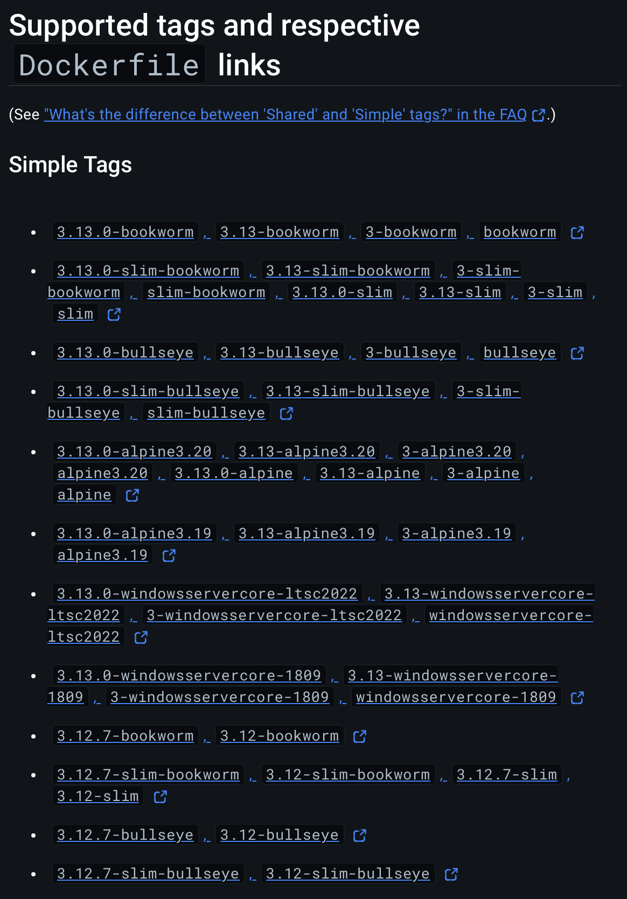
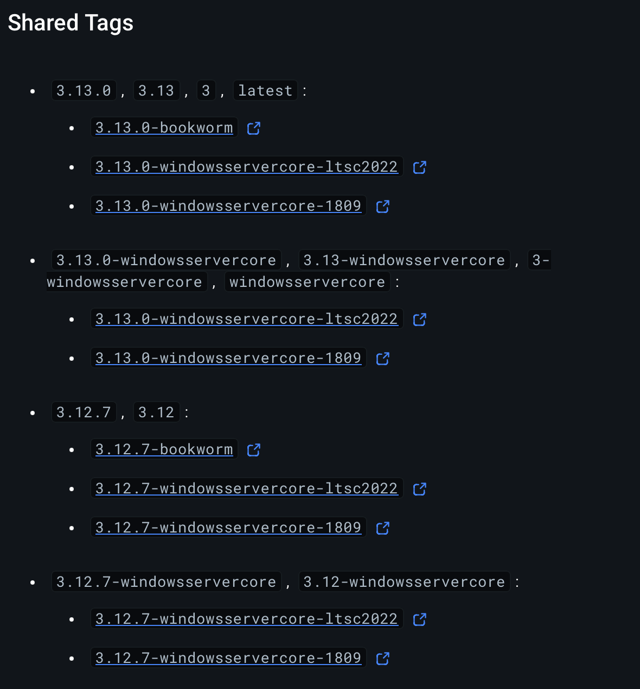

이번 게시글에서는 컨테이너 기술에 대해 간략히 설명하고, 파이썬 컨테이너를 구성하기 위한 선택지를 살펴봅니다.

## 컨테이너 기술?

요즘은 컨테이너로 서비스를 배포하는 것이 굉장히 일상적입니다. 각종 기고문 등에서도 컨테이너를 사용한 배포가 일상화 되어있고, 국내의 큰 회사도 100만개의 컨테이너가 동시에(!) 돌기도 한다고 합니다. 그렇다면 컨테이너가 어떤 것인지 먼저 살펴볼까요?

### 컨테이너 이전에는...

과거 서버를 구성할 때는 개발팀(Dev)의 개발 후 품질보증팀(QA), 보안팀(Infosec)의 검증을 거쳐서 운영팀(Ops)이 배포하는 흐름이었습니다. 이러한 개발 방식은 서비스를 기획하고 지속적으로 운영하며 여러 문제를 겪는데요. 첫 번째 문제는, 개발한 코드가 배포되기까지의 흐름이 너무 늦다는 것입니다.

우리는 배포에 가까워지며 버그를 패치할 때는 임시방편으로 일정을 맞추기 위한 코드를 짜죠. 이런 '기술 부채'들은 지속적으로 쌓이고, 언젠간 해결해야지 하는 방법으로 계속 때우는 것으론 한계가 발생합니다. 근본결함을 수정하기에는 문제 해결에 대한 시간이 너무 짧다는 것입니다. 

두 번째 문제는 배포와 관리를 하기 위한 서버 관리 비용 또한 고려의 대상이라는 것입니다. 배포를 할 땐 서버 환경을 모두 알고 잘 구성해야 합니다. 하나라도 어긋나면 서버구동이 되지 않을 수 있습니다. 서버를 늘리고 줄이기 위해서는 물리 서버에 동일한 작업을 여러 번 반복하는 것 또한 일입니다.

이 두 가지 단점에 대해서는, 후술할 DevOps 개념과 컨테이너가 본격적으로 쓰이기 전인 2011년 IDC와 가트너(Gartner)는 전 세계 GDP의 약 3.1조 달러가 IT에 지출된다고 추정했습니다[^1].

> 🍎 tips
>
> 컨테이너가 등장하기 이전에도 이를 위한 많은 시도가 있었지만, 주제와 어긋나므로 과감히 생략합니다. 관련해서는 이 글[^2]의 단락을 읽어주세요.

### 컨테이너, IaC, DevOps, let's go

컨테이너는 정말 쉽게 말하면, 어디서든 구동될 수 있는 서버 환경까지 고정하여 어디서든 동일하게 사용할 수 있도록 구성한 프로세스 입니다. 이게 구동되면 서버가 돌 수 있는 것이지요. 그런 컨테이너 기술로 널리 사용되는 것은 단연 Docker 입니다.

<details>
<summary>(생략가능) Docker와 더 상세한 컨테이너 기술에 대한 정보는 여기에 정리했습니다.</summary>

> 🍎 tips
>
> 글의 방향을 이해하는 데는 크게 필요없지만, 만약 더 알아보시고 싶으시다면 이 내용을 참고해주세요.

- **Docker의 역할과 발전**
  - Docker는 컨테이너 기술을 대중화한 선구자 역할을 했습니다.
  - 초기에는 자체적인 도커 엔진을 통해 컨테이너를 관리했습니다.
  - 현재는 내부적으로 `containerd`를 사용하여 컨테이너 런타임을 관리합니다.

- **`containerd`의 분리와 역할**
  - `containerd`는 원래 도커 엔진의 핵심 컴포넌트였습니다.
  - 2017년 CNCF(Cloud Native Computing Foundation)에 기부되어 독립 프로젝트가 되었습니다.
  - 2019년 CNCF 졸업 프로젝트가 되었습니다.
  - 컨테이너 이미지 관리, 실행, 네트워킹 등 컨테이너 생애주기 전반을 관리합니다.
  - Docker뿐만 아니라 쿠버네티스 등 다른 상위 레벨 시스템에서도 직접 사용될 수 있습니다.

- **OCI(Open Container Initiative)와 표준화**
  - 2015년 설립되어 컨테이너 포맷과 런타임에 대한 개방형 업계 표준을 개발합니다.
  - 주요 표준:
    - 런타임 명세 (runtime-spec)
    - 이미지 명세 (image-spec)
  - 다양한 컨테이너 런타임이 호환성을 유지할 수 있게 합니다.

- **다른 주요 컨테이너 기술**
  - `CRI-O`: 쿠버네티스를 위해 특별히 설계된 컨테이너 런타임입니다. Red Hat과 쿠버네티스 커뮤니티에 의해 개발되었습니다.
  - `rkt`: CoreOS에서 개발한 대안적인 컨테이너 런타임으로, 보안과 모듈성에 중점을 두었습니다. (현재는 개발 중단)
  - `LXC`: 리눅스 커널 수준의 컨테이너화 기술로, 운영 체제 수준의 가상화를 제공합니다.

- **컨테이너 기술의 최신 트렌드**
  - 마이크로서비스 아키텍처의 부상과 함께 컨테이너 기술의 중요성이 더욱 커졌습니다.
  - 서버리스 컴퓨팅에서도 컨테이너 기술이 백엔드로 활용되고 있습니다.
  - 쿠버네티스와 같은 오케스트레이션 도구의 발전으로 컨테이너 관리가 더욱 효율적으로 이루어지고 있습니다.

</details>

컨테이너 기술의 대두는 기존에 지적되어왔던 단점을 훌륭하게 해결해주었지요. 실행 당시의 환경을 별도로 격리시켜주고, 종속성을 유지할 수 있게 할 수 있지요. 이렇게 되면 아래와 같은 장점이 있습니다.

- 개발환경과 운영환경 구성 시의 차이점을 최소화 할 수 있습니다.
- 다른 사람이 만든 "서버"를 쉽게 가져다 사용할 수 있습니다.
- 서버 가용성을 확장하기 위해 컨테이너를 한 서버/다른 서버 에서 동시에 구동하여 처리할 수도 있습니다.

그리고 클라우드 컴퓨팅의 시대로 들어오며 이런 장점은 더욱 극대화 되기 시작했습니다. 기존에는 서버실 구성, 각종 배선작업 및 쿨링 시스템 구축을 거의 모든 회사가 직접 해야했으나, 원격지의 서버를 임대하여 사용할 수 있는 시스템이 등장함으로 인해 이런 컨테이너를 통한 장점이 더욱 극대화될 수 있는 환경마저 제공된 것이죠. 심지어는 이런 구성마저도 코드로 관리하여(IaC, Infrastructure as Code) 처리하는 접근법이 대두되기도 합니다.

이런 식으로 기존 개발 방식에서 개발팀(Dev)와 운영팀(Ops)의 역할 사이클을 한 번에 줄이고 보다 자주, 그리고 견고하게 배포하도록 하는 과정이 DevOps의 일부라고 할 수 있겠습니다.

> 이 이상의 DevOps와 IaC에 대한 내용은 본 주제와 어긋날 수 있으니 과감히 생략하겠습니다.
> 
> 만일 알아보시고 싶으시다면 제가 [기존에 작성한 글타래](https://velog.io/@s3ich4n/series/2022년-Terraform-스터디)를 살펴봐주시면 감사하겠습니다. 🙇

## 파이썬 컨테이너에 대해 알아봅시다

그렇다면, 파이썬 컨테이너에 대해 살펴볼까요. 컨테이너는 앞서 언급했듯 어디서든 구동될 수 있는 서버 환경을 구성할 수 있습니다.

### 파이썬 컨테이너 살펴보기

저희가 살펴볼 파이썬 컨테이너는 [Docker Hub에서 확인](https://hub.docker.com/_/python)할 수 있습니다. 사이트에 접속해서 어떤 내용이 있나 살펴보죠.





뭔가 되게 많군요. 숫자는 파이썬 버전같은데, `-` 뒤의 값은 뭔지 알아봅시다. 각각 Simple tags, Shared tags 인데요. 이 값은 아래와 같습니다.

- `simple tags`: 기재된 리눅스 혹은 윈도우즈에서만 동작을 보장하는 컨테이너 이미지임을 의미합니다. 이 값을 사용하면 해당 태그에 명시된 플랫폼(리눅스나 윈도우즈 등)의 하나의 매니페스트에 연결됩니다. 이 경우, 명확히 지정한 플랫폼의 이미지만 사용할 수 있습니다.

- `shared tags`: 여러 운영체제(리눅스 및 다양한 윈도우즈 버전)와 아키텍처에서 동작하는 컨테이너 이미지를 나타냅니다. 이 값을 Docker Engine이 구동되는 환경(운영체제, 아키텍처 등)에 맞는 적절한 이미지를 자동으로 선택해서 pull하게 됩니다. 예를 들어, mongo:4.0 같은 shared tag를 사용하면 Docker Engine이 현재 실행 중인 호스트의 운영체제와 아키텍처에 맞는 이미지를 알아서 가져옵니다.

### 헬로 글또!

그렇다면, shared tags를 사용해서 헬로월드를 출력하는 도커 이미지를 만들어봅시다.

1. `hello.py` 파일 생성:

```python
print("Hello, geultto!")
```

2. `Dockerfile` 생성:

```dockerfile
FROM python:3.12

WORKDIR /app

COPY hello.py .

CMD ["python", "hello.py"]
```

3. 이미지 빌드 및 실행:

```bash
docker build -t python-hello .
docker run python-hello
```

3을 실행시키면 아래와 같은 결과가 나옵니다.

```shell
docker build -t python-hello .
[+] Building 26.1s (8/8) FINISHED                                                                                                 docker:desktop-linux
 => [internal] load build definition from Dockerfile                                                                                              0.0s
 => => transferring dockerfile: 151B                                                                                                              0.0s
 => [internal] load metadata for docker.io/library/python:3.12                                                                                    2.7s
 => [internal] load .dockerignore                                                                                                                 0.0s
 => => transferring context: 2B                                                                                                                   0.0s
 => [1/3] FROM docker.io/library/python:3.12@sha256:05855f5bf06f5a004b0c1a8aaac73a9d9ea54390fc289d3e80ef52c4f90d5585                             22.7s
 (생략)
 => => extracting sha256:3795519dea7759f67ddca8240187a3dd44b924bf57de62a5a77ac2226c7b9d43                                                         0.0s
 => [internal] load build context                                                                                                                 0.0s
 => => transferring context: 98B                                                                                                                  0.0s
 => [2/3] WORKDIR /app                                                                                                                            0.5s
 => [3/3] COPY hello.py .                                                                                                                         0.0s
 => exporting to image                                                                                                                            0.1s
 => => exporting layers                                                                                                                           0.0s
 (생략)
 => => naming to docker.io/library/python-hello:latest                                                                                            0.0s
 => => unpacking to docker.io/library/python-hello:latest                                                                                         0.0s

What's next:
    View a summary of image vulnerabilities and recommendations → docker scout quickview

$ docker run python-hello
Hello, geultto!
```

축하합니다. 당신은 첫 파이썬 컨테이너를 빌드했습니다! 🎉🎉

이제 빌드한 이미지의 크기를 확인해봅시다.

```shell
$ docker images python-hello
REPOSITORY     TAG       IMAGE ID       CREATED         SIZE
python-hello   latest    746136719e90   3 minutes ago   1.46GB
```

헬로월드 하나 찍는데 `1.46GB` 나 쓴다구요?????? 이건 무슨 의미일까요?

### 컨테이너 크기가 커지는 이유

컨테이너 크기가 비대한 이유는 아래와 같습니다:

- 기본 파이썬 이미지의 크기
    - 기본 파이썬 인터프리터, 표준 라이브러리, pip 뿐 아니라 개발 도구와 디버깅 도구도 포함될 수 있기 때문입니다.
- 운영체제 레이어와 각종 의존성
    - 기본 OS 파일 시스템, 유틸리티 등이 함께 포함될 수 있기 때문입니다. 저희는 shared tags를 썼으니까요.
- 그런데 여기서 애플리케이션 코드 및 데이터가 들어가면?
    - 프로젝트에 필요한 라이브러리 설치 시 크기 증가
    - 프로젝트 파일, 정적 자산 등이 추가될 때마다 크기 증가

그렇다면 이미지는 현재라면 더 커지는 수 밖에 없겠습니다. 점점 커지는 이미지는 지양해야 할 것 같은 예감이 드는데요. 어떤 단점이 있는지 살펴보았습니다.

- 배포 시간 증가
    - 큰 이미지는 다운로드와 업로드에 더 많은 시간을 소요합니다.
- 스토리지 비용 증가
    - 컨테이너 레지스트리(일종의 컨테이너 저장소입니다)와 호스트 시스템에서 더 많은 공간 차지할 수 있습니다
- 보안 취약점 증가 가능성
    - 불필요한 패키지가 포함될 경우 공격 표면(attack vector, 공격받을 수 있는 pain point를 의미)이 잠재적으로 많아집니다
- 컨테이너 시작 시간 증가
    - 큰 이미지는 로딩에 더 많은 시간 소요
    - 앞으로 더 커진다면 더 로딩되는 시간이 길어지겠지요
- 리소스 사용 효율성 저하
    - 불필요한 컴포넌트로 인한 메모리 및 CPU 사용량 증가

그렇다면 다음 글에서는 컨테이너 크기를 줄이기 위한 방안을 살펴보고, 파이썬 컨테이너 이미지의 특징을 살펴보도록 하겠습니다.

긴 글 읽어주셔서 감사합니다.

[^1]: 자세한 내용은 [이 링크를](https://www.itjungle.com/2011/07/11/tfh071111-story03/), 관련 출처는 [이 링크](https://readingraphics.com/book-summary-the-devops-handbook/)에서 확인할 수 있습니다.
[^2]: https://www.44bits.io/ko/post/why-should-i-use-docker-container#운영하면서-만들어지는-눈송이-서버들snowflake-servers
