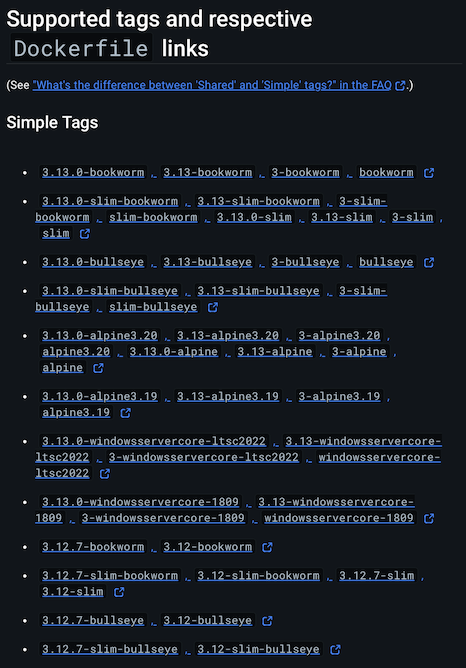
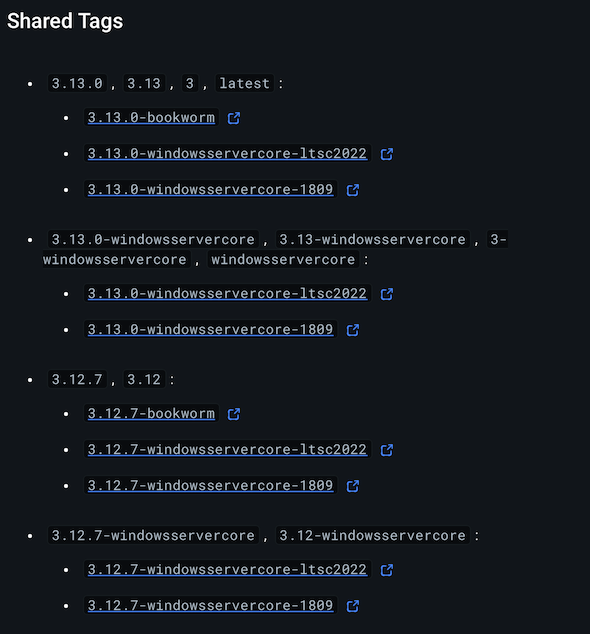

이번 게시글에서는 컨테이너 크기를 줄이기 위한 방안을 살펴보고, 파이썬 컨테이너 이미지 빌드가 가지는 특징을 살펴보도록 하겠습니다.

## 빌드 최적화를 해봅시다

지난 글에서 빌드된 이미지의 크기를 다시 살펴볼까요?

```shell
$ docker images python-hello
REPOSITORY     TAG       IMAGE ID       CREATED         SIZE
python-hello   latest    746136719e90   3 minutes ago   1.46GB
```

1.46GB인 데는 분명 이유가 있을 겁니다. 그러면 `latest` 라는 태그가 무엇을 의미하는지부터 살펴볼까요?

### 잠시만, 왜 이렇게 크지?

[Docker Hub](https://hub.docker.com/_/python)으로 다시 들어가봐서, 어떤 컨테이너가 있나 살펴봅시다.

뭔가 되게 많군요. 숫자는 파이썬 버전같은데, `-` 뒤의 값은 뭔지 알아봅시다.





이 값들은 각각 Simple tags, Shared tags 인데요. 이 값은 아래와 같습니다.

- `simple tags`: 태그로 기재된 리눅스 배포판 혹은 윈도우즈에서만 동작을 보장하는 컨테이너 이미지 입니다. 이 값을 사용하면 해당 태그에 명시된 플랫폼(리눅스나 윈도우즈 등)의 하나의 이미지 정보(이미지의 구성 정보, 레이어 정보, 실행 환경 등을 담은 매니페스트)에 연결됩니다. 이 경우, 명확히 지정한 플랫폼의 이미지만 사용할 수 있습니다.

- `shared tags`: 여러 운영체제(리눅스 및 다양한 윈도우즈 버전)와 아키텍처에서 동작하는 컨테이너 이미지를 나타냅니다. 이 값을 Docker Engine이 구동되는 환경(운영체제, 아키텍처 등)에 맞는 적절한 이미지를 자동으로 선택해서 pull하게 됩니다. 예를 들어, mongo:4.0 같은 shared tag를 사용하면 Docker Engine이 현재 실행 중인 호스트의 운영체제와 아키텍처에 맞는 이미지를 알아서 가져옵니다.

<details>
<summary>🤔 도커의 매니페스트란?</summary>

도커 매니페스트는 컨테이너 이미지에 대한 상세 정보를 담고 있는 메타데이터입니다. 여기에는:
- 이미지가 실행될 수 있는 운영체제와 아키텍처
- 이미지를 구성하는 레이어들의 정보
- 이미지의 설정값 (환경 변수, 실행 명령어 등)
등이 포함됩니다. 도커는 이 매니페스트를 읽어 해당 이미지가 현재 환경에서 실행 가능한지, 어떤 레이어들이 필요한지 등을 파악합니다.

</details>

### 그럼 어떻게 하죠?

도커 이미지 크기를 줄이기 위해서는 아래와 같은 과정을 처리할 수 있습니다.

- 가능하면 가벼운 베이스 이미지를 선택할 것
- 멀티-스테이지를 사용해서, 빌드-런타임 환경을 분리할 것
- 다양한 최적화 방안을 고려해보기
    - `.dockerignore` 파일 작성
    - `RUN` 레이어 최적화
    - 나에게 맞는 패키지/파일을 취사선택하기

### step 1. simple tag를 골라봅시다

앞서 말씀드린 `latest` 는 shared tags 입니다. 구동하려는 호스트에 맞게 구동될 수는 있지만, 최적화는 다른 문제죠. 이럴 땐 최소한의 내용만을 컨테이너를 통한 배포를 수행할 때는 최소한의 내용만 맞추고 배포하는 것이 보다 나은 접근입니다.

대표적인 베이스 이미지는 `Debian linux` 기반의  `slim` 과 `Alpine linux` 기반의 `alpine`이 있습니다. 이 둘을 사용해서 각각 빌드해볼까요?

<details>
<summary>👨‍💻 `slim` 빌드를 해봅시다. </summary>

...

</details>

<details>
<summary>👨‍💻 `alpine` 빌드를 해봅시다. </summary>

...

</details>


### step 1. 멀티-스테이지 사용해보기

1. 멀티-스테이지 구성하기

### step 2. 빌드 타임을 줄여봅시다

1. 빌드타임 줄이기 (캐싱과 동시에 라이브러리 얘기도 하기)

## alpine? debian?

빌드 타임과 simple tag를 이야기하며 말씀드린 alpine 이란 리눅스 배포판과 debian 이란 배포판에 대해 알아봅시다.

1. 알파인과 데비안의 주요 차이점 소개
1. glibc, musl, 그리고 C 라이브러리 소개
1. 원래는 컨테이너 빌드 시점에 파이썬 라이브러리 빌드도 같이 했어야했는데...

## PEP 656의 등장

- pep 513(platform tag for portable linux built dist.), pep 571(manulinux2010), 599(manylinux2014) 등이 나왔고, 이후에는 `manylinux` 로 관리되게끔 하도록 future-proof한 내용은 앞으로 pep 600(Future `manylinux` Platform Tags for Portable Linux Built Distributions)에서 관리
- PEP 656(Platform Tag for Linux Distributions Using Musl)은 이거의 연장선상. 이걸 하면서 `musl` 기반의 파이썬 패키지 배포 표준이 잡힘
- (하지 말아야할 것?) 괜히 C 구현체까지 갖고오는 짓
    - 성능 비교까지 드갈거면 필요는 한데 당장 그걸 할 필요가?

`manylinux` 라는 게 PEP 600으로 나왔다. ([manylinux 링크](https://github.com/pypa/manylinux)) 이거의 목적 자체가 Python wheels that work on any linux (almost). 인걸보면 답 나오지?

```markdown
manylinux
---

Older archives: https://groups.google.com/forum/#!forum/manylinux-discuss

The goal of the manylinux project is to provide a convenient way to distribute binary Python extensions as wheels on Linux. This effort has produced PEP 513 (manylinux1), PEP 571 (manylinux2010), PEP 599 (manylinux2014), PEP 600 (manylinux_x_y) and PEP 656 (musllinux_x_y).
```


2부

빌드최적화를 할거다! 그래서 빌드 최적화의 방안을 소개한다

1. 멀티스테이지 구성을 한다
2. 빌드타임도 줄여야한다
3. simple tag를 써야한다

멀티스테이지는 그렇다 치고(걍 설명하면 되지), 빌드타임과 simple tag는 왜써야되는데?

- 빌드타임 얘기하면서 `manylinux` 얘기하기
- simple tag 얘기하면서 알파인/데비안 소개

---

3부

그러면 어떤 베이스이미지를 어떻게 고르는게 좋은데?
- 아예 scratch를 쓰는건?
- distroless를 쓰는건? (임마 데비안 기반인거면 내부적으로 glibc 쓰는거냐?)

추가로 더 뭘 고려할건데?
- 루트 없는 컨테이너 (1001번 /etc/shadow ?)
- 보안 스캐닝 도구 소개

실제 사용사례 연구???? - 약간 위험한 실험을 하자고

1. I/O bound 태스크 중심: 1억개 데이터 밀어넣고 이 구현체는 이런게 되더라
2. CPU bound 태스크 중심: 끝장나게 많은 데이터를 pandas로 처리하게 구성해보고 이 구현체는 이런 성능을 내더라

이걸 하면서 언제 어떤 컨테이너가 좋은지는 사실 테스트 해보는 수 밖에 없다 이런걸 말하기


## 결론: 상황에 맞는 선택이 정답입니다

우리가 실험을 통해 발견한 내용을 정리해보면:

1. 개발/테스트 환경
   - debian 기반 이미지 권장
     - 디버깅이 용이
     - 추가 패키지 설치가 자유로움
     - CI/CD 파이프라인에서의 유연성

2. 프로덕션 환경
   - I/O bound 워크로드
     - alpine이 충분히 좋은 선택
     - 작은 이미지 크기가 주는 이점이 더 큼
   - CPU bound 워크로드
     - distroless 또는 debian-slim 권장
     - glibc의 성능적 이점 활용
     - 특히 수치 계산이 많은 경우 효과적

3. 보안이 중요한 환경
   - distroless가 최선의 선택
     - 최소한의 공격 표면
     - glibc의 안정성
     - rootless 컨테이너와 조합 시 더욱 효과적

결국 "이것이 절대적으로 좋다"는 없습니다. 우리의 실험이 보여주듯:
- 워크로드의 특성
- 개발 환경과 운영 환경의 차이
- 보안 요구사항
- 팀의 운영 역량

이러한 요소들을 종합적으로 고려해 선택해야 합니다. 

마지막으로 드리고 싶은 조언:
1. 실험하세요: 여러분의 워크로드로 직접 테스트해보세요
2. 측정하세요: 가정이 아닌 데이터로 의사결정하세요
3. 반복하세요: 요구사항 변화에 따라 선택을 재검토하세요
