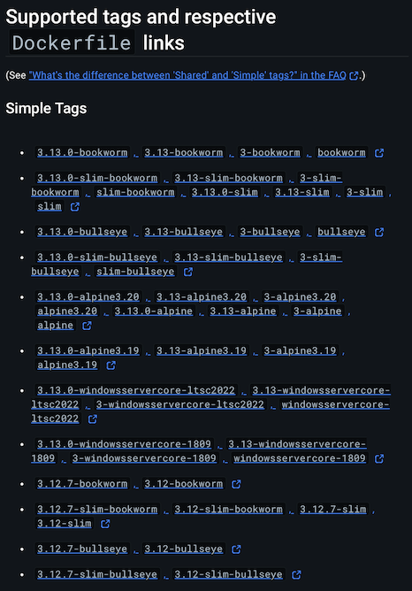
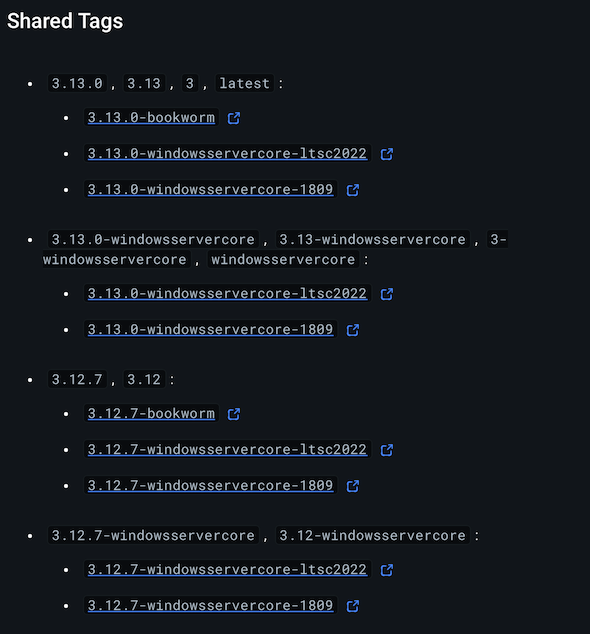

이번 게시글에서는 컨테이너 크기를 줄이기 위한 방안을 살펴보고, 파이썬 컨테이너 이미지 빌드가 가지는 특징을 살펴보도록 하겠습니다.

## 빌드 최적화를 해봅시다

지난 글에서 빌드된 이미지의 크기를 다시 살펴볼까요?

```shell
$ docker images python-hello
REPOSITORY     TAG       IMAGE ID       CREATED         SIZE
python-hello   latest    746136719e90   3 minutes ago   1.46GB
```

1.46GB인 데는 분명 이유가 있을 겁니다. 그러면 `latest` 라는 태그가 무엇을 의미하는지부터 살펴볼까요?

### 잠시만, 왜 이렇게 크지?

[Docker Hub](https://hub.docker.com/_/python)으로 다시 들어가봐서, 어떤 컨테이너가 있나 살펴봅시다.

뭔가 되게 많군요. 숫자는 파이썬 버전같은데, `-` 뒤의 값은 뭔지 알아봅시다.





이 값들은 각각 Simple tags, Shared tags 인데요. 이 값은 아래와 같습니다.

- `simple tags`: 태그로 기재된 리눅스 배포판 혹은 윈도우즈에서만 동작을 보장하는 컨테이너 이미지 입니다. 이 값을 사용하면 해당 태그에 명시된 플랫폼(리눅스나 윈도우즈 등)의 하나의 이미지 정보(이미지의 구성 정보, 레이어 정보, 실행 환경 등을 담은 매니페스트)에 연결됩니다. 이 경우, 명확히 지정한 플랫폼의 이미지만 사용할 수 있습니다.

- `shared tags`: 여러 운영체제(리눅스 및 다양한 윈도우즈 버전)와 아키텍처에서 동작하는 컨테이너 이미지를 나타냅니다. 이 값을 Docker Engine이 구동되는 환경(운영체제, 아키텍처 등)에 맞는 적절한 이미지를 자동으로 선택해서 pull하게 됩니다. 예를 들어, mongo:4.0 같은 shared tag를 사용하면 Docker Engine이 현재 실행 중인 호스트의 운영체제와 아키텍처에 맞는 이미지를 알아서 가져옵니다.

<details>
<summary>🤔 도커의 매니페스트란?</summary>

도커 매니페스트는 컨테이너 이미지에 대한 상세 정보를 담고 있는 메타데이터입니다. 여기에는:
- 이미지가 실행될 수 있는 운영체제와 아키텍처
- 이미지를 구성하는 레이어들의 정보
- 이미지의 설정값 (환경 변수, 실행 명령어 등)
등이 포함됩니다. 도커는 이 매니페스트를 읽어 해당 이미지가 현재 환경에서 실행 가능한지, 어떤 레이어들이 필요한지 등을 파악합니다.

</details>

### 그럼 어떻게 하죠?

도커 이미지 크기를 줄이기 위해서는 아래와 같은 과정을 처리할 수 있습니다.

- 가능하면 가벼운 베이스 이미지를 선택할 것
- 멀티-스테이지를 사용해서, 빌드-런타임 환경을 분리할 것
- 다양한 최적화 방안을 고려해보기
    - `.dockerignore` 파일 작성
    - `RUN` 레이어 최적화
    - 나에게 맞는 패키지[^1]/파일을 취사선택하기

### step 1. simple tag를 골라봅시다

앞서 말씀드린 `latest` 는 shared tags 입니다. 구동하려는 호스트에 맞게 구동될 수는 있지만, 최적화는 다른 문제죠. 이럴 땐 최소한의 내용만을 컨테이너를 통한 배포를 수행할 때는 최소한의 내용만 맞추고 배포하는 것이 보다 나은 접근입니다.

대표적인 베이스 이미지는 `Debian linux` 기반의  `slim` 과 `Alpine linux` 기반의 `alpine`이 있습니다. 

- slim 이미지는,
    - Debian linux의 최소화 버전이며
    - 필수적인 시스템 라이브러리를 갖추고 있습니다
    - C 라이브러리 구현체로 `glibc` 를 사용합니다. 이는 거의 대부분의 라이브러리와 호환됩니다.
- alpine 이미지는,
    - Alpine linux에 대한 최소한의 버전이며
    - 필수적인 시스템 라이브러리로 `busybox` 를 이용합니다
    - C 라이브러리 구현체로 `musl` libc를 사용합니다. 경량버전의 라이브러리를 추구하는 것이 목표이므로, 일부 라이브러리와 호환되지 않을 수도 있습니다.

그러면 이 둘을 사용해서 각각 빌드해볼까요?

<details>
<summary>👨‍💻 `slim` 빌드를 해봅시다. </summary>

1. `Dockerfile` 을 제작합니다.

```dockerfile
FROM python:3.12-slim       # slim은 Debian slim 이미지를 의미합니다.
WORKDIR /app
COPY hello.py .
CMD ["python", "hello.py"]
```

2. 빌드를 동일하게 해보고,

```shell
ocker build -t python-hello:slim .
```

3. 사이즈를 확인해볼까요?

```shell
docker images
REPOSITORY          TAG            IMAGE ID       CREATED         SIZE
python-hello        slim           2f648897463c   5 seconds ago   212MB
python-hello        latest         746136719e90   12 days ago     1.46GB
```

</details>

<details>
<summary>👨‍💻 `alpine` 빌드를 해봅시다. </summary>

1. `Dockerfile` 을 제작합니다.

```dockerfile
FROM python:3.12-alpine       # alpine은 Alpine 이미지를 의미합니다.
WORKDIR /app
COPY hello.py .
CMD ["python", "hello.py"]
```

2. 빌드를 동일하게 해보고,

```shell
ocker build -t python-hello:alpine .
```

3. 사이즈를 확인해볼까요?

```shell
docker images
REPOSITORY          TAG            IMAGE ID       CREATED         SIZE
python-hello        slim           2f648897463c   5 seconds ago   212MB
python-hello        alpine         37a9f605a036   3 minutes ago   78.4MB
python-hello        latest         746136719e90   12 days ago     1.46GB
```

</details>

### step 2. 멀티-스테이지 사용해보기

멀티-스테이지는 하나의 `Dockerfile`에서 다양한 스테이지로 나누어서 레이어를 쌓는 개념을 의미합니다. 그렇다면 어떤 스테이지가 있는지 살펴볼까요?

- 빌드 스테이지
    - 빌드 도구에 필요한 내용만을 포함합니다
    - 빌드 결과를 저장합니다
- 런타임 스테이지
    - 직전 phase에서 저장한 파일들을 복사합니다.
    - 빌드 후의 내용을 구동할 최소한의 파일만을 설치합니다
    - 본 내용에서는 런타임 스테이지를 run stage, service stage 둘로 나눕니다.
        - 이는 각각 실행환경 구성, 앱 실행환경 구성을 의미합니다.

그렇다면 멀티-스테이지로 빌드를 수행해볼까요?

이번 예시부터는 이 [GitHub repo](https://github.com/max-pfeiffer/python-poetry)를 사용해보겠습니다.

### 멀티-스테이지가 없다면?

그렇다면, 멀티-스테이지 없이 헬로글또를 찍어볼까요?

```dockerfile
FROM python:3.12-slim

ARG POETRY_VERSION=1.6.1
ARG APPLICATION_SERVER_PORT=8000

ENV PIP_NO_CACHE_DIR=off \
    PIP_DISABLE_PIP_VERSION_CHECK=on \
    PIP_DEFAULT_TIMEOUT=100 \
    POETRY_VERSION=${POETRY_VERSION} \
    POETRY_HOME="/opt/poetry" \
    PYTHONUNBUFFERED=1 \
    PYTHONDONTWRITEBYTECODE=1 \
    PYTHONPATH=/application_root \
    POETRY_VIRTUALENVS_IN_PROJECT=true \
    POETRY_CACHE_DIR="/application_root/.cache" \
    VIRTUAL_ENVIRONMENT_PATH="/application_root/.venv" \
    APPLICATION_SERVER_PORT=$APPLICATION_SERVER_PORT \
    PATH="/opt/poetry/bin:$PATH"

# 빌드 도구 설치
RUN apt-get update \
    && apt-get install --no-install-recommends -y \
        build-essential

# Poetry 설치
RUN python -m venv ${POETRY_HOME}
RUN ${POETRY_HOME}/bin/pip install -U pip setuptools
RUN ${POETRY_HOME}/bin/pip install "poetry==${POETRY_VERSION}"

# 사용자 생성
RUN groupadd -g 1001 python_application && \
    useradd -r -u 1001 -g python_application python_application

WORKDIR ${PYTHONPATH}
COPY . ${PYTHONPATH}
RUN chown python_application:python_application ${PYTHONPATH}

RUN mkdir ${POETRY_CACHE_DIR} && chown python_application:python_application ${POETRY_CACHE_DIR}

EXPOSE ${APPLICATION_SERVER_PORT}

COPY ./docker/dev/entrypoint /entrypoint
RUN sed -i 's/\r$//g' /entrypoint
RUN chmod +x /entrypoint

USER 1001

RUN poetry install --without dev

ENTRYPOINT ["/entrypoint"]
```

이걸로 만든 이미지의 크기를 살펴봅시다.

```shell
docker images
REPOSITORY          TAG                  IMAGE ID       CREATED          SIZE
python-hello        slim-without-multi   f4be58bb8080   38 seconds ago   700MB
```

### 멀티-스테이지가 있다면?

반대로 멀티-스테이지를 추가해서 헬로글또를 찍어봅시다.

1. 빌드 스테이지

빌드 스테이지는 실제 필요한 내용들만을 설치합니다.

```dockerfile
### ### ### ### ### ### ###
# STAGE 0. Prerequisites  #
### ### ### ### ### ### ###
ARG OFFICIAL_PYTHON_IMAGE=3.12

FROM python:${OFFICIAL_PYTHON_IMAGE}-slim AS build-stage        # debian slim 이미지를 빌드 스테이지로 설정합시다.
ARG POETRY_VERSION=1.6.1                                        # 패키지 매니저로 poetry v1.6.1를 씁니다.

ENV PIP_NO_CACHE_DIR=off \                                      # 최적화 옵션입니다. 자세한 것은 위의 GitHub 링크를 확인해주세요!
    PIP_DISABLE_PIP_VERSION_CHECK=on \
    PIP_DEFAULT_TIMEOUT=100 \
    POETRY_VERSION=${POETRY_VERSION} \
    POETRY_HOME="/opt/poetry"

RUN apt-get update \
    && apt-get install --no-install-recommends -y build-essential \   # 빌드에 필요한 핵심 내용들만 설치합니다.
    && rm -rf /var/lib/apt/lists/*

# https://python-poetry.org/docs/#installing-manually
RUN python -m venv ${POETRY_HOME}                               # 가상환경을 구성하고, poetry를 설치합니다.
RUN ${POETRY_HOME}/bin/pip install -U pip setuptools
RUN ${POETRY_HOME}/bin/pip install "poetry==${POETRY_VERSION}"
```

2. Run 스테이지

- 실행환경을 구성하는 중간단계 입니다.
- 필요한 부분만을 복사하고, 빌드도구를 제외합니다.

```dockerfile
### ### ### ### ###
# STAGE 1. 'run'  #
### ### ### ### ###
FROM python:${OFFICIAL_PYTHON_IMAGE}-slim AS run-stage

ENV PATH="/opt/poetry/bin:$PATH"                    # 환경변수를 추가하여, poetry를 쓸 수 있게 구성합니다.

COPY --from=build-stage /opt/poetry /opt/poetry/    # build-stage에서 필요한 내용만 가져옵니다.
```

3. Service 스테이지

- 실제 애플리케이션이 구동될 환경을 구성합니다.
- 보안설정, 런타임에 필요한 의존성을 구성하고 서비스를 구동합니다.
- 구동 전 `entrypoint` 파일을 별도로 두고 이 파일을 entrypoint 로 구성합니다.

```dockerfile
### ### ### ### ### ###
# STAGE 2. 'service'  #
### ### ### ### ### ###
FROM run-stage AS service-stage

ARG APPLICATION_SERVER_PORT=8000

    # https://docs.python.org/3/using/cmdline.html#envvar-PYTHONUNBUFFERED
ENV PYTHONUNBUFFERED=1 \
    # https://docs.python.org/3/using/cmdline.html#envvar-PYTHONDONTWRITEBYTECODE
    PYTHONDONTWRITEBYTECODE=1 \
    PYTHONPATH=/application_root \
    # https://python-poetry.org/docs/configuration/#virtualenvsin-project
    POETRY_VIRTUALENVS_IN_PROJECT=true \
    POETRY_CACHE_DIR="/application_root/.cache" \
    VIRTUAL_ENVIRONMENT_PATH="/application_root/.venv" \
    APPLICATION_SERVER_PORT=$APPLICATION_SERVER_PORT

# 가상환경이 먼저 실행될 수 있도록 PATH의 앞에 추가
# https://docs.python.org/3/library/venv.html#how-venvs-work
ENV PATH="$VIRTUAL_ENVIRONMENT_PATH/bin:$PATH"

# 권한분리를 위해 처리
RUN groupadd -g 1001 python_application && \
    useradd -r -u 1001 -g python_application python_application

# WORKDIR를 애플리케이션 루트 디렉터리로 지정
# https://www.uvicorn.org/settings/#development
# https://docs.docker.com/engine/reference/builder/#workdir
WORKDIR ${PYTHONPATH}
COPY . ${PYTHONPATH}
RUN chown python_application:python_application ${PYTHONPATH}

# poetry 캐시 디렉터리를 만들고, 권한을 부여함. 링크 참조
# https://python-poetry.org/docs/configuration/#cache-directory
RUN mkdir ${POETRY_CACHE_DIR} && chown python_application:python_application ${POETRY_CACHE_DIR}

# API 엔드포인트에 대해 문서화를 수행
# https://docs.docker.com/engine/reference/builder/#expose
EXPOSE ${APPLICATION_SERVER_PORT}

# ENTRYPOINT로 사용할 파일에 대해 복사 후 내용 구성
COPY ./docker/dev/entrypoint /entrypoint
RUN sed -i 's/\r$//g' /entrypoint
RUN chmod +x /entrypoint

# 컨테이너 구동 시에 부여하는 권한을 명시함
USER 1001

# poetry를 이용하여 의존성 설치
RUN poetry install --without dev

# Entrypoint 로 추가한 파일을 사용.
# https://www.docker.com/blog/docker-best-practices-choosing-between-run-cmd-and-entrypoint/
ENTRYPOINT ["/entrypoint"]
```

이렇게 되면 용량은 얼마나 줄어들까요?

```shell
docker images
REPOSITORY          TAG            IMAGE ID       CREATED          SIZE
python-hello        slim-multi     4f8e4848dc55   27 minutes ago   324MB
```

절반이나 줄어들었군요!

### step 2. 빌드 타임을 줄여봅시다

멀티-스테이지는 빌드타임이 얼마나 걸리는지 살펴볼까요? 이번에는 외부 패키지를 추가로 설치해서 테스트 해봅시다.
설치 대상은 `pandas` 와 `matplotlib` 입니다.

```shell
docker build -t python-hello:slim-multi-2 --no-cache .
[+] Building 45.6s (20/20) FINISHED                                                                                                    docker:desktop-linux
 => [internal] load build definition from Dockerfile                                                                                                   0.0s
 => => transferring dockerfile: 3.53kB                                                                                                                 0.0s
 => [internal] load metadata for docker.io/library/python:3.12-slim                                                                                    2.6s
 => [internal] load .dockerignore                                                                                                                      0.0s
 => => transferring context: 2B                                                                                                                        0.0s
 => [internal] load build context                                                                                                                      0.0s
 => => transferring context: 87.08kB                                                                                                                   0.0s
 => [build-stage 1/5] FROM docker.io/library/python:3.12-slim@sha256:032c52613401895aa3d418a4c563d2d05f993bc3ecc065c8f4e2280978acd249                  5.6s
(생략)
 => [build-stage 2/5] RUN apt-get update     && apt-get install --no-install-recommends -y build-essential     && rm -rf /var/lib/apt/lists/*          12.4s
 => [build-stage 3/5] RUN python -m venv /opt/poetry                                                                                                   1.9s 
 => [build-stage 4/5] RUN /opt/poetry/bin/pip install -U pip setuptools                                                                                1.1s 
 => [build-stage 5/5] RUN /opt/poetry/bin/pip install "poetry==1.6.1"                                                                                  5.1s 
 => [run-stage 2/2] COPY --from=build-stage /opt/poetry /opt/poetry/                                                                                   0.2s
 => [service-stage 1/9] RUN groupadd -g 1001 python_application &&     useradd -r -u 1001 -g python_application python_application                     0.2s
 => [service-stage 2/9] WORKDIR /application_root                                                                                                      0.0s
 => [service-stage 3/9] COPY . /application_root                                                                                                       0.0s
 => [service-stage 4/9] RUN chown python_application:python_application /application_root                                                              0.1s
 => [service-stage 5/9] RUN mkdir /application_root/.cache && chown python_application:python_application /application_root/.cache                     0.1s
 => [service-stage 6/9] COPY entrypoint /entrypoint                                                                                                    0.0s
 => [service-stage 7/9] RUN sed -i 's/\r$//g' /entrypoint                                                                                              0.1s
 => [service-stage 8/9] RUN chmod +x /entrypoint                                                                                                       0.1s
 => [service-stage 9/9] RUN poetry install --without dev                                                                                               7.4s
 => exporting to image                                                                                                                                 8.3s
 => => exporting layers                                                                                                                                6.5s
 => => exporting manifest sha256:2e1a026e67ea60a968a576838692cc7661011085b146d3b94bff86e21c10fedd                                                      0.0s
 => => exporting config sha256:f7b5913e1edb9f4566cd1bf1c1f32e0baa757f9fae90fea096917d7241a0fd6d                                                        0.0s
 => => exporting attestation manifest sha256:6482e53034c92e947f0c26372d5a0fc24e24d510ec9a4a5c5ff6901310ef5263                                          0.0s
 => => exporting manifest list sha256:a23299c55409341354951e7931f8bf1f38137fd21391853773255b17062c1c0f                                                 0.0s
 => => naming to docker.io/library/python-hello:slim-multi-2                                                                                           0.0s
 => => unpacking to docker.io/library/python-hello:slim-multi-2                                                                                        1.8s
```

그렇다면, alpine 베이스 이미지로 빌드를 수행해봅시다.

```shell
docker build -t python-hello:alpine-multi-2 --no-cache .
[+] Building 90.4s (21/21) FINISHED                                                                                                     docker:desktop-linux
 => [internal] load build definition from Dockerfile                                                                                                    0.0s
 => => transferring dockerfile: 2.18kB                                                                                                                  0.0s
 => [internal] load metadata for docker.io/library/python:3.12-alpine                                                                                   1.4s
 => [internal] load .dockerignore                                                                                                                       0.0s
 => => transferring context: 2B                                                                                                                         0.0s
 => [internal] load build context                                                                                                                       0.0s
 => => transferring context: 85.72kB                                                                                                                    0.0s
 => [build-stage 1/5] FROM docker.io/library/python:3.12-alpine@sha256:38e179a0f0436c97ecc76bcd378d7293ab3ee79e4b8c440fdc7113670cb6e204                 2.3s
(생략)
 => [build-stage 2/5] RUN apk add --no-cache     gcc     python3-dev                                                                                   12.1s
 => [build-stage 3/5] RUN python -m venv /opt/poetry                                                                                                    2.2s 
 => [build-stage 4/5] RUN /opt/poetry/bin/pip install -U pip setuptools                                                                                 1.3s 
 => [build-stage 5/5] RUN /opt/poetry/bin/pip install "poetry==1.6.1"                                                                                   5.7s 
 => [run-stage 2/2] COPY --from=build-stage /opt/poetry /opt/poetry/                                                                                    0.2s
 => [service-stage  1/10] RUN addgroup -g 1001 -S python_application &&     adduser -S -u 1001 -G python_application python_application                 0.1s
 => [service-stage  2/10] WORKDIR /application_root                                                                                                     0.0s
 => [service-stage  3/10] COPY . /application_root                                                                                                      0.0s
 => [service-stage  4/10] RUN chown python_application:python_application /application_root                                                             0.1s
 => [service-stage  5/10] RUN mkdir /application_root/.cache && chown python_application:python_application /application_root/.cache                    0.2s
 => [service-stage  6/10] COPY entrypoint /entrypoint                                                                                                   0.0s
 => [service-stage  7/10] RUN sed -i 's/\r$//' /entrypoint                                                                                              0.2s
 => [service-stage  8/10] RUN chmod +x /entrypoint                                                                                                      0.1s
 => [service-stage  9/10] RUN apk add --no-cache     g++     openssl                                                                                    8.2s
 => [service-stage 10/10] RUN poetry install --without dev                                                                                             44.2s
 => exporting to image                                                                                                                                 11.8s```
 => => exporting layers                                                                                                                                 9.2s
 => => exporting manifest sha256:6b7bcd80340bf252c06947fde85a4fb53012c3d8bb07ff6dfd3a8b6fe6d1022c                                                       0.0s
 => => exporting config sha256:58c4058d992779af8b0e3aa67ceabd655d234d871e38af0e6996155a56ed953e                                                         0.0s
 => => exporting attestation manifest sha256:e88ed3098ce10fbce9ed2452c82ada1f5ccccb7c9d094b6f2da495754249db26                                           0.0s
 => => exporting manifest list sha256:b0b8cc043f1436abf29e9b45bcbcf618d0838de9d1678086c9b2b5acc1541e9b                                                  0.0s
 => => naming to docker.io/library/python-hello:alpine-multi-2                                                                                          0.0s
 => => unpacking to docker.io/library/python-hello:alpine-multi-2                                                                                       2.6s
```

빌드 시간과 크기에 대해 한번 살펴보죠.

```shell
docker images
REPOSITORY     TAG              IMAGE ID       CREATED         SIZE
python-hello   alpine-multi-2   b0b8cc043f14   2 minutes ago   1.13GB
python-hello   slim-multi-2     a23299c55409   3 minutes ago   755MB
```

|베이스이미지|빌드된 이미지 크기|소요시간(단위: 초)|
|------------|------------------|--------|
|debian slim|`755 MB`|`45.6`|
|alpine|`1.13 GB`|`90.4`|

- debian 베이스 이미지는 용량, 소요시간 측면 모두에서 안정적이었습니다.
- alpine 베이스 이미지는 빌드시간 자체도 늦고, 크기도 커졌습니다.

그렇다면 alpine 베이스 이미지는 사용할 수 없는 걸까요? 왜 그런건지 알아보기에 앞서, 앞서  알아봅시다.

## C 라이브러리 구현체와 빌드의 차이

그렇다면 앞서 alpine linux 배포판과 debian 배포판의 차이를 알아봅시다. 이 글에서 살펴볼 둘의 주요 차이점은 C 라이브러리 구현체의 선택입니다. 각각의 특징을 살펴보겠습니다:

### `glibc` (Debian 계열)
- 리눅스 생태계의 사실상 표준 구현체입니다
- 대부분의 파이썬 패키지가 `glibc` 기준으로 빌드되어있으니, 안정성과 호환성이 검증되어 있습니다.
- 그런 이유로 베이스 이미지 크기가 상대적으로 큽니다

### `musl` (Alpine Linux)
- 경량화된 C 라이브러리 구현체입니다
- 단순한 구현으로 보안 공격 표면이 작습니다
- 베이스 이미지 크기가 매우 작습니다 (Debian 대비 약 1/20)
- 일부 바이너리와 호환성 이슈가 발생할 수 있습니다

## Python Wheels의 발전과 Alpine Linux 지원

과거에는 Alpine Linux에서 많은 파이썬 패키지를 설치할 때 소스로부터 직접 빌드해야 했고, 이는 컨테이너 빌드 시간을 길어지게 하는 주요 요소였습니다. 하지만 Python 패키징 생태계의 발전으로 상황이 크게 개선되었습니다.

### Python 패키징의 발전 과정

다양한 배포판에서 파이썬 패키지를 바로 설치할 수 있도록 하기 위해, 아래와 같은 PEP가 지속적으로 제안되어 왔고 또 받아들여졌습니다.

1. PEP 513 (manylinux1): 최초의 호환성 있는 Linux wheel 표준 도입
2. PEP 571 (manylinux2010): glibc 2.12 기반 호환성 확장
3. PEP 599 (manylinux2014): 더 새로운 시스템 라이브러리 지원
4. PEP 600 (Future manylinux): 향후 확장성을 고려한 태그 체계 도입
5. **PEP 656 (musllinux)**: Alpine Linux 등 `musl` 기반 배포판 공식 지원

PEP 656이 accept 되며, `musl` 기반의 빌드가 이루어진 파이썬 패키지도 직접 다운로드 받게 되어, 이를 지원하고 빌드한 라이브러리라면 누구나 쓸 수 있게 되었습니다.

### manylinux?

manylinux는 "Python wheels that work on any linux (almost)." 라는 목표를 가지고 다양한 배포판을 타겟으로 빌드하기 위해 시작된 프로젝트 입니다. 원하는 리눅스 배포판에서 라이브러리를 빌드없이 직접 다운로드 받아 쓸 수 있도록 규약을 잡기 시작한 것이라고 이해할 수 있지요([manylinux 링크](https://github.com/pypa/manylinux)에서 발췌하였습니다).

```markdown
manylinux
---

Older archives: https://groups.google.com/forum/#!forum/manylinux-discuss

The goal of the manylinux project is to provide a convenient way to distribute binary Python extensions as wheels on Linux. This effort has produced PEP 513 (manylinux1), PEP 571 (manylinux2010), PEP 599 (manylinux2014), PEP 600 (manylinux_x_y) and PEP 656 (musllinux_x_y).
```

### PEP 656의 의의

Alpine linux와 관련해서는 PEP 656(Platform Tag for Linux Distributions Using Musl)은 위 PEP의 연장선상이라 할 수 있지요. 이 표준이 받아들여지면서, `musl` 기반의 빌드된 wheel을 배포자가 업데이트 하면 사용자가 즉시 설치할 수 있게 된 것입니다. 이로 인해 alpine linux 기반의 베이스 이미지를 선택해도 빌드 시간 단축 및 의존성 문제를 해결할 수 있게 된 겁니다.

이로인해 Alpine 베이스 파이썬 컨테이너를 선택하더라도 빌드 시간 단축과 이미지 크기 최적화의 이점을 누릴 수 있게 되었습니다. 특히 PEP 656 도입 이후에는 많은 패키지가 musllinux wheel을 제공하고 있고, 코어 로직이 Rust로 짜여진 파이썬 패키지들은 크로스플랫폼을 쉽게 지원하기 때문에 이런 부분에서도 선택에 제약이 크게 없습니다.

## 마지막으로

그렇지만 여전히 의문입니다. 그러면 언제, 어떤 시기에 적절한 베이스 이미지를 선택하면 될까요? 무턱대고 고르기에는 아무래도 의심이 듭니다. 간단하게나마 있을법한 일을 검증해보고 적절한지 예시 데이터를 보면 더욱 안심이겠죠. 그래서 다음장에는 아래의 상황에서 어떤 베이스 이미지가 좋은지 함께 살펴볼 예정입니다.

- I/O bound 태스크 중심: API 서비스를 만들고, DB에는 1억개의 데이터을 추가한 후, 쿼리 테스트 및 부하 테스트를 수행하여 성능을 리포트
- CPU bound 태스크 중심: 매우 큰 데이터를 pandas로 처리, matplotlib으로 연산하게 구성해보고 성능을 리포트

긴 글 읽어주셔서 감사합니다.

[^1]: 패키지(이 글에서는 파이썬 패키지를 의미)는 `pip` 등으로 설치할 수 있는 외부 모듈의 모음을 의미합니다. 쉽게 말하자면 파이썬 라이브러리라고 할 수 있지요.