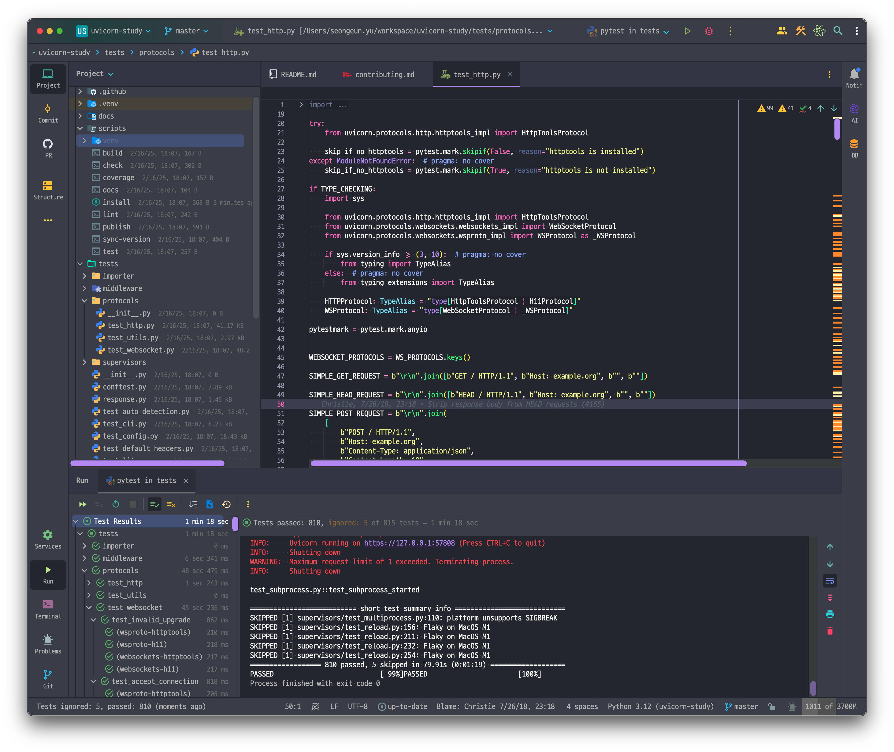
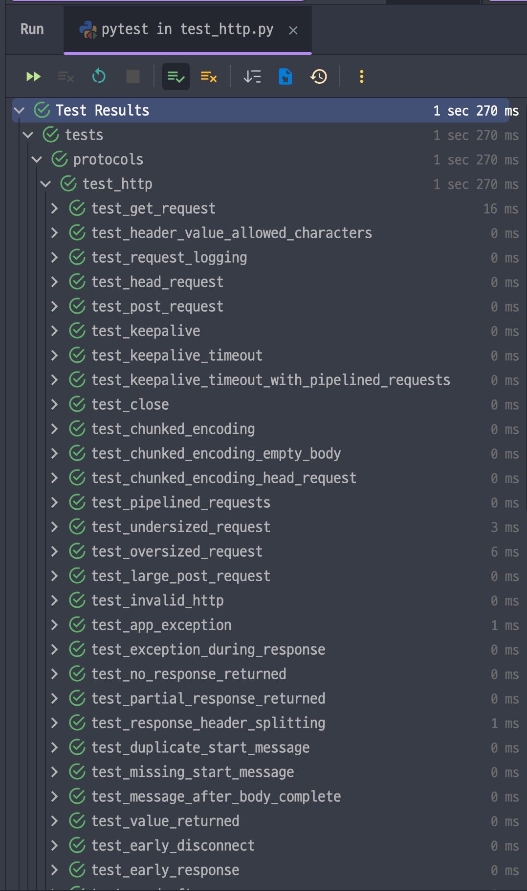
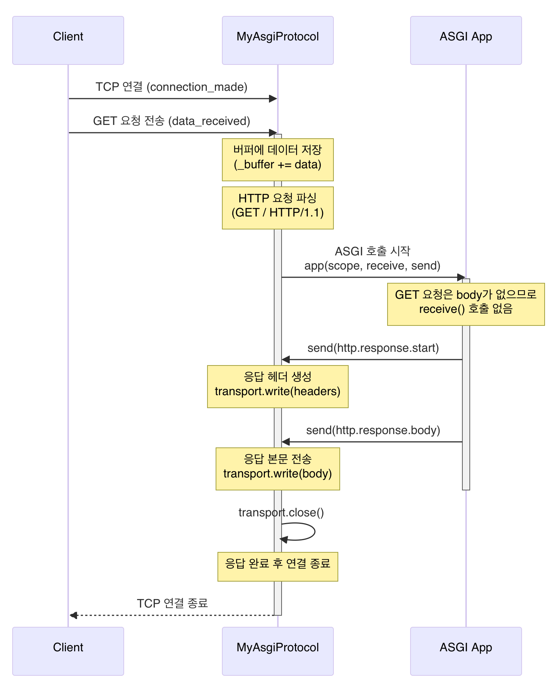
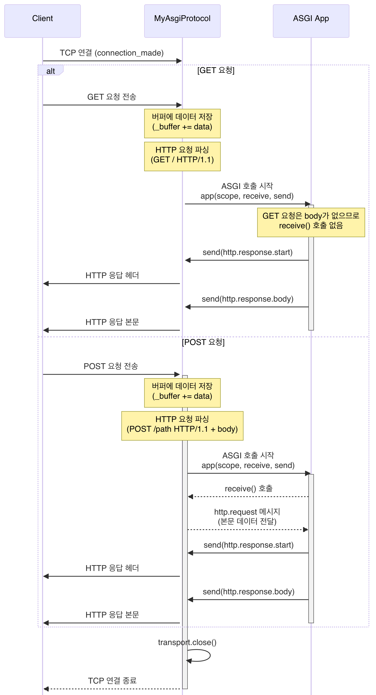

# 들어가며

지난 글에서 살펴보았던 WSGI의 간단한 구현체 작성에 이어 이번에는 ASGI 스펙을 읽고, 어떤 점과 차이가 있는지 살펴봅니다. 그리고 어떤 부분에서 다른지 추가로 구현해봅니다.

# 제한사항

이 글에서는 이벤트 루프를 다루지 않습니다. 그저 이벤트 루프를 쓴다 정도에만 한정하고, ASGI의 구현에 집중합니다.

이벤트 루프에 대해서는 아래 글과 영상을 참고해주세요:

- [Python 공식 문서 - 이벤트 루프](https://docs.python.org/ko/3.13/library/asyncio-eventloop.html)
- [블로그 - [ python ] event loop (1)](https://ks1171-park.tistory.com/81)
- [YouTube -  Talks - Arthur Pastel: Demystifying AsyncIO: Building Your Own Event Loop in Python ](https://www.youtube.com/watch?v=8I9Rc2Zaos4)

# ASGI란?

ASGI는 네트워크 프로토콜 서버(특히 웹 서버)와 Python 애플리케이션 간의 표준 인터페이스 확장입니다. WSGI는 HTTP 프로토콜만을 다루었지만 HTTP, HTTP/2, WebSocket을 포함한 여러 일반적인 프로토콜 스타일을 비동기 스타일로 처리할 수 있도록 하기 위한 확장(_superset_)입니다. 

ASGI는 기존의 동기처리와 새로운 비동기 처리를 모두 지원합니다. WSGI에서 동기 처리를 위헤 Callable 객체를 주고받았던 것 처럼, ASGI는 비동기 호출 모델로 구성되어 있습니다. 파이썬으로 작성된 비동기 처리 웹 앱과 웹 서버 간의 통신규약이라는 뜻이지요.

그리고 ASGI는 다양한 구현체들이 있습니다. 유명한 구현체로는 [uvicorn](https://www.uvicorn.org/), [hypercorn](https://github.com/pgjones/hypercorn/), [daphne](https://github.com/django/daphne) 가 있습니다. ASGI 공식 스펙에 필요한 주요 도구를 지속 개발중인 리포지토리도 알아주시면 좋습니다([asgiref](https://github.com/django/asgiref))[^1].

놀랍게도 앞선 글에서 언급한 WSGI는 PEP 표준이지만, ASGI는 PEP 표준은 아닙니다. 비동기 처리 대응용 확장 정도로 살펴보면 되겠네요.

# ASGI 소개

## WSGI 처리의 한계점?

우선 WSGI는 살펴보았다시피 단일 콜러블 인터페이스로 구성됩니다. 이런 인터페이스는 단독 요청-응답에 맞게 설계되어있다보니 롱 폴링이 필요한 WebSocket 같은 웹 프로토콜에는 적합하지 않지요. 이런 프로토콜은 연결이 오래 지속되고 여러 이벤트가 발생합니다.

따라서 단순히 비동기 처리를 하도록 바꾸기에는 어려우므로 WSGI를 바탕으로 한 새 설계가 시작된 것입니다.

## ASGI의 설계 기초

ASGI도 WSGI와 비슷하지만, _단일 비동기 콜러블_ 인터페이스로 설계되었습니다. 이 메소드는 `scope`, `send`, `receive`를 각각 가집니다. 아래에서 설명하겠습니다:

- `scope`: 딕셔너리 - 현재 커넥션 관련 상세정보를 저장함
- `send`: 비동기 콜러블 - 애플리케이션이 이벤트 메시지를 클라이언트에 전송해줌
- `receive`: 비동기 콜러블 - 애플리케이션이 클라이언트로부터 메시지를 받게 해줌

이런 구조는 들어오고 나가는 이벤트를 각 애플리케이션 마다 처리할 수 있슬 뿐 아니라 백그라운드 코루틴을 허용하여 애플리케이션이 다른 작업을 수행할 수 있도록 합니다. 예를 들어 Redie queue를 통한 외부 트리거 리스닝 등이 있어요.

예시를 보면 어떻게 되어있나 봅시다:

```python
async def application(scope, receive, send):
    event = await receive()
    ...
    await send({"type": "websocket.send", ...})
```

`send` 하고 `receive` 하는 모든 이벤트는 사전에 정의된(_predefined_) `dict` 타입입니다. 이렇게 되면 필요할 때 애플리케이션을 서버 간 교체를 할 수 있습니다. 다른 ASGI서버를 쓰더라도 잘 실행할 수 있다는 뜻이지요.

모든 이벤트는 `type` 이라는 값을 가집니다. 이 값을 통해 이벤트의 구조를 추론할 수 있지요. HTTP 프로토콜인지, WebSocket 프로토콜인지, 후술할 lifespan 프로토콜인지 설명해줍니다.

이벤트는 이런 규칙을 가집니다:

```python
{
    "type": "http.request",        # HTTP 요청임을 나타내는 타입
    "body": b"Hello World",        # 요청 본문 (바이트 형식)
    "more_body": False,            # 추가 본문이 없음을 표시
}
```

만일 웹소켓 이벤트라면:

```python
{
    "type": "websocket.send",      # WebSocket 메시지 전송을 나타내는 타입
    "text": "Hello world!",        # 전송할 텍스트 메시지
}
```

lifespan 프로토콜은 ASGI 애플리케이션의 수명주기를 관리합니다. 서버 시작/종료시점에 필요한 행위를 처리하는 이벤트임을 말해주는 것이죠.

## WSGI 호환

ASGI는 설계부터 WSGI의 superset으로 고려되었습니다. 따라서 WSGI 앱이 ASGI 앱 내에서도 작동되도록 하는 전환 wrapper가 따로 존재합니다(`asgiref` 라이브러리에서 제공됩니다). 정확히는 스레드풀이 동기 WSGI 앱을 async event loop와 별개로 쓰이는 형식입니다(`WsgiToAsgi` 를 참고하세요).

# ASGI 스펙 상세보기

이제부터 본격적인 ASGI의 구성을 살펴봅시다.

## 구성요소와 하는 일

ASGI는 크게 두 가지 구성요소를 가집니다:

1. 프로토콜 서버
    - 소켓 연결을 관리하고, 이를 연결과 연결 별 이벤트 메시지로 변환
    - 비동기 이벤트 루프 관리
2. 애플리케이션
    - 프로토콜 서버 내부에 존재하며, 각 연결당 한 번씩 호출됨
    - 이벤트 메시지가 발생할 때마다 처리하고, 필요할 때 자체 이벤트 메시지를 전송
    - 메인 스레드에서 실행되며, 필요시 동기 코드를 위한 별도 스레드/프로세스 사용 가능

구조는 WSGI와 유사하지만, 애플리케이션은 비동기 Callable 객체임에 유의합니다. 데이터 처리는 단일 입력 스트림 대신 비동기 이벤트 메시지를 통해 이루어집니다. 그러므로 ASGI 애플리케이션은 `async`/`await` 호환 코루틴(i.e., `asyncio` 호환)으로 실행되어야 합니다.

ASGI 연결은 다음 두 가지 주요 부분으로 구성됩니다:

1. 연결 `scope`
    - 사용자와의 프로토콜 연결을 나타내는 정보
    - 연결이 종료될 때까지 유지됨
2. 이벤트 처리
    - receive: 연결에서 발생하는 이벤트를 애플리케이션이 수신
    - send: 애플리케이션이 서버로 응답을 전송(클라이언트에게 전달될 데이터 포함)
    - 두 가지 모두 awaitable callable로 구현

각 애플리케이션 호출은 하나의 연결에 매핑되며, 해당 연결의 수명과 정리 작업이 완료될 때까지 유지됩니다.

# ASGI 예시코드 짜보기

> 🍅 tips
> 먼저 GET 요청을 받고 확인하는 로직을 구현합니다.
> POST 요청은 그 다음에 진행해봅시다.

이제부터는 ASGI의 두 구성요소를 만들어봐야겠죠. 애플리케이션의 예시는 보았다시피 단순히 요청을 받고, 처리할 수 있기만 하면 됩니다. 그렇다면 우리는 소켓 연결을 관리하고, 메시지로 변환해주는 ASGI의 프로토콜 서버를 만들어봅시다. 그런데 예시가 너무 막막하네요. 이럴 땐 완성된 구현체를 한번 보는것부터 시작합시다.

## ASGI의 프로토콜 서버 만들기

### `uvicorn` 구현체와 테스트 구동을 통한 확인

우선 기념비적인 전체 테스트를 돌려봅시다.



그렇다면, `protocols` 디렉터리 내의 HTTP 프로토콜 테스트를 돌려봅시다.



HTTP의 다양한 케이스에 대해 정리한 것을 볼 수 있습니다. 그러면 우리는 가장 쉬운 "일단 되기" 부터 만들기 위해 테스트 케이스를 분석해보죠.

```python
async def test_get_request(http_protocol_cls: HTTPProtocol):
    app = Response("Hello, world", media_type="text/plain")

    protocol = get_connected_protocol(app, http_protocol_cls)
    protocol.data_received(SIMPLE_GET_REQUEST)
    await protocol.loop.run_one()
    assert b"HTTP/1.1 200 OK" in protocol.transport.buffer
    assert b"Hello, world" in protocol.transport.buffer
```

app은 ASGI의 애플리케이션 서버의 예시를 말합니다. 실제로도 코드에 그렇게 정의되어 있어요[^2]. 우리가 관심있는 `get_connected_protocol` 은 바로 윗줄에 있습니다[^3].

이 코드를 보면 loop, transport, config, lifespan, 기타 등등이 있지만 우리의 주요 관심사인 `protocol` 부터 봅시다.

```python
def get_connected_protocol(
    app: ASGIApplication,
    http_protocol_cls: HTTPProtocol,  # 이건 무슨타입일까요.
    lifespan: LifespanOff | LifespanOn | None = None,
    **kwargs: Any,
):
    ...
```

`HTTPProtocol` 타입에 대해 봅시다.

```python
if TYPE_CHECKING:
    # (생략)
    HTTPProtocol: TypeAlias = "type[HttpToolsProtocol | H11Protocol]"   # 이 코드에 집중합시다!
    WSProtocol: TypeAlias = "type[WebSocketProtocol | _WSProtocol]"
```

H11Protocol과 HttpToolsProtocol 둘 중 하나가 될 수 있는 모양이군요. `conftest.py` 를 봤더니 둘 다 쓰고있도록 하고있구요[^4].

```python
@pytest.fixture(
    params=[
        pytest.param(
            "uvicorn.protocols.http.httptools_impl:HttpToolsProtocol",
            marks=pytest.mark.skipif(
                not importlib.util.find_spec("httptools"),
                reason="httptools not installed.",
            ),
            id="httptools",
        ),
        pytest.param("uvicorn.protocols.http.h11_impl:H11Protocol", id="h11"),
    ]
)
def http_protocol_cls(request: pytest.FixtureRequest):
    return import_from_string(request.param)  # 이건 아래 4번 각주를 참고해주세요.
```

이런 식으로 픽스처 처리를 하면 parametrized 처리도 할 수 있나봅니다. 하나 배웠네요!

...아무튼 본론으로 다시 돌아가서,

`HttpToolsProtocol`과 `H11Protocol` 구현체를 봅시다. 각각 아래와 같이 되어있습니다.

```python
# uvicorn/protocols/http/h11_impl.py
class H11Protocol(asyncio.Protocol):
    def __init__(
        self,
        config: Config,
        server_state: ServerState,
        app_state: dict[str, Any],
        _loop: asyncio.AbstractEventLoop | None = None,
    ) -> None:
        ...

# uvicorn/protocols/http/httptools_impl.py
class HttpToolsProtocol(asyncio.Protocol):
    def __init__(
        self,
        config: Config,
        server_state: ServerState,
        app_state: dict[str, Any],
        _loop: asyncio.AbstractEventLoop | None = None,
    ) -> None:
        ...
```

공통적으로 `asyncio.Protocol` 을 상속하고 있네요. 그렇다면 `asyncio.Protocol` 은 무엇인지 볼까요?

### `asyncio.Protocol` 살펴보기 (1) - 큰 개념

`asyncio.Protocol` 구현체를 이해하기 위해선 이 글[^5] 에 대한 이해가 선행되어야 합니다. 하지만 하고자하는 목적에서 많이 벗어나지 않게, 우리가 필요한 최소한의 것만을 요약해보았습니다:

- 큰 그림에서...
    - `Transport`와 `Protocol`은 loop.create_connection()과 같은 저수준 이벤트 루프 API에서 사용
    - 콜백 기반 프로그래밍 스타일을 사용
    - 네트워크나 IPC 프로토콜(예: HTTP)의 고성능 구현을 위한 규약
- `Transport`와 `Protocol`의 책임 분리
    - `Transport`: "어떻게" 전송할지 (바이트 전송 메커니즘)
    - `Protocol`: "무엇을" 전송할지 (바이트 내용과 타이밍)
- 추상화 수준
    - `Transport`: 소켓 수준의 추상화
    - `Protocol`: 애플리케이션 수준의 추상화
- 1:1 관계
    - 하나의 `Transport`는 하나의 `Protocol`과 연결
- 서로 호출하는 관계:
    - `Protocol` → `Transport`: 데이터 전송 요청
    - `Transport` → `Protocol`: 수신된 데이터 전달
- 이벤트 루프와의 관계
    - protocol_factory를 통해 프로토콜 객체 생성
    - (transport, protocol) 쌍으로 작동

이를 그림으로 그려보면 이렇습니다:

```
[클라이언트] HTTP 요청
       ↓
[OS 소켓/TCP]
       ↓
[이벤트 루프] (create_server로 생성된)
       ↓
[Transport] (TCP/소켓 추상화)
    │  ↑ (1:1 관계)
    ↓  │
[Protocol] (HTTP 파싱/처리)
       ↓
[ASGI 애플리케이션]
```

### `asyncio.Protocol` 살펴보기 (2) - HTTP 파서 구현하기

HTTP 파서를 구현하기 위해 `asyncio.Protocol` 에서 구현(_implement_)해야하는[^6] 메소드를 살펴봅시다.

1. **`connection_made(transport)`**

   - 연결이 성립되었을 때 호출됨
   - transport 인자로 Transport 객체를 받음
   - 일반적으로 이 transport 객체를 저장해두고 나중에 데이터 전송에 사용
   - (**중요**) 이 코드의 존재로 인해 `Transport` 객체는 자동으로 주입되고, 소켓 추상화는 처리하지 않아도 됩니다.

   ```python
   def connection_made(self, transport):
       self.transport = transport
   ```

2. **`data_received(data)`**

   - 데이터가 수신될 때마다 호출됨
   - data는 bytes 타입
   - 부분적으로 데이터가 올 수 있으므로 버퍼링이 필요할 수 있음
   - (**중요**) 여기서 이벤트를 수신하고 HTTP 메시지를 파싱합니다!

   ```python
   def data_received(self, data):
       self._buffer += data
       # 데이터 처리 로직
   ```

3. **`connection_lost(exc)`**

   - 연결이 종료되었을 때 호출됨
   - exc가 None이면 정상 종료, Exception이면 에러로 인한 종료
   - (**중요**) 여기서 연결 종료 시의 예외처리를 수행합니다.

   ```python
   def connection_lost(self, exc):
       if exc:
           print(f"에러로 인한 연결 종료: {exc}")
       else:
           print("정상적인 연결 종료")
   ```

## my first protocol implementation!

좋습니다. 방법을 알았으니 일단 짜보고 테스트를 구동해봅시다!

먼저 기본적인 규약을 흉내내봅시다.

### 객체 초기화 따라하기

```python
import asyncio
from typing import Callable


class MyAsgiProtocol(asyncio.Protocol):
    def __init__(self, app: Callable):
        self.app = app
        self.transport = None
        self._buffer = b''
```

객체 생성 시의 내용은 이대로 베낍시다. 후에 설명하겠습니다.

### HTTP 파서 구현하기 (1) - 기본적인 것만

이어서 필수로 구현해야하는 메소드를 만들어봅시다. 간단한 것 부터 설명하겠습니다.

1. `connection_made`는 transport를 단순히 받기만 하면 됩니다. 이미 약속된 패턴입니다.
2. `connection_lost`는 연결 단절 시 예외처리 구문을 추가하는 로직입니다. 간단히 만들어둡시다.
3. `data_received` 는 TCP 데이터가 넘어오고난 후의 로직입니다. `data` 를 버퍼에 그대로 담고, HTTP 로직인지 확인한 후 이벤트 루프에 태스크를 하나 생성합니다[^7].

```python
def connection_made(self, transport):
    self.transport = transport

def data_received(self, data: bytes):
    self._buffer += data

    # 올바른 HTTP 요청 헤더인지 확인
    if b"\r\n\r\n" in self._buffer:
        asyncio.create_task(self.handle_request())  # 후술합니다

def connection_lost(self, exc):
    if exc:
        print(f"Connection lost: {exc}")
    else:
        print(f"Connection closed")
```

### HTTP 파서 구현하기 (2) - `handle_request()` 구현

다음과정입니다. HTTP 요청 파싱을 위한 별도 태스크를 구현한 로직입니다.

```python
async def handle_request(self):
    request_data = self._buffer.decode()

    # HTTP 요청 자체를 헤더, 바디로 파싱
    headers, _, body = request_data.partition("\r\n\r\n")

    # HTTP 요청 첫 줄 파싱 (예: "GET / HTTP/1.1")
    request_line, *_ = headers.split("\r\n")
    # HTTP method와 경로를 파싱
    method, path, _ = request_line.split(" ")

    scope = {
        "type": "http",
        "method": method,
        "path": path,
        "headers": [],  # 헤더를 추가할 수 있음
    }

    async def receive():
        """ 애플리케이션이 클라이언트로부터 메시지를 받게 해줌

        :return:
        """
        return {"type": "http.request", "body": body.encode(), "more_body": False}

    async def send(message):
        """ 애플리케이션이 이벤트 메시지를 클라이언트에 전송해줌

        :param message:
        :return:
        """
        if message["type"] == "http.response.start":
            response_headers = b"HTTP/1.1 200 OK\r\nContent-Type: text/plain\r\n\r\n"
            self.transport.write(response_headers)
        elif message["type"] == "http.response.body":
            self.transport.write(message["body"])
            self.transport.close()  # 응답 완료 후 연결 종료

    await self.app(scope, receive, send)

```

### 테스트합시다 (1) - GET 요청 테스트

그렇다면 제대로 도는지 테스트해볼까요. 필요한 최소한의 내용을 구성합시다.

테스트를 위한 픽스처를 구성하고...

```python
@pytest.fixture
async def server():
    """서버 fixture: 테스트용 서버를 시작하고 정리"""
    loop = asyncio.get_event_loop()
    server = await loop.create_server(
        lambda: MyAsgiProtocol(app),
        "127.0.0.1",
        8000
    )

    try:
        await asyncio.sleep(0.1)    # 서버 인스턴스 생성을 위해 일시대기
        yield server
    finally:
        server.close()
        await server.wait_closed()


@pytest.fixture
async def client():
    """클라이언트 fixture: aiohttp 클라이언트 세션 생성 및 정리"""
    async with aiohttp.ClientSession() as session:
        yield session
```

테스트를 구동해봅시다!

```python
@pytest.mark.asyncio
async def test_get_request_returns_hello_world(server, client):
    """기본 HTTP GET 요청 테스트"""
    async with client.get("http://127.0.0.1:8000") as response:
        assert response.status == 200
        text = await response.text()
        assert text == "Hello, World!"
```

```shell
$ pytest -v
================================================================ test session starts =================================================================
platform darwin -- Python 3.12.6, pytest-8.3.4, pluggy-1.5.0 -- /Users/seongeun.yu/Library/Caches/pypoetry/virtualenvs/asgi-explained-S4wxQJIT-py3.12/bin/python
cachedir: .pytest_cache
rootdir: /Users/seongeun.yu/workspace/asgi_explained
configfile: pyproject.toml
plugins: cov-6.0.0, asyncio-0.25.3
asyncio: mode=Mode.AUTO, asyncio_default_fixture_loop_scope=function
collected 1 item                                                                                                                                     

tests/test_server.py::test_get_request_returns_hello_world PASSED                                                                              [100%]

================================================================= 1 passed in 0.16s ==================================================================
```

패스합니다! 그럼 내부적으로 어떻게 돌았던 건지 디버깅한 결과를 보여드릴게요:



즉, 아래와 같이 동작함을 볼 수 있습니다.

1. TCP, HTTP까진 알아서 오고
2. HTTP 요청인지 확인 후 HTTP 파싱을 요청 (비동기 태스크 시작)
3. GET 요청은 body가 없으므로 `receive()` 처리를 안함
4. 응답헤더, 바디 각각 완성될 때마다 도착
5. 완성되면 응답 완료 후 연결 종료

### 테스트합시다 (2) - POST 요청 테스트

이어서, POST 에 대한 케이스도 추가해볼까요. POST 처리를 위해 애플리케이션도 약간 수정해봅시다.

```python
async def app(scope, receive, send):
    """ ASGI 프로토콜 서버에서 데이터를 받고, 이를 가공

    :param scope:
    :param receive:
    :param send:
    :return:
    """
    if scope["method"] == "POST":
        request = await receive()
        body = request.get("body", b"")  # 요청 데이터 가져오기
    else:
        body = b"Hello, World!"  # GET 요청에서는 바디가 필요 없음
    
    # 생략
```

```python
@pytest.mark.asyncio
async def test_post_request_returns_hello_world(server, client):
    """기본 HTTP POST 요청 테스트"""
    async with client.post("http://127.0.0.1:8000", data="Hello, ASGI!") as response:
        assert response.status == 200
        text = await response.text()
        assert text == "Hello, ASGI!"
```

둘 다 돌리면...

```shell
$ pytest -v
================================================================ test session starts =================================================================
platform darwin -- Python 3.12.6, pytest-8.3.4, pluggy-1.5.0 -- /Users/seongeun.yu/Library/Caches/pypoetry/virtualenvs/asgi-explained-S4wxQJIT-py3.12/bin/python
cachedir: .pytest_cache
rootdir: /Users/seongeun.yu/workspace/asgi_explained
configfile: pyproject.toml
plugins: cov-6.0.0, asyncio-0.25.3
asyncio: mode=Mode.AUTO, asyncio_default_fixture_loop_scope=function
collected 2 items                                                                                                                                    

tests/test_server.py::test_get_request_returns_hello_world PASSED                                                                              [ 50%]
tests/test_server.py::test_post_request_returns_hello_world PASSED                                                                             [100%]

================================================================= 2 passed in 0.27s ==================================================================
```

다행입니다, 잘 되네요.

## my first protocol flow charts

그렇다면 GET, POST 요청 각각에 대한 플로우차트를 읽어봅시다.



내부적으로 어떻게 돌았던 건지 다시 살펴봅시다.

1. TCP, HTTP까진 알아서 오고
2. HTTP 요청인지 확인 후 HTTP 파싱을 요청 (비동기 태스크 시작)
3. GET 요청은 body가 없으므로 `receive()` 처리를 안함. POST는 이를 수행
4. 응답헤더, 바디 각각 완성될 때마다 도착
5. 완성되면 응답 완료 후 연결 종료

# 마무리

이번 글에서는 WSGI와 ASGI의 차이를 살펴보고, ASGI가 등장하게 된 배경과 핵심 개념(`scope`, `receive`, `send`)을 이해하는 데 초점을 맞췄습니다. 또한, 가장 기본적인 형태의 ASGI 애플리케이션을 구현하고, 이를 활용하여 간단한 ASGI 서버를 직접 만들어 보았습니다.

다음 글에서는 보다 실전적인 활용과 최적화에 초점을 맞추려 합니다. 아래 내용을 다룰 예정입니다:
- ASGI 스펙 상세 분석(WebSocket, lifespan 이벤트 소개 등)
- ASGI 구현체 간단 분석

2부에서 계속됩니다.

감사합니다.

[^1]: daphne 구현체와 asgiref는 현재 Django Software Foundation (DSF)가 현재 관리중입니다. 이번에 알게되었네요!
[^2]: https://github.com/encode/uvicorn/blob/master/tests/response.py
[^3]: https://github.com/encode/uvicorn/blob/54d9575e75cd821cadef0eff64677ebd2fda4885/tests/protocols/test_http.py#L261-L279
[^4]: https://github.com/encode/uvicorn/blob/master/uvicorn/importer.py
[^5]: https://docs.python.org/3/library/asyncio-protocol.html
[^6]: 다른 언어들처럼 overriding을 강제하지는 않지만, 구현을 안 하면 런타임에서 터집니다(!)<br /> 필수로 구현해야 할 메소드는 `BaseProtocol` 을 살펴보시고, `Protocol` 도 함께 살펴봐주세요.
[^7]: 바디를 포함한 요청이라면 `Content-Length` 까지 함께 파싱하는 편이 좋겠지요.
