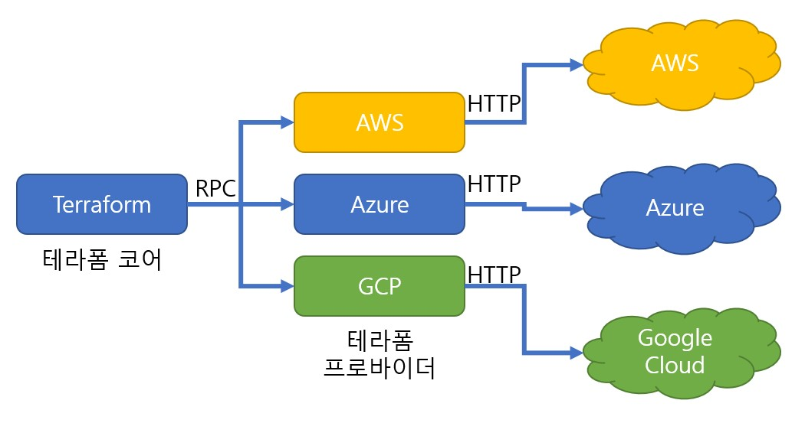

이 내용은 CloudNet@ 에서 진행하는 테라폼 기초 입문 스터디에 대한 연재글입니다.

스터디에서 사용하는 교재는 [Terraform Up & Running 2nd Edition](http://www.yes24.com/Product/Goods/101511312) 입니다.

---

# Prerequisites

- 테라폼을 처음 배우면서 함께 살펴봐도 좋을 듯 합니다
- 하지만, 제 8장을 이해하고 오신다면 보다 더 낫겠습니다.

# 본문

현재까지의 테라폼 코드는 모두 이 코드가 들어가 있었습니다.

```
provider "aws" {
  region = "us-east-2"
}
```

그렇지만, 필요에 따라 MS Azure나 GCP를 사용한다면 어떻게 해야할까요? 다른 리전이나 여러 리전을 선택할 수는 있을까요? 혹은 계정별로 권한을 분리하여 작업하려면 어떻게 해야할까요? 프로바이더 블록에 대해 다시 한번 살펴봅시다.

## Provider deep-dive

프로바이더를 알기 전, 테라폼 코어와 프로바이더에 대해 간략히 살펴봅시다.

- core

  - 테라폼 바이너리입니다.
  - 모든 플랫폼에서 사용되는 테라폼의 모든 기본 기능을 제공합니다.
  - 명령줄 인터페이스(예: 계획, 적용 등), Terraform 코드(HCL)용 파서 및 해석기, 리소스 및 데이터 소스에서 종속성 그래프를 작성하는 기능, 상태 파일을 읽고 쓰는 논리 등입니다.
  - 내부적인 코드는 Go로 작성되었으며 HashiCorp에서 관리하는 GitHub 저장소에 있습니다. (오픈소스입니다!)

- provider

  - 테라폼 코어를 위한 플러그인입니다.
  - 각 플러그인은 AWS, Azure, GCP 등 외부 플랫폼과 통신합니다. 초기에는 HashiCorp 측에서 프로바이더를 만들었지만, 지금은 메인 프로바이더의 경우 각 회사에서 직접 프로바이더를 관리합니다.
  - 각 프로바이더는 특정 접두사를 할당하고, 해당 접두사를 포함하는 하나 이상의 리소스 및 데이터 소스를 표현합니다.
    - E.g., `aws_` prefix: `aws_instance`, `aws_autoscaling_group`, `aws_ami`
    - E.g., `azurerm_` prefix: `azurerm_virtual_machine`, `azurerm_virtual_machine_scale_set`, `azurerm_image`

- Terraform 코어는 RPC(원격 프로시저 호출)를 통해 플러그인과 통신하며 해당 플러그인은 차례로 아래 그림과 같이 네트워크를 통해(예: HTTP 호출을 통해) 해당 플랫폼과 통신합니다.



## 단독 프로바이더 사용방안

단독 프로바이더를 통해 작업하는 방안에 대해 살펴보겠습니다. 기존까지 사용하던 프로바이더를 정확히 알아봅시다.

프로바이더를 선언하고 `terraform init` 을 하면, 프로바이더 코드를 자동으로 다운로드 받습니다.

이런 코드에 대해 만들고

```terraform
provider "aws" {
  region = "us-east-2"
}
```

...이어서 `terraform init`을 하면, 이런 식이지요.

```bash
terraform init

Initializing provider plugins...
- Finding hashicorp/aws versions matching "4.19.0"...
- Installing hashicorp/aws v4.19.0...
- Installed hashicorp/aws v4.19.0 (signed by HashiCorp)
...
```

프로바이더를 보다 상세하게 설정하고싶다면 어떻게 해야할까요?

```terraform
terraform {
  required_providers {
    <LOCAL_NAME> = {
      source  = "<URL>"
      version = "<VERSION>"
    }
  }
}
```

지난 장에서 살펴보았던 `require_providers` 블록을 사용합니다. 보다 자세하게 살펴보죠.

- `<LOCAL_NAME>` : provider 가 사용할 local name 이며, 각 provider 에서 유일한 이름이여야 합니다. 드문 경우 지만 만약 두 프로바이더가 http 경로를 중복 사용 시, 로컬 이름으로 구별 할 수 있습니다.
- `<URL>` : 해당 provider 다운로드 URL 이며, 형식은 `[<HOSTNAME>/]<NAMESPACE>/<TYPE>` 입니다.
  - `HOSTNAME`: 프로바이더를 배포하는 테라폼 레지스트리의 호스트 이름입니다. 생략 시 테라폼 공개 레지스트리를 가리킵니다.
  - `NAMESPACE`: 조직 네임스페이스 입니다(일반적으로 회사 이름).
  - `TYPE`: 프로바이더가 관리하는 플랫폼의 이름입니다(일반적으로 TYPE는 기본 로컬 이름).
    - E.g.,
      - aws 프로바이더 전체 URL) **registry.terraform.io/hashicorp/aws** → 생략 표현이 가능합니다! **hashicorp/aws**
- `<VERSION>`: 버전 조건입니다. 예를 들어 `4.19.0` 처럼 특정 버전을 지정하거나, `> 4.0 , < 4.3` 처럼 버전 범위를 지정할 수 있습니다.

아래 코드는 AWS 4.x 프로바이더 버전 설치를 지정하는 코드의 예시입니다.

```
terraform {
  required_providers {
    aws = {
      source  = "hashicorp/aws"
      version = "~> 4.0"
    }
  }
}
```

이제야 각종 오픈소스들에서 이렇게 쓰는 이유를 알겠군요. 프로바이더 블록만 단독으로 쓰기보다는, 이 편이 더 좋은 듯 합니다.

```terraform
terraform {
  required_providers {
    aws = {
      source  = "hashicorp/aws"
      version = "~> 4.0"
    }
  }
}
```

## 동일 프로바이더에서 여러 복사본을 사용하는 방안

동일 프로바이더에서 여러 리전을 작업하거나, 여러 계정을 통해 작업하는 방안에 대해 살펴봅시다.

### 여러 AWS 리전에 대해 작업하는 방안

`chapter09/examples01`의 파일들을 살펴보고, 각 세부문단 별로 명령을 내려 결과를 살펴봅시다.

#### 멀티리전 배포 (1), 테스트

```bash
cd chapter09/examples01/01_multi_region

# init & plan & apply
tfenv use 1.2.3
terraform init
terraform plan & terraform apply -auto-approve
Outputs:
region_1 = "us-east-2"
region_2 = "us-west-1"
```

#### 멀티리전 배포 (2), EC2 배포 관련

```bash
# [터미널1] us-east-2
while true; do aws ec2 describe-instances --region us-east-2 --query "Reservations[*].Instances[*].{PublicIPAdd:PublicIpAddress,InstanceName:Tags[?Key=='Name']|[0].Value,Status:State.Name}" --filters Name=instance-state-name,Values=running --output text ; echo "------------------------------" ; sleep 1; done

# [터미널2] us-west-1
while true; do aws ec2 describe-instances --region us-west-1  --query "Reservations[*].Instances[*].{PublicIPAdd:PublicIpAddress,InstanceName:Tags[?Key=='Name']|[0].Value,Status:State.Name}" --filters Name=instance-state-name,Values=running --output text ; echo "------------------------------" ; sleep 1; done

# 작업 경로로 이동
cd chapter09/examples01/02_multi_region_ec2

# init & plan & apply
terraform init
terraform plan && terraform apply -auto-approve
Outputs:

instance_region_1_az = "us-east-2c"
instance_region_2_az = "us-west-1c"
region_1 = "us-east-2"
region_2 = "us-west-1"

# 삭제 : 아래 RDS 배포 후 데이터 INSERT 등 실습 후 삭제해도 됨
terraform destroy -auto-approve
```

#### 멀티리전 배포 (3), Primary RDS의 Replica RDS를 다른 리전에 배포 시

참고사항: Primary RDS 는 `backup_retention_period` 설정이 `0`보다 커야 되며, `replicate_source_db` ARN 설정 시 replica RDS 입니다. - [참고 링크](https://github.com/brikis98/terraform-up-and-running-code/blob/3rd-edition/code/terraform/07-working-with-multiple-providers/modules/data-stores/mysql/variables.tf)

```bash
# [터미널1] us-east-2
while true; do aws rds describe-db-instances --region us-east-2 --query "*[].[Endpoint.Address,Endpoint.Port,MasterUsername]" --output text  ; echo "------------------------------" ; sleep 1; done

# [터미널2] us-west-1
while true; do aws rds describe-db-instances --region us-west-1 --query "*[].[Endpoint.Address,Endpoint.Port,MasterUsername]" --output text  ; echo "------------------------------" ; sleep 1; done

# 환경변수에 지정
export TF_VAR_db_username='cloudneta'
export TF_VAR_db_password='cloudnetaQ!'

# 이동
cd chapter09/examples01/03_multi_region_rds_with_replica

# main.tf 에 백엔드 부분 수정
vi main.tf
  backend "s3" {
    # This backend configuration is filled in automatically at test time by Terratest. If you wish to run this example
    # manually, uncomment and fill in the config below.
    bucket         = "ex9-t101-tfstate"
    key            = "prod/data-stores/mysql/terraform.tfstate"
    region         = "us-east-2"
    dynamodb_table = "ex9-t101-locks"
    # encrypt        = true
  }

# 초기화 및 검증 : 환경변수 적용 확인
terraform init
terraform plan

# 배포 : 총 25분 정도 소요 (8분 후 primary 완료, 이후 16분 후 replica 생성 및 동기화 완료)
terraform apply -auto-approve
terraform output
aws s3 ls s3://$TF_VAR_bucket_name --recursive --human-readable --summarize

# (옵션) Primary RDS에 데이터 INSERT 후 Replica RDS에 복제되는지 확인 해볼것

# 삭제 6분 정도 소요
terraform destroy -auto-approve

# S3/DynamoDB 삭제
cd ~/terraform-up-and-running-code/code/terraform/03-terraform-state/file-layout-example/global/s3
terraform destroy -auto-approve
```

#### 주의사항

1. Warning 1 : Multiregion is hard, 프로덕션 수준의 멀티 리전은 **어렵습니다**!
   - **Active-Active** 멀티 리전 서비스를 위한 ‘**지역간 지연 시간, 고유 ID, 최종 일관성**’ 등 여러가지 고려사항이 많아서 쉽지 않습니다.
2. Warning 2 : Use aliases sparingly, Alias 를 빈번하게 사용하지 맙시다!
   - 별칭을 사용하여 두 리전에 배포하는 단일 테라폼 모듈은 한 리전이 다운 시, plan 과 apply 시도가 실패합니다.
   - 프로덕션 환경은 멀티 리전의 별칭을 사용하는 것보다는, 3장에서 설명한 것 처럼 **환경**을 완전히 **격리**해야 합니다. 이를 통해 영향도를 최소화 할 수 있습니다.

### 여러 AWS 계정에 대해 작업하는 방안

배우기에 앞서, 멀티 계정을 사용하는 이유에 대해 알아봅시다.

1. Isolation (aka. compartmentalization)
   - Staging 과 Prod 간 다른 계정을 사용함으로써 각자에게 끼치는 영향을 최소화합니다.
2. Authentication and authorization
   - 다중 계정에 따른 인증과 권한 분리로 각자에게 끼치는 영향을 최소화합니다(예를 들면 권한을 잘못 부여 시)
   - 계정 별 세분화된 권한으로 접근통제가 가능합니다.
3. Auditing and reporting
   - 모든 환경과 계정의 변경 사항 및 감사 추적이 가능합니다.
   - 이를 통해 규정 준수와 이상 징후 감시를 할 수 있고 비용 추적등에 용이해집니다.

#### 사전작업

1. AWS Organizaions 설정 및 계정 초대를 실시합니다.
   1. 이 때, 그룹 하의 계정을 2개 만듭시다.
2. AWS IAM 정책과 산하에 속한 계정을 설정합니다.

#### 실습

`chapter09/examples02` 의 파일들을 살펴보고, 아래 명령으로 결과를 살펴봅시다.

```bash
# 이동
cd chapter09/examples02

# IAM Role ARN 지정
#export TF_VAR_child_iam_role_arn='arn:aws:iam::<자신의 두 번째 혹은 세 번째 계정 Account ID>:role/<해당 계정의 IAM Role 이름>'
export TF_VAR_child_iam_role_arn='arn:aws:iam::REDACTED_CHILD:role/role-name-unknown'

# 배포 확인
terraform init
terraform plan && terraform apply -auto-approve
Outputs:
child_account_id = "REDACTED_CHILD"
parent_account_id = "REDACTED_PARENTS"
```

#### 주의 사항

1. Warning 1 : Cross-account IAM roles are double opt-in
   - 교차 계정 역할 동작을 위해서 2개의 계정에서 모두 **권한 등 설정**이 필요합니다.
2. Warning 2 : Use aliases sparingly Alias 를 빈번하게 사용하지 맙시다!
   - 영향도 최소를 위해서 계정 간 분리를 하는 것을 권장합니다.

## 여러 프로바이더에서 작업하는 방안 (추후 업로드!)

# Lessons Learned

제 9장에서는 아래의 내용을 반드시 기억하셨으면 좋겠습니다.

1. provider 블록에 대해 보다 더 깊게 살펴보았습니다.
1. 계정별, 여러 프로바이더 별, 여러 리전 별 배포 또한 가능함을 살펴보았습니다.
1. 도커와 쿠버네티스 실습환경에 대한 내용은 곧 업데이트 하겠습니다!

이것으로 제 9장을 마칩니다. 긴 글 읽어주셔서 감사합니다.
