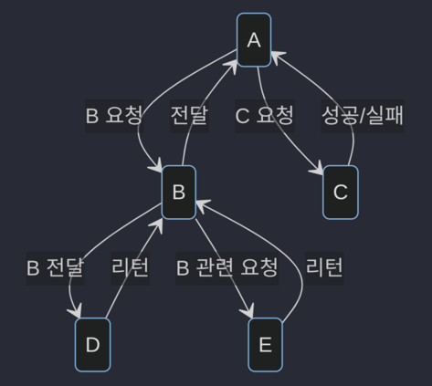
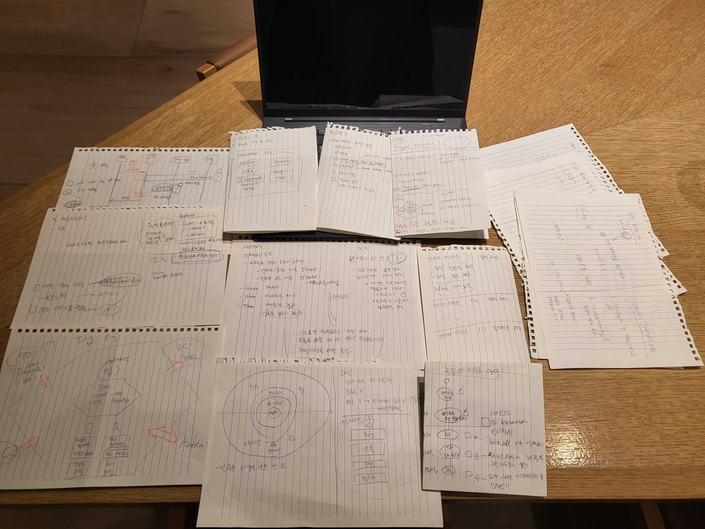

# 연재 안내

- 2023년 과제형 코딩 테스트 후기 (1)
- [2023년 과제형 코딩 테스트 후기 (2)](/retrospect/2023-02-20-assignment-pt02)

# 들어가며

이 게시글은 최근 치렀던 코딩 테스트를 회고하는 게시글입니다.

결론은 떨어졌습니다. 그렇지만, 많은 것을 얻었습니다.

이 게시글에서는 그간 갈급했던 모든 지식들이 한번이 소화되는 느낌이 들었고, 저를 다시 되돌아보게 되는 소중한 경험을 얻었습니다.

# 목차

- [클린 아키텍처, Hexagonal Architecture](#클린-아키텍처-hexagonal-architecture)
- [도메인 구상 및 구조 쌓아올리기](#도메인-구상-및-구조-쌓아올리기)
- [TDD와 테스트 피라미드](#TDD와-테스트-피라미드)
- [코드 완성과정](#코드-완성과정)
- [구체적인 스펙 결정을 통한 완성](#구체적인-스펙-결정을-통한-완성)
- [설계 및 개발에 사용된 도구들](#설계-및-개발에-사용된-도구들)

# 클린 아키텍처, Hexagonal Architecture

먼저 이 글은 과제형 테스트를 수행한 소개를 위주로 말씀드리고자 합니다(사실 DDD나 클린 아키텍처 등을 하나의 게시글로 요약하기도 힘들겠죠). 보다 상세한 내용은 연재글로 다시 기록하겠습니다. [^1] [^2]

본 과제를 수행하며 이름으로만 듣던 DDD(Domain-driven Design)를 접하게 되었습니다. DDD는 Eric Evans가 제시한 개념입니다. 소프트웨어 설계를 회사(혹은 단체)와 연관있는 일련의 요구사항(비즈니스)을 표현하기 위한 "도메인"이란 단어로 묶어 설계하는 소프트웨어 설계 기법입니다. 도메인은 "(지식·활동의) 영역[분야], (책임의) 범위" 를 의미하지요. 즉, 개발하고자 하는 일련의 아키텍처를 도메인 간의 상호작용으로 이해하고 풀어나가는 방식입니다. 이를 적용하기 위해 자연스럽게 객체지향 패러다임으로 접근하게 되었습니다.

저는 과제에 필요한 도메인을 설계하고, 이를 그림으로 묶었습니다. 이후 설계방법에 대한 방향성을 잡고, 클린 아키텍처와 Hexagonal Architecture(aka. Ports and Adapters Architecture, 이하 헥사고널 아키텍처) 를 참고하였습니다. 그 키워드를 토대로 프로젝트를 구성하였습니다. [^3]


본 과제를 수행하며 참고한 프로젝트 5개를 소개드리고자 합니다. 모두 파이썬으로 구성되어 있습니다. 추후 DDD 및 클린아키텍처, 나아가 헥사고널 아키텍처를 연재하며 해당 프로젝트를 다시 살펴보도록 하겠습니다.

- 프로젝트를 한번에 소화하긴 어렵지만 정말 도움되는 리포지토리
  - [https://github.com/pgorecki/python-ddd](https://github.com/pgorecki/python-ddd)
- 실질적인 구현에 도움되었던 리포지토리
  - [https://github.com/GArmane/python-fastapi-hex-todo](https://github.com/GArmane/python-fastapi-hex-todo)
  - [https://github.com/iktakahiro/dddpy](https://github.com/iktakahiro/dddpy)
  - [https://github.com/slimovich/Realworld-fastapi-gino-template](https://github.com/slimovich/Realworld-fastapi-gino-template)
  - [https://github.com/fkromer/code/tree/appendix_fastapi 접근 후 `appendix_fastapi` 브랜치를 참고](https://github.com/fkromer/code/tree/appendix_fastapi)

# 도메인 구상 및 구조 쌓아올리기

과제 전반을 보고, 도메인이 어떻게 흘러갈지를 결정해야겠지요. 저는 우선 도메인이 어떻게 흐르는지에 먼저 집중했습니다. [^4] 아래와 같은 도표를 통해 전체 프로젝트가 어떻게 구상될지 이해하였습니다.



여기까지 정리하고 코드를 쌓는 사항이 가장 오래 걸렸습니다. 정말 오랜만에 학습과 설계를 동시에 하다보니, 노트로 적어가며 필수개념들을 해제했었네요.



# TDD와 테스트 피라미드

[FIRST 원칙](/books/clean-code/2023-02-10-pt09#first)에 맞게 내 로직을 방어할 수 있는 코드가 있다면 그것만큼 든든한게 없죠. 클린 아키텍처, 헥사고널 아키텍처에서도 마찬가지입니다. 각 레이어별로 필요한 테스트는 반드시 존재해야 한다고 생각했고, 이에 따라 디렉토리를 구성하였습니다. 각각 도메인 레이어 테스트, 인프라스트럭처 레이어 테스트, 서비스 레이어 테스트, e2e 테스트로 나누었고 공통 코드를 `util` 디렉토리로 빼서 이 쪽을 바라보도록 했습니다.

본 과제에서는 아래와 같은 디렉토리 구조로 구상하였습니다:

```
.
└── tests
    ├── modules
    │   ├── DOMAIN01
    │   │   ├── domain
    │   │   └── e2e
    │   ├── DOMAIN02
    │   │   ├── domain
    │   │   ├── e2e
    │   │   ├── factories
    │   │   ├── infrastructure
    │   │   └── service
    │   └── DOMAIN03
    │       ├── domain
    │       ├── e2e
    │       └── factories
    └── utils
```

# 코드 완성과정

1. 코드 규칙에 대한 추가사항을 정의했습니다.

   1. 프로젝트 세팅과 동시에 pre-commit hook을 두어 일관된 규칙을 통해 코드를 작성하도록 했습니다.
   1. 하나의 커밋에는 하나의 작업단위만을 커밋하고, 커밋 컨벤션에 의거하여 작업내용을 기록하였습니다.

1. 서비스 레이어에서 커맨드와 쿼리를 별도로 분리해두었습니다.

   1. 커맨드보다는 쿼리가 훨씬 더 빈번하게 일어나는 작업이므로, 이를 처리하는 역할을 분리하도록 생각했습니다.
   1. 커맨드는 atomic한 작업을 반드시 수반해야 하므로, 코드의 관심사를 분리해야 추후 유지보수가 쉬운 코드가 될 것이라는 생각이 들었습니다.

1. 필요에 따른 분기별 로직 처리를 [STRATEGY 패턴](https://refactoring.guru/design-patterns/strategy)으로 풀어보았습니다.

   1. 조건에 따라 수행하는 알고리즘이 계속해서 증가할 것으로 판단하였습니다.
   1. 알고리즘이 추가/삭제됨과 상관 없이, 객체가 "필요한 값을 요청한다" 만 호출해도 원하는 결과를 얻어올 수 있는 이점을 얻었습니다.

# 구체적인 스펙 결정을 통한 완성

1. 인프라스트럭처 레이어에 쓰이는 기술들은 아래와 같이 선택했습니다.

   1. 영속적 데이터 저장에는 `PostgreSQL`을, 인메모리 DB에는 `Redis`를 사용하였습니다(Redis는 시간상의 문제로 구현까지는 생각하지 못하였습니다).
   1. 특정 도메인 메시지를 주고받을 때 사용할 이벤트 전달용 메시지 큐로는, 익숙하게 사용하던 `Kafka` 혹은 레퍼런스가 많은 `RabbitMQ` 를 생각하였습니다(이 또한 제한 시간 내에는 구현하지 못했네요).

1. 표현 레이어에 사용할 웹 프레임워크는 FastAPI를 사용하였습니다.

   1. 토이프로젝트처럼 간단히 접근할 것이 아니라, 수많은 요청에도 부담없이 사용될 수 있도록 하기 위하여 기존에 프로덕션 레벨에서 사용해본 경험을 이용하였습니다.
   1. `Gunicorn` 매니저 프로세스와 `uvicorn` 프로세스들을 경우에 맞게 확장하여 Throughput을 확장하도록 구성했습니다.
   1. 비동기 처리를 할 수 있도록 라이브러리부터 프레임워크까지 쉽게 대비할 수 있는 프레임워크를 선택하였습니다.
   1. 작은 서비스를 여럿을 만들고 서로 통신하도록 하여, 표현계층도 다른 표현계층과 서로 메시지를 주고받을 수 있도록 설계하였습니다.

이후, 최종적으로 아래와 같은 디렉토리 구조를 구상하였습니다: [^5]

```
.
├── api
│   └── endpoints
├── config
├── modules
│   ├── DOMAIN01
│   │   ├── application
│   │   ├── domain
│   │   └── infrastructure
│   │   │   └── postgres
│   │   │       └── models
│   ├── DOMAIN02
│   │   ├── application
│   │   ├── domain
│   │   │   └── OBJECT01          # [5]
│   │   │       └── helpers
│   │   └── infrastructure
│   │       └── postgres
│   │           ├── models
│   │           └── repositories
│   └── DOMAIN03
│   │   ├── application
│   │   ├── domain
│   │   └── infrastructure
│   │       └── postgres
│   │           ├── models
│   │           └── repositories
│   └── common
└── tests
│   └── ...(아래에 테스트코드 구조를 그대로)
└── utils

```

# 설계 및 개발에 사용된 도구들

## `mermaid.js`를 통한 도식 표현

간단한 도식을 표현하는데는 [mermaid.js](https://mermaid.js.org/) 만한 도구가 없지요. 복잡해진다면 복잡해질 수록 전문 툴을 사용하는 것이 맞으나, 간단히 처리하는 데는 이만한 녀석이 없습니다.

## JetBrains의 `HTTP Client`

마침 이런 도구를 최근에 학습하였고, 빠르게 IDE 내에서 바로 사용할 수 있다는 장점을 십분 활용하였습니다.

- [참고 링크 #1](https://www.jetbrains.com/help/pycharm/http-client-in-product-code-editor.html)
- [참고 링크 #2](https://www.jetbrains.com/help/pycharm/exploring-http-syntax.html)

## ER diagram엔?

[ERD Cloud](https://www.erdcloud.com/) 라는 도구가 쓰기 정말 쉽고 좋았습니다.

# 마무리

이번 테스트를 통해 아래 사항을 얻을 수 있었습니다.

1. 객체지향적 패러다임을 논리적으로 꽃피울 수 있는 DDD의 개념의 기초를 배웠습니다.
1. 도메인 별로 어떻게 객체를 끌어내고, 이를 통해 어떻게 메시지를 주고받으며 어떤 방식으로 서로 상호작용하는지 확실히 알게 되었습니다.
1. 이를 실현하는 방법인 클린 아키텍처, 헥사고널 아키텍처의 기초적인 부분을 배우고 구현하였습니다. 또, 기술을 필요에 따라 선택하는 이유를 확실히 알게 되었습니다.
1. 테스트 피라미드를 두어, 주요 레이어 별 테스팅이 어떻게 되면 좋을지 구상하였습니다.
1. `mermaid.js` 및 JetBrians의 기본 도구와 ER Diagram 설계 도구를 익혔습니다.

다음 2부에서는, 왜 떨어졌을지에 대해 스스로 반추하는 게시글로 찾아뵙겠습니다.

[^1]: 이를 학습하기 전, 이 전에 읽었던 객체지향의 사실과 오해의 내용이 정말 도움되었습니다([이 영상](https://www.youtube.com/watch?v=26S4VFUWlJM&t=3434s)은 그 일부를 올린 것이니 보시면 매우 좋습니다). 저는 [도메인 주도 개발 시작하기: DDD 핵심 개념 정리부터 구현까지](https://search.shopping.naver.com/book/catalog/32436316743?NaPm=ct%3Dlebllqq0%7Cci%3D69c2124ba02d2115182c8d68fe4f85205a3ace74%7Ctr%3Dboksl1%7Csn%3D95694%7Chk%3D0425ef7e53fce8d8c45d6816648c48f8ec5cb238) 와 [파이썬으로 살펴보는 아키텍처 패턴: TDD, DDD, EDM 적용하기](https://play.google.com/store/books/details/%ED%8C%8C%EC%9D%B4%EC%8D%AC%EC%9C%BC%EB%A1%9C*%EC%82%B4%ED%8E%B4%EB%B3%B4%EB%8A%94*%EC%95%84%ED%82%A4%ED%85%8D%EC%B2%98*%ED%8C%A8%ED%84%B4_TDD_DDD_EDM*%EC%A0%81%EC%9A%A9%ED%95%98%EA%B8%B0?id=PeUxEAAAQBAJ&hl=ko&gl=US&pli=1) 를 상당부분 참고하였습니다.
[^2]: DDD에 대한 전반적인 이해에 아래 글들이 상당히 도움되었습니다.<br >[DDD 핵심만 빠르게 이해하기](https://happycloud-lee.tistory.com/94)<br >[Domain Driven Design](https://incheol-jung.gitbook.io/docs/q-and-a/architecture/ddd) <br >상기 글들을 보고 [이 글을](https://tech.kakao.com/2022/12/12/ddd-of-recommender-team/) 함께 보신다면 보다 빠르게 이해하실 수 있으시리라 믿습니다.
[^3]: Hexagonal Architecture는 이 글들을 참고하시면 상당히 도움되시리라 믿습니다. <br >[Why DDD, Clean Architecture and Hexagonal?](https://dataportal.kr/74#DDD%EC%--%--%--%EA%B-%-D%EC%B-%B-%EC%A-%--%ED%--%A-)<br >[지속 가능한 소프트웨어 설계 패턴: 포트와 어댑터 아키텍처 적용하기](https://engineering.linecorp.com/ko/blog/port-and-adapter-architecture/)<br >[헥사고날 아키텍쳐(Hexagonal Architecture)](https://blog.imqa.io/hexagonal-architecture/)<br >[헥사고날(Hexagonal) 아키텍처 in 메쉬코리아](https://mesh.dev/20210910-dev-notes-007-hexagonal-architecture/)
[^4]: 늦게 회고하자면, [이 영상](https://www.youtube.com/watch?v=F7EnW8dfetU) 을 함께 보았다면 더 좋았을 것입니다. 이벤트 스토밍을 통해 도메인 간의 유기적인 정보교환 뿐 아니라, 실제 업무를 수행하면서 나올 법한 행위를 수행할 수 있었음을 보여줄 수 있었을 것입니다.
[^5]: 이 부분은 정확히 어떻게 설계할지 몰라서 다른 서비스들을 최대한 참고하였습니다. 도메인 객체가 이렇게 비대해지는 것을 어떻게 제어해야할지도 학습해야겠습니다.
