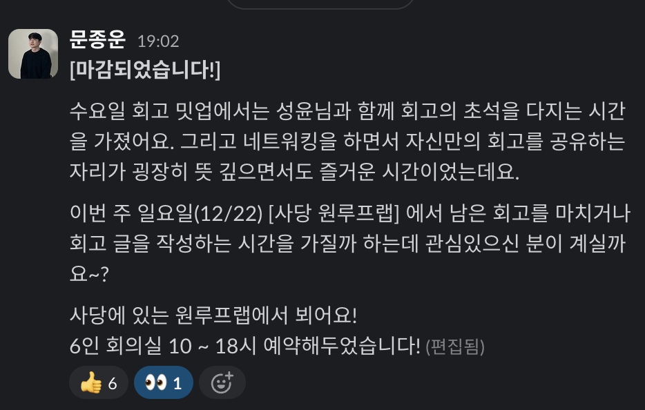
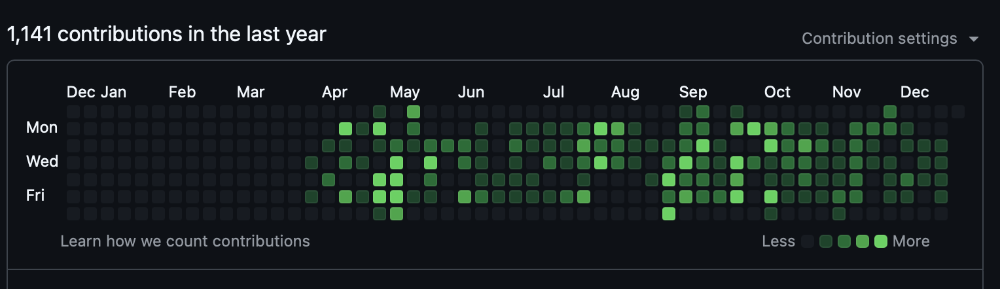

이 글은 2024년 한 해를 바라보고, 앞으로의 액션 아이템을 세워보는 게시글입니다.

# 와 세상에 이런 모임이 있네?!

오늘은 글또10기 분들과 함께 만나 1년회고를 진행해볼 수 있었습니다. 너무 즐거운 경험이었습니다! 글 쓰는 것 만으로 사람을 만날 수 있었다는 게 너무 좋았어요.

결론부터 이야기하자면 너무 행복했습니다. 열정있는 사람과 함께 여러 대화를 나누고 이걸로 함께 한 해를 마무리하다니, 그저 영광이라 생각합니다. 이 자리를 빌어서 다시금 감사하다 말씀드리고 싶네요! 🥰🥰

# 저는 이렇게 살았어요

그럼 본격적으로 저의 한 해를 돌이켜 보겠습니다.

## 해왔던 것들 - 회사에서

직전 회사에서 나온 후 현 회사에서의 일들을 쭉 살펴본 결과를 보니, 아주 대충 산 건 아니었구나 하는 안도감이 들었습니다. 감사하게도 자리가 생겨서 [발표도 한 번 해보고](https://pyweb.python.or.kr/talks/talk8/) 리뷰도 받아볼 수 있었습니다.

현재 회사는 퇴근 시 오늘 한 일을 모두 쓰는 시스템이 되어있다보니 그걸 적극적으로 활용했습니다. 쓸 때는 너무 귀찮다가도, 미래의 저를 생각했을 때 도움되겠다라 생각하면 쓰겠다던게 벌써 8개월이 지났군요. 잘했다 과거의 나!

기술적으로는 아래 일들이 핵심이었습니다:

- 기존 레거시와 설계문서를 통해 전면 리뉴얼 완료
- 전체 인프라를 네이티브 클라우드 형식으로 전면 리뉴얼 및 IaC 도입
- 기존 프로젝트 리팩터링 및 테스트코드 확보

### 기술적인 부분?

암만 생각해도 도무지 개선의 여지가 보이지 않았던 레거시를 버리기로 결정했습니다. 치명적인 버그와 유지보수가 배배꼬인 테이블, 그리고 비협조적으로 나오던 외주처의 태도를 보고 시원하게 던졌습니다. "이거 못 합니다. 제게 맡기시면 정말 잘 만들 수 있습니다." 하고 자신있게 말했습니다.

그렇다보니 면접때부터 이야기한 네이티브 클라우드 구성부터, 재설계와 전면 리뉴얼을 진행했습니다. 기존 프로젝트 리팩터링 및 배포도 계속 이어가면서 작업하다보니 효율을 찾기 위해 전에 쓰던 IaC를 도입했습니다. 그러다보니 자연스럽게 테라폼 모듈에서 Terragrunt로 이어지게 되었습니다. 개발서버도 회사 내에서만 접근할 수 있도록 했어야해서요.

실제 비즈니스 로직을 짜기위해선 기획서부터 먼저 읽어보았습니다. 이후 담당자들이 공통적으로 쓰는 용어를 파악했구요. 파악하고 나서는 용어집으로 만들고 회의를 통해 확정지었지요. 이후 이를 코드화하기 위해 구조를 설계했습니다.

도메인부터 이를 영속화하는 과정, 그리고 API에 이르기까지 계속해서 생각했습니다. 정답은 없겠지만 오답을 피하기 위한 노력을 계속 했던 것 같습니다. 이 과정이 가장 머리아팠지만 그만큼 재밌었다고 생각합니다.

## 해왔던 것들 - 개인적으로

나를 찾는 과정이 가장 컸습니다. 이 것은 아마 평생 갈 일이 아닐까 합니다.

회사 사람과 언쟁을 높인일이 있었습니다. 블로그와 같이 공개된 자리에서 언급하기엔 너무 부끄럽긴 합니다만, 이를 통해 정말 많은 걸 배워 쓰게 되었습니다.

### 上善若水

상선약수(上善若水) 라는 말, 아시나요? 이는 물의 성질을 닮아 다른 사람을 이롭게 하는 삶의 자세를 가리킵니다.  

> 물은 막히면 돌아서 흐르고, 깊으면 채워서 흐르며, 만물을 이롭게 할 뿐 다투지 않습니다.
>
> 물은 언제나 낮은 곳으로 흐르고, 깊은 연못처럼 고요하며, 어질고 선한 사람과 같습니다.

이는 물의 포용력을 일컫기도 하지만, 물의 단호함을 말하기도 하는 말입니다.

물은 겉으로는 부드럽고 순응하는 것 같지만, 끊임없이 흐르며 바위도 깎아내는 내면의 강인함을 가지고 있습니다. 이처럼 상선약수는 겸손하고 이로움을 주는 삶의 자세와 함께, 자신의 길을 묵묵히 걸어가는 단호함도 가르치고 있습니다.

상대의 입장을 헤아리고, 저의 입장을 함께 놓고 판단하여 최선의 결과를 낼 필요가 있습니다. 이 과정을 배웠고, 현재도 이를 실천하고 있습니다.

1. 의견을 제시합니다
2. 피드백을 받습니다. 이 때 의사소통에 특히 유의합니다
    1. 주장과 근거를 함께 제시하며, 자유로운 의사소통이 되게 합니다.
    2. 의견이 다르다면 그에 해당하는 명확한 근거와 데이터로 의사소통합니다. 이견을 최대한 줄이며, 나의 근거를 잘 표현하도록 노력합니다.
3. 정리된 내용을 해당 내용을 명문화하고 버저닝하여 후에 있을 논쟁을 피합니다.

이렇게 상대방을 경청하고 의견을 존중해야 함께 일할 수 있다 생각합니다. 비록 상대가 그렇지 않더라도 내쪽에서 그리 해야할 것이며, 상대가 존중하려 하지만 내가 그렇지 않은지도 유의해야합니다.

이것이 올해 배운 가장 중요한 요소입니다.

# Look back

오늘까지 총 `1141`번의 커밋을 했습니다. 이슈 뿐 아니라 PR리뷰, 그리고 실제 커밋 등을 다 해낸 결과입니다.

많고 적음에 따라 한 조직에 정신놓고 이렇게 기여해본 것은 감사할 일입니다. 어떤 조직에서든 소프트웨어 엔지니어로서 이렇게 일할 수 있단 점에 감사히 생각하고 있습니다. 보다 더 나은 소프트웨어로 만들기 위한 여정은 더 멀지만, 언젠가 먼저 걸은 이 길이 참 밝은 횃불이었다는 평을 받고싶습니다.

# ...and Look forward!

그렇다면 앞으로의 저를 위해 무엇을 하면 좋을지 생각해봤습니다.

1. 도메인 주도 설계에 대한 면밀한 이해
2. 운동하기
3. 파이썬 딥다이브 하기
4. 자바로 이사갈 준비를 사이드 프로젝트로 하기
5. 물과 같이 되려하기

결국 "문제를 풀기위한 사람"이 되기 위해 내가 다루는 도구와 언어를 공부하고, 외적으로든 내적으로든 준비해야겠다는 것이 되겠네요.

## 도메인 주도 설계에 대한 면밀한 이해

올해 도메인 기반 주도 설계의 사실과 오해 라는 강의를 참석한 적이 있습니다.

조영호님께 DDD는 방법론인가요? 라는 질문을 던졌는데요. 그 분이 답변하시기로,

> DDD는 방법론[^1]이 아니라, 디자인 패턴과 같은 일련의 PATTERN LANGUAGE 입니다.

라는 답변을 주셨습니다. 추측컨대 DDD는 오직 소프트웨어로 가치창출을 하기 위한 도구로서 받아들이라는 말씀으로 이해했어요. 이렇게 해석한다면 8시간 내도록 강조하신 말을 함축된다고 이해했기 때문이지요. 흔히 하는 오해로, 'DDD'를 도입하기 위해 프로젝트를 바꾸었다, 내지는 DDD를 하느라고 일정이 딜레이됐다 라는 것이 나오면 안된다는 것이지요. 요구사항을 보다 빠르고 기민하게 대응하기 위한 전술∙전략 이기 때문이지요.

## 운동하기

인간은 태어나고 죽기까지 노화합니다. 건강하게 살기 위해선 운동이 필수라는 것을 깨달았습니다. 오늘 모임에 열심히 운동하셔서 자존감과 건강해짐을 받았다는 분을 보고 깨달았습니다.

~~왜 사람은 직접 경험해야 아는걸까요~~

## 파이썬, 자바 둘 다를 하겠다고?

물론 욕심이죠. 하지만 그 언어가 메인이 되는 순간에는 그 언어에 집중해야한다고 봅니다. 그런 뜻에서 사이드 프로젝트를 풀고, 파이썬 딥다이브도 함께 이어가야 하지 않을까 라고 생각합니다. 2025년에는 이런 게시글로도 여러분과 만나뵐 수 있을 것 같습니다.

# 끝으로

내년의 저는 과연 어떤 리뷰를 쓰게될까요?

기대됩니다.

[^1]: **교조적인 의미**에서 쓰이는 방법론을 의미하는 것으로 보입니다.
