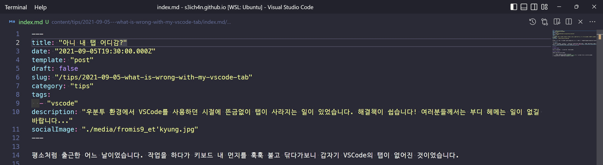
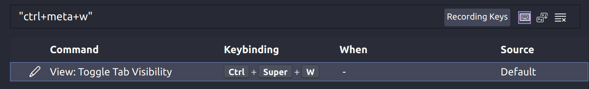
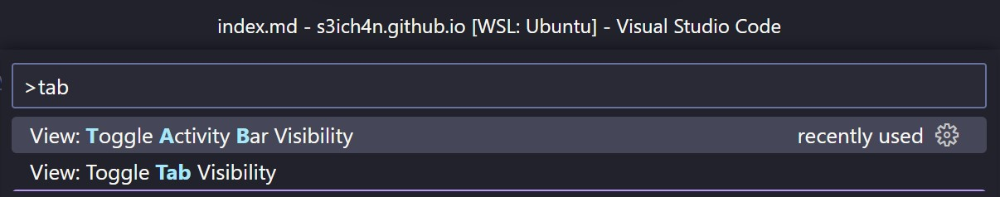

평소처럼 출근한 어느 날이었습니다. 작업을 하다가 키보드 내 먼지를 훅훅 불고 닦다가보니 갑자기 VSCode의 탭이 없어진 것이었습니다.

대강 이런식이었습니다. 저는 작업 시 많은 탭을 열어서 사용하는 편이라 매우 당황스러웠습니다. 뭔가 단축키를 눌렀을 것이라 생각했지만 이를 어떻게 찾아야할지 몰라서 짧은 영어로 스택오버플로우에 검색을 했습니다. [역시 해답이 있더군요!](https://stackoverflow.com/questions/48589785/vscode-showing-only-one-file-in-the-tab-bar-cant-open-multiple-files)

## 문제는?

제 우분투에 설치된 VSCode 상에서는 단축키 바인딩이 되어있었고, 그걸 예기치않게 눌렀나봅니다. 그 탓에 탭이 사라지지 않았나 싶었습니다.

## 또다른 해결책?

Show all commands(`Ctrl + Shift + P`) 를 통해 토글을 직접 수행할 수도 있습니다.

## Lessons learned

아래의 내용을 배울 수 있었습니다.

1. 짧은 영어로 검색해서 최대한 힌트를 얻어봅시다.
   1. 저는 이번 건을 해결하기 위해 `vscode tab is missing` 이라고 쳤음에도(!) 결과를 찾을 수 있었습니다.
1. VSCode의 Show all commands 가 정말 꿀기능 이었습니다. 필요한 커맨드를 찾고 바로 수행할 수가 있네요.

## 마무리

별 것 아닌 내용이지만, 괜히 지웠다 깔 필요 없이 다음번에도 헤메지 않기 위해 메모했습니다. 별 것 아니지만, 여러분들께도 도움이 되길 바랍니다. 감사합니다.
