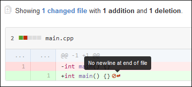

코드리뷰 시 왜 GitHub이 파일 끝에 엔터를 치도록 요구하는지 궁금했습니다. 이참에 Git을 쓰며 개행문자 문제를 해결하는 방안이 떠올라 함께 썼습니다. 왜냐하면 엔터는 개행문자를 텍스트파일에 쓰는 것이니까요(?)

# TL;DR

1. POSIX 에서 하나의 행을 정의하는 표준을 지킵시다.
2. 개행에 대해 잘 이해하고 있으면, 타 운영체제에서 Git을 이용할 때 개행문자 차이로부터 일어나는 사이드이펙트를 방지할 수 있습니다.

# POSIX 표준을 준수합시다

필요한 부분들을 살펴보기 위해, 논의에 연관이 없다고 판단되는 부분은 생략하려 합니다.

먼저, 코드가 쓰여지는 텍스트 파일의 정의를 먼저 살펴봅시다.

[3.403 Text File](https://pubs.opengroup.org/onlinepubs/9699919799/basedefs/V1_chap03.html#tag_03_403)

> A file that contains characters organized into zero or more lines. (중략)

모든 텍스트 파일에서 줄(Line)은 개행문자(newline)를 기준으로 만들어 집니다.

[3.206 Line](https://pubs.opengroup.org/onlinepubs/9699919799/basedefs/V1_chap03.html#tag_03_206)

> A sequence of zero or more non- <newline> characters plus a terminating <newline> character. (중략)

끝나지 않은 줄(Incomplete Line)은 파일 끝에 non-newline 문자가 하나 이상 있는 것을 의미합니다

[3.195 Incomplete Line](https://pubs.opengroup.org/onlinepubs/9699919799/basedefs/V1_chap03.html#tag_03_195)

> A sequence of one or more non- <newline> characters at the end of the file. (중략)

다시말해, 파일 끝에 newline 문자가 없으면 끝나지 않은 행으로 한다는 것입니다.

## Git에서 개행 문자(New line)차이의 문제를 미연에 방지할 수 있어요

Git을 사용할 때, 윈도우즈에서 수정한 코드를 가져오면 `^M` 문자열이 온 코드 끝에 다 붙어있는 경우를 간혹 보게됩니다. 이는 개행문자의 차이로 인해 발생하는 문제입니다.


윈도우즈는 CRLF 방식의 개행을, GNU/Linux나 macOS에서는 LF를 개행으로 사용합니다. 엔터키를 눌렀을 때, 파일에 새 줄을 어떻게 기록할 것인지를 구별하는 바이너리 값이 다르게 붙음을 의미합니다.

Git에서는 이를 방지할 수 있도록 설정을 부여해줄 수 있습니다. 여러 방법이 있습니다만 이 글에서 소개할 방법은 리포지토리에 `.gitattributes` 파일을 추가하는 방안입니다.

> `git config --global core.autocrlf [true|false|input]` 명령을 통해 개인 PC에 설정을 넣어두는 것으로 해결할 수 있습니다. 하지만 저는 프로젝트 전체에 `.gitattributes` 파일 추가를 통해 모든 사람과 논의하는 것이 좋다고 생각합니다. 이유는 아래와 같습니다:
>
> 첫째, 모든 이에게 이런 문제가 일어날 수 있음을 제고할 수 있습니다.
>
> 둘째, 해결책을 제시하고 보다 나은 사항을 알아볼 수 있게끔 방향을 잡을 수 있습니다.

### `.gitattributes`

이 파일은 프로젝트에 Git 설정을 동일하게 하여 혼동을 없앨 때 사용합니다. 그 중, EOL 과 관련한 옵션을 살펴봅시다.

1. `text=auto` 옵션

이 설정은 EOL normalization에 대한 설정입니다. `text=auto` 을 주면 모든 텍스트 파일의 EOL이 LF로 normalize됩니다. 하지만 현재 워킹 트리의 텍스트 파일은 CRLF 그대로입니다. 바이너리(이미지, 폰트 등)들의 EOF는 변경되지 않습니다(참조링크를 확인해보세요).

아래 설정은 [이 리포지토리](https://github.com/alexkaratarakis/gitattributes)에서 가져왔습니다(이런 게 있군요!).

```git
# THIS IS ONLY FOR THE gitattributes REPOSITORY.
# Handle line endings automatically for files detected as text
# and leave all files detected as binary untouched.
*               text=auto
```

2. 파일 일괄적용

- git 2.16 버전(2018년 2월 22일 릴리즈)부터 현 브랜치 내의 모든 파일들에 대해 renormalize 할 수 있습니다.

```shell
git add --renormalize .             # normalize 수행

git status                          # 변경된 상태확인

git ls-files --eol                  # 파일의 EOL을 살펴봅시다.
git ls-files path/to/file --eol     # 특정 파일의 EOL을 살펴봅시다.
```

git 버전이 그보다 아래라면, `find`와 `sed`를 적절히 이용하거나, `dos2unix` 같은 바이너리를 이용하여 수동으로 개행 바이너리값을 바꾸어 커밋하면 되겠죠.

# 마무리

파일에 EOL을 균일하게 넣고, 모든 구성원들에게 동일한 설정을 부여하는 것으로 일어나는 문제를 해결할 수 있었습니다.

---

- 참고링크
  - [`.gitattributes`의 text 옵션](https://git-scm.com/docs/gitattributes#_text)
  - [`text=auto`의 의미](https://git-scm.com/docs/gitattributes#Documentation/gitattributes.txt-Settostringvalueauto)
  - [CRLF vs. LF: Normalizing Line Endings in Git](https://www.aleksandrhovhannisyan.com/blog/crlf-vs-lf-normalizing-line-endings-in-git/#all-line-ending-transformations-concern-the-index)
  - [EOL을 넣어야 하는 이유와 운영체제별 EOL(EndOfLine) 차이로 인한 Git 문제 해결](https://velog.io/@jangws/EOL%EC%9D%84-%EB%84%A3%EC%96%B4%EC%95%BC-%ED%95%98%EB%8A%94-%EC%9D%B4%EC%9C%A0%EC%99%80-git%EC%97%90%EC%84%9C-CRLF-EOL-%EC%B0%A8%EC%9D%B4%EB%A1%9C-%EC%9D%B8%ED%95%9C-%EB%AC%B8%EC%A0%9C-%ED%95%B4%EA%B2%B0-%EB%B0%A9%EB%B2%95)
