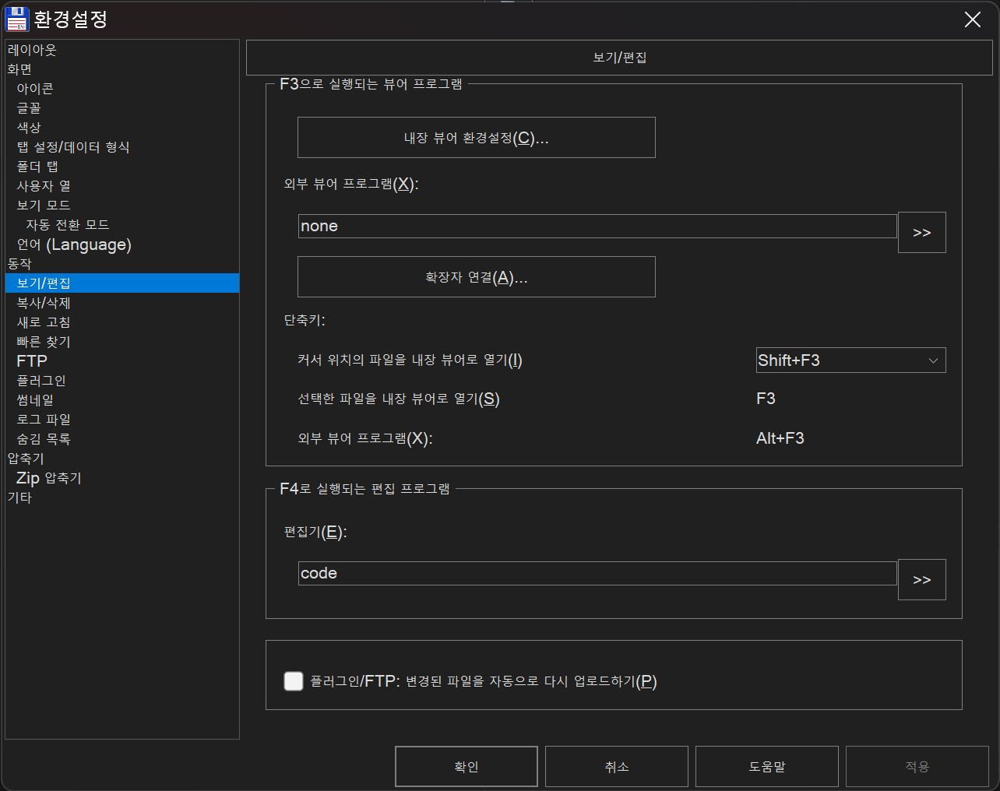
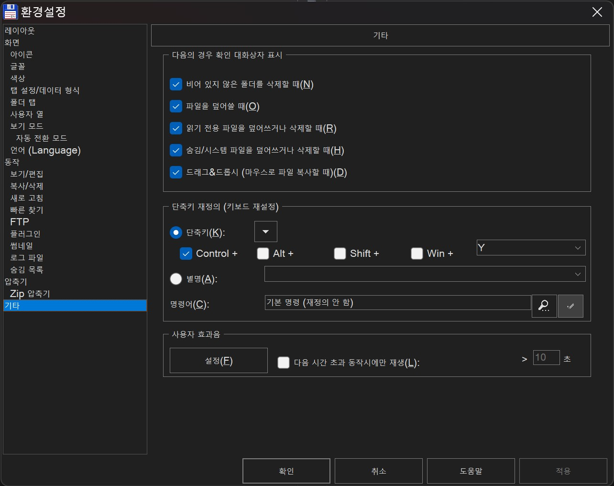
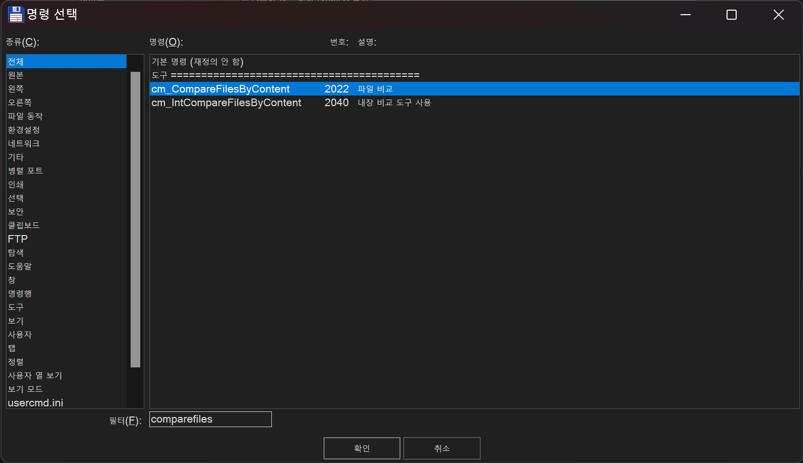
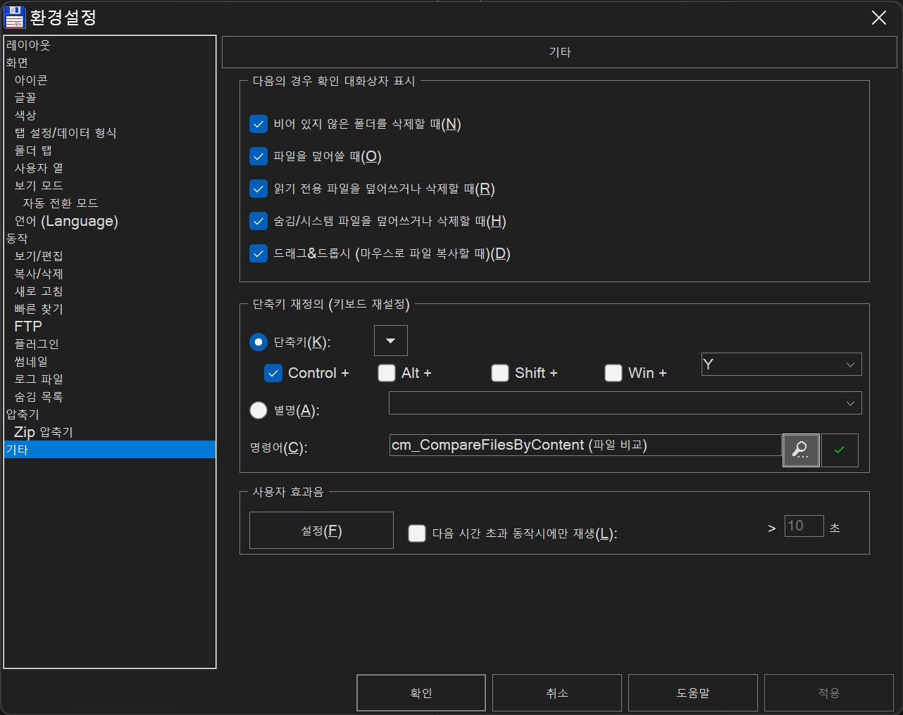
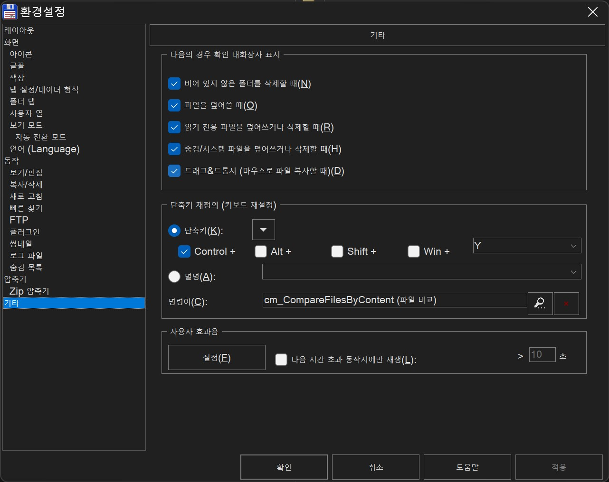
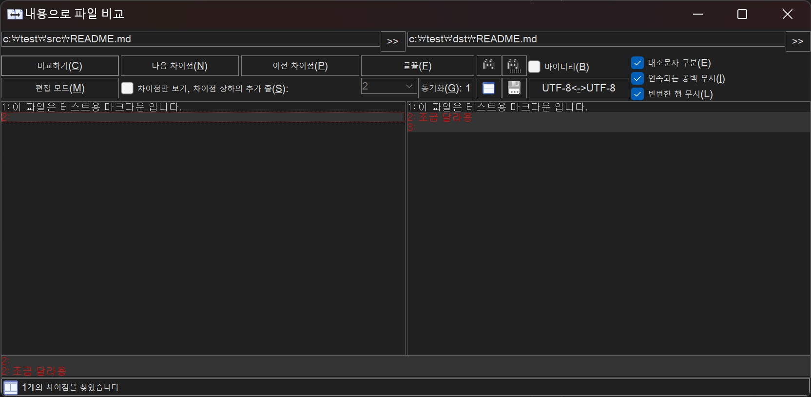

# 토탈 커맨더 써보기

## 토탈 커맨더란?

30년 가량의 유구한 전통을 가진 윈도우즈 유틸리티입니다. 현재까지도 무려 Windows 3.1 버전부터 지원을 하는 식입니다. 충분히 닉값하지요. GNU/Linux 진영의 GUI 버전으로는 [Double Commander](https://doublecmd.sourceforge.io/)가 있고, CLI 버전으로는 [Midnight Commander](https://midnight-commander.org/)가 있습니다. 터미널의 편의성에, 생각합니다.

참고) 이런류의 파일 관리 프로그램을 [Orthodox File Managers](https://en.wikipedia.org/wiki/File_manager#Orthodox_file_managers)(abbr. OFM) 라고 일컫습니다. OFM에 대한 내용은 [이 글](https://softpanorama.org/OFM/index.shtml)을 읽어보는 것을 추천합니다.

## 기왕 쓰기로 했다면 잘 써보자구요

既来之, 则安之 라는 말이 있습니다. 기왕 쓰기로 했으면, 마음 굳히고 잘 해보자 라는 뜻이죠. 기왕 토탈 커맨더를 써보기로 했다면, OFM을 통해 아끼는 시간이 상당해지길 바랍니다. 이 글을 읽으시는 여러분들께도 마찬가지이길 바랍니다! [이 글](https://softpanorama.org/Articles/introduction_to_orthodox_file_managers.shtml#Recommendations_for_Users)을 읽고 입문에 대한 방향성이 정해지길 바랍니다.

1. OFM을 잘 쓰려면 꾸준한 연습이 필요합니다. 마치 악기를 다루는 것 처럼 꾸준히 사용해야 합니다.
2. [로그북](https://dictionary.cambridge.org/dictionary/english/log-book)을 읽어봅시다. 처음에 무슨 표현인가 했더니, 사용설명서나 도움말 같은 느낌이더군요.
   1. 토탈 커맨더의 도움말은 `F1` 이다!
3. 나만의 단축키를 익힙시다
   1. 토탈 커맨더의 기본 단축키 내용은 `도움말 >> 단축키` 를 차례로 클릭해서 확인할 수 있습니다.
   2. 검색 후 필요한 내용을 찾고, 단축키를 바꿔봅시다.
4. (더 나아가서) 나만의 키보드 매크로와 유저 메뉴까지 만들어봅시다
   1. 이건 나중에 다뤄봅시다
5. OFM 유저 포럼이 있다면 "꼭" 들러봅시다!
   1. 선대 사람들이 묻고답한 내용들이 피가되고 살이될 수 있습니다
   1. 당장 아래에서 소개할 커스텀 단축키 내용도, [거의 20년된](https://ghisler.ch/board/viewtopic.php?t=3809) 답변에서 답을 얻었습니다!

## 주요 동작 익히기

메인 화면에서?

- 메인화면은 항상 좌측/우측으로 나누어져 있습니다. 좌측 → 우측, 우측 → 좌측으로 이동할 수 있습니다.
- 마우스를 안 씁니다!
- 앞으로 "이동한다" 라는 뜻은 반대쪽 탭으로 옮김을 일컫습니다.

주요 동작

- 파일/폴더 선택하기 → `Spacebar`
  - 하나 뿐 아니라 여러개를 선택할 수 있습니다.
  - 옮기기
    - `F6`
- 폴더 즐겨찾기 → `Ctrl + D`
  - 폴더 즐겨찾기 찾아가기
  - 폴더 즐겨찾기 등록하기 (`A` 입력)
- 탭에서 선택한 하위 디렉토리를 반대쪽 탭에서 띄우기 (`Ctrl + Shift + →` 혹은 `Ctrl + Shift + ←`)
- 이전 디렉토리로 돌아가기 (`Alt + ←`)
- 파일 내용 보기 → `F3`
- 파일 내용 수정하기 → `F4`
  - 지정한 프로그램을 이용하여 파일을 수정하게 할 수도 있습니다. 아래 탭에서 살펴보시죠.
- 현재 디렉토리를 탐색기(File Explorer)에서 보기
  - (해당 디렉토리 선택 후) `Ctrl + Enter`
  - (현재 디렉토리 보기)`.` 입력 후 엔터
- 파일 비교하기
  - 1.  양쪽 탭의 파일을 `Spacebar`로 선택
  - 2.  `파일 >> 내용으로 비교` 클릭 후 비교
  - 하지만 이렇게 일일이 하기엔 번거롭기 때문에, 커스텀 단축키를 만들어 봅시다!

### 파일 수정 시, 내가 지정한 프로그램으로 수정하기

1. 상단 메뉴바의 `환경설정 >> 옵션`을 클릭합니다
2. `동작 >> 보기/편집` 란으로 이동합니다
3. _F4로 실행되는 편집 프로그램_ 을 지정합니다.

참고) 저는 [vscode](https://code.visualstudio.com/)를 사용하고, 설치 시 `%PATH%` 경로에 등록하여서 `code` 만 기재하였습니다! 추가하는 방법은 [이 링크](https://code.visualstudio.com/docs/setup/windows)를 참고해 주세요.

### 커스텀 단축키 만들기: 토탈 커맨더 명령 지정

토탈 커맨더에 존재하는 명령을 단축키로 지정할 수도 있습니다.

1. 상단 메뉴바의 `환경설정 >> 옵션`을 클릭합니다.
1. `기타` 란으로 이동합니다.
1. _단축키 재정의_ 를 통해 사용할 단축키를 지정해봅시다!

   1. 명령어가 먼저 등록되어 있는지부터 살펴봅시다. 저는 `Ctrl + Y`로 지정하겠습니다.
   1. 아무 명령이 지정되어있지 않군요. 그렇다면 돋보기 버튼을 눌러 지정해봅시다.

   

   1. 두 파일을 비교하는 명령은 `cm_CompareFilesByContent` 입니다. ([참고링크](https://ghisler.ch/board/viewtopic.php?t=3809))

   

1. 초록 체크버튼을 눌러 단축키를 지정합니다.

1. 그러면 빨갛게 변합니다. 단축키 지정을 완료했습니다!

#### 직접 해봅시다!

`Ctrl + Y` 를 눌러, 두 파일을 비교해봅시다! 아래와 같은 창이 뜨며 비교한다면 성공입니다.

## 토탈 커맨더 로그

- `%TEMP%` 에 저장됩니다.
- 성공한 커맨드에 대해서는 로그가 남는데, 실패한 커맨드(E.g., 잘못 입력한 명령 등)는 로그가 안 남더라구요.

## 마무리

이 정도만 해도 제가 쓰는 완전 기본적인 내용은 소개가 된 듯 합니다. 향후에도 괜찮은 내용이 있다면 소개드리겠습니다. 봐주셔서 감사합니다.
