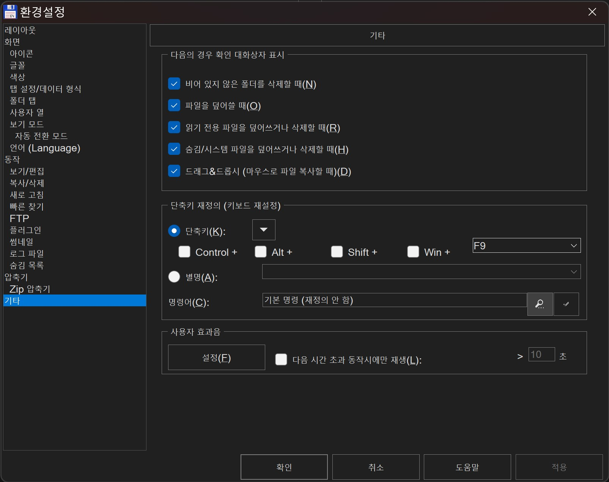
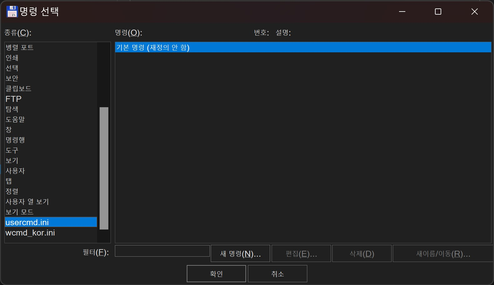
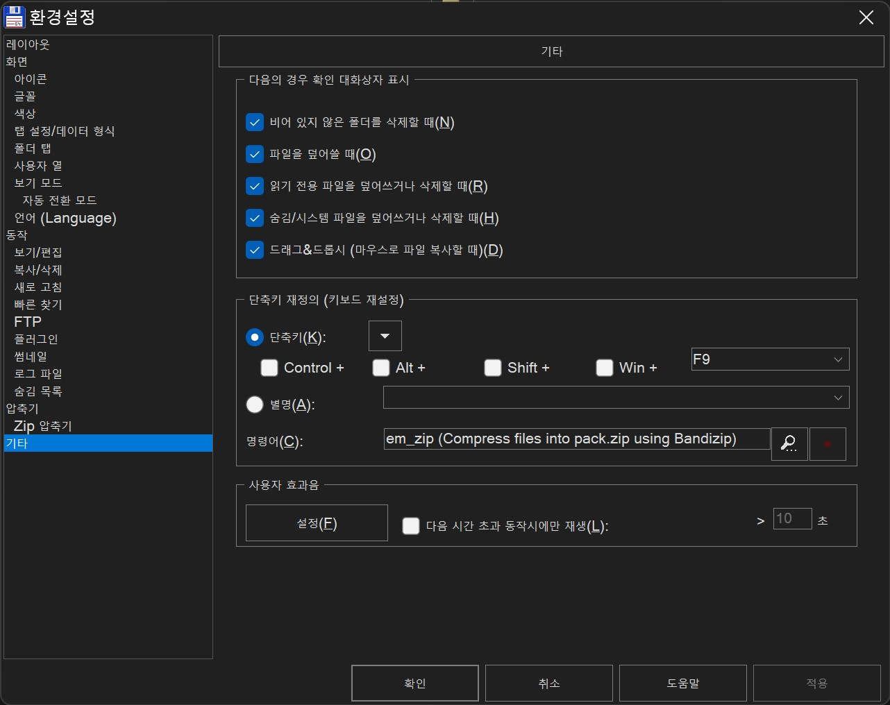
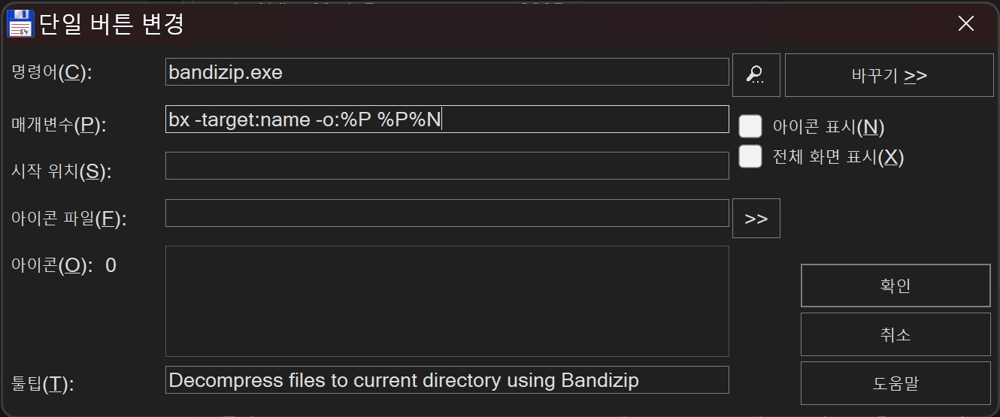
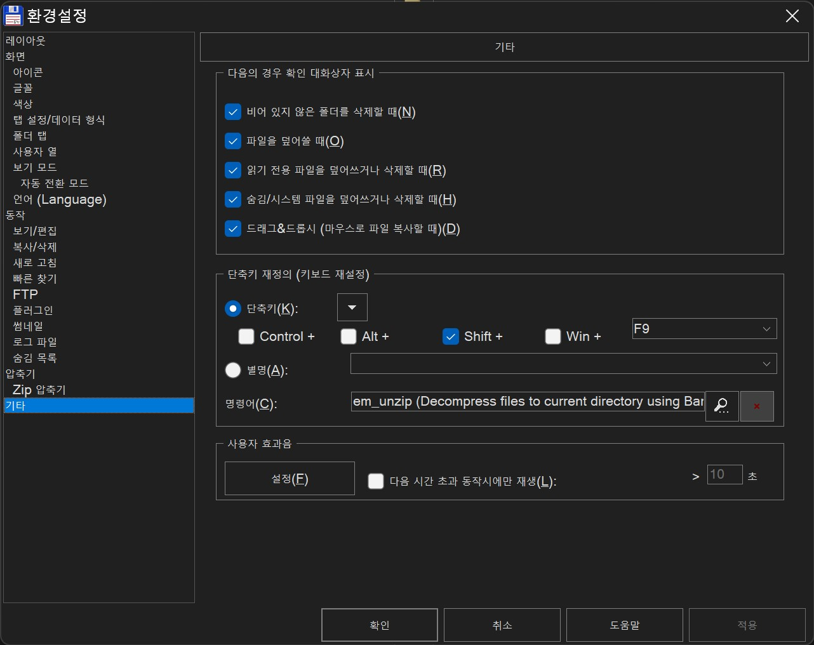
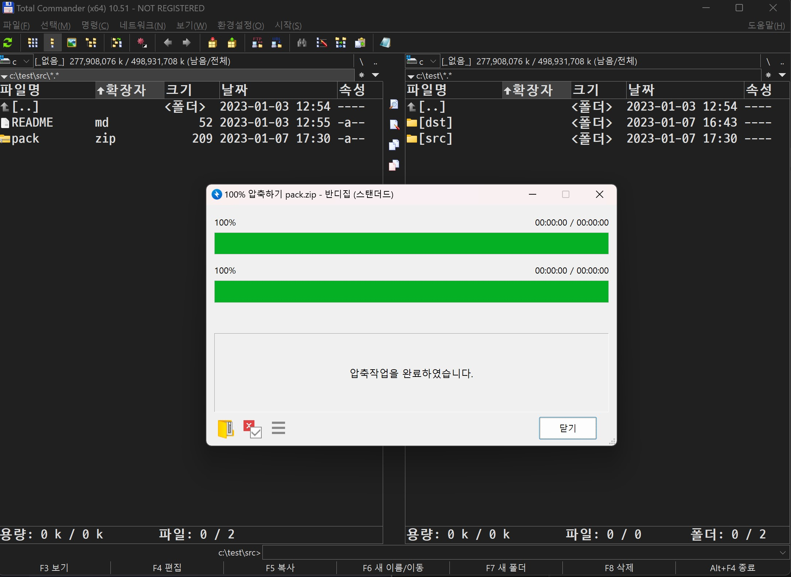
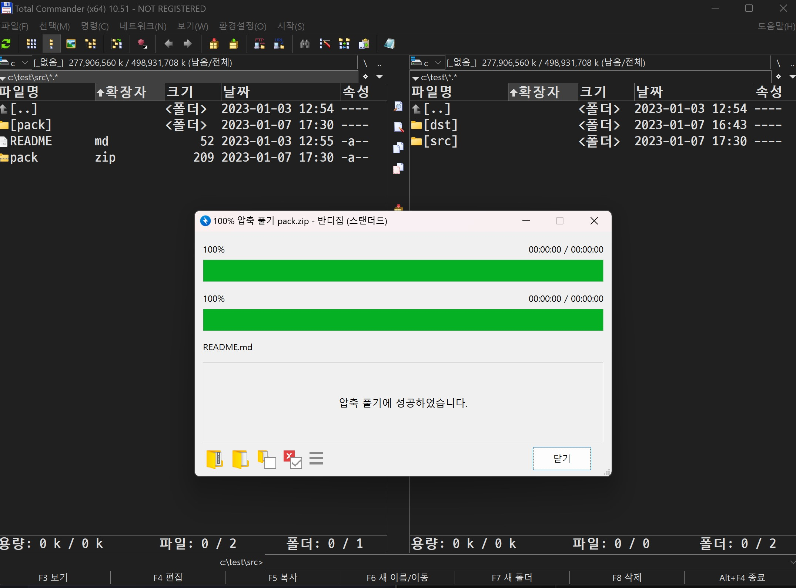

# 토탈 커맨더에서 반디집 사용하기

이 게시글은 토탈 커맨더에서 반디집을 사용하여 압축하기/압축풀기를 수행하는 내용에 대한 글입니다.

## 요구사항

1. 반디집 설치 (`%PATH%` 값에 반디집을 추가하시길 바랍니다!)
2. 토탈 커맨더 설치

## 커스텀 단축키 설정하기: 커스텀 명령 지정

토탈 커맨더엔 없지만, 사용자가 임의로 지정한 명령을 단축키로 지정할 수도 있습니다.

1. 상단 메뉴바의 `환경설정 >> 옵션`을 클릭합니다.
1. `기타` 란으로 이동합니다.
1. _단축키 재정의_ 를 통해 사용할 단축키를 지정해봅시다!

   1. 명령어가 먼저 등록되어 있는지부터 살펴봅시다.  저는 `F9`/`Shift + F9`로 압축하기/압축풀기를 각각 지정하겠습니다.
   1. `F9` 부터 살펴볼까요? 현재는 아무 명령이 지정되어있지 않군요. 그렇다면 돋보기 버튼을 눌러 지정해봅시다.

   

   1. 이 명령은 커스텀 명령이므로 좌측 `usercmd.ini` 파일을 손봐야합니다. 아직 아무 커스텀 단축키를 지정하지 않으셨다면 아무 내용도 없을 것입니다. "새 명령" 버튼을 눌러 명령을 추가해봅시다.

   

   1. 압축하기 명령은 아래 내용을 입력합니다.   

   | 카테고리 | 입력값                                       |
   | -------- | -------------------------------------------- |
   | 명령어   | `bandizip.exe`                               |
   | 매개변수 | `c %p\pack.zip %P%S`                         |
   | 툴팁     | 해당 명령에 대한 톨팁값을 입력하시면 됩니다. |

   

   1. 압축하기 커스텀 명령을 지정 후 설정을 완료해줍시다!

   

   1. 압축 풀기 명령은 아래 내용을 입력합니다.   

   | 카테고리 | 입력값                                       |
   | -------- | -------------------------------------------- |
   | 명령어   | `bandizip.exe`                               |
   | 매개변수 | `bx -target:name -o:%P %P%N`                 |
   | 툴팁     | 해당 명령에 대한 톨팁값을 입력하시면 됩니다. |

   

   1. 압축풀기 커스텀 명령을 지정 후 설정을 완료해줍시다!

   

## 토탈 커맨더에서 압축하기

단축키 커스텀에서 지정한 단축키로 압축을 해봅시다.

1. 압축할 파일을 `Spacebar`로 선택합니다.
2. `F9`를 눌러 압축을 수행합니다.
3. 압축이 완료되었습니다. 파일명은 `pack.zip` 입니다.

## 토탈 커맨더에서 압축풀기

마찬가지로 단축키 커스텀에서 지정한 단축키로 압축을 풀어봅시다.

1. 압축할 파일을 `Spacebar`로 선택합니다.
2. `Shift + F9`를 눌러 압축해제를 수행합니다.
3. 압축파일 이름으로 디렉토리를 생성하여 압축 해제를 수행하였습니다.

### 사실은...

압축폴더 안을 들어가서 `Spacebar`로 선택하여 `F6`을 수행하는 것으로도 압축을 풀 수는 있습니다만, 반디집을 사용해야할 필요가 있다면 이런 방법이 있음을 말씀드립니다!

## 이거 안돼요

막상 만들고 나니 아래 기능들이 없었습니다...

### 파일 이름이 `pack.zip` 으로 고정이에요

사용자 입력값을 받는 부분을 찾지못하여, 현재는 파일 압축 시 이름을 `pack.zip`으로 고정할 수 밖에 없었습니다. 추후 방법을 알아온다면 업데이트 하도록 하겠습니다.

반디집 파라미터 및 토탈 커맨더의 기능을 조금 더 찾아본다면 가능할 것 같다는 생각이 드네요!

### 암호걸린 파일은 어떻게 푸나요?

사용자 입력값을 받을 수 있다면, 추가 커맨드를 주거나 해서 압축해제가 가능할 것으로 보입니다. 추후 방법을 알아온다면 업데이트 하도록 하겠습니다.

## 마무리

그래도 커스텀 하니까 정말 제 도구처럼 애착이 붙는 것 같기도 하네요!

다음번엔 보다 재밌는 주제를 소개할 수 있었으면 좋겠습니다. 감사합니다.

---

참고링크

- [반디집 파라미터](https://kr.bandisoft.com/bandizip/help/parameter/)
