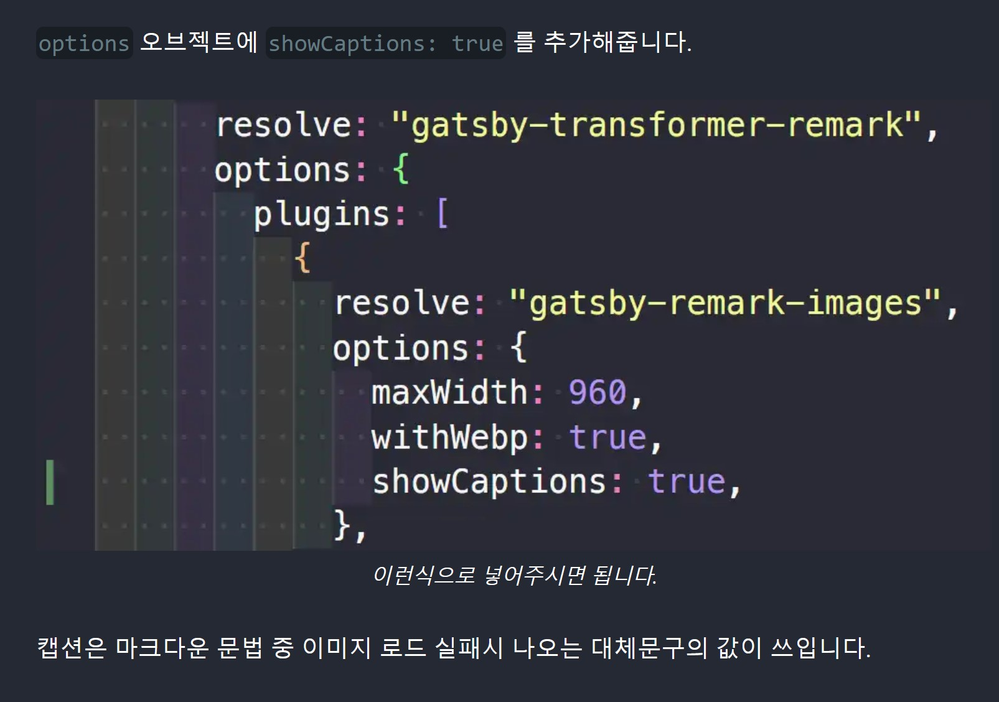

이 글은 `gatsby-remark-images` 를 사용하시는 분들 중, 그림에 캡션을 달고싶은 분들을 위한 글입니다.

# TL;DR

1. [gatsby-remark-images](https://www.gatsbyjs.com/plugins/gatsby-remark-images/) 의 `showCaptions` 설정값으로 캡션을 사용할 수 있습니다.
2. 이는 `gatsby-config.js`(혹은 TS 파일) 파일에 있으며, `options` 값의 키-밸류를 추가해줌으로서 가능합니다.

# 설정방법

`gatsby-config.js`(혹은 TS) 파일 내 플러그인 설정

```javascript
// In your gatsby-config.js
plugins: [
  `gatsby-plugin-sharp`,
  {
    resolve: `gatsby-transformer-remark`,
    options: {
      plugins: [
        {
          resolve: `gatsby-remark-images`,
          options: {
            // 여기에 설정을 추가합니다!
            maxWidth: 590,
          },
        },
      ],
    },
  },
];
```

`options` 오브젝트에 `showCaptions: true` 를 추가해줍니다.


캡션은 마크다운 문법 중 이미지 로드 실패시 나오는 대체문구의 값이 쓰입니다. 아래 스크린샷과 같이 _이런식으로 넣어주시면 됩니다._ 하는 것 처럼 나오죠. (아래 스크린샷은 캡션을 넣지 않았습니다!)



그 외에도, 캡션에 대해 마크다운 문법을 적용할 것인지에 대한 `markdownCaptions` 같은 옵션도 있습니다. 필요에 따라 적용하시면 될 듯 합니다.

---

# 마무리

그 외에도 여러 옵션이 있습니다. 필요에 따라 플러그인 옵션을 제어하면 보다 입맛에 맞는 블로그 설정을 줄 수 있겠네요. 앞으로도 더 알고 쓰면 좋겠네요.

짧은 글 읽어주셔서 감사합니다.
